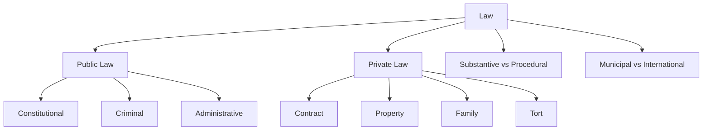

# 📘 Module 01 — Introduction to Jurisprudence

> Syllabus cluster: Meaning, nature and utility of jurisprudence • characteristics, purposes and classification of law • relationship between law and morality.

## 1. Meaning, nature, and utility of jurisprudence

**Jurisprudence** (Latin *juris-prudentia* — knowledge of law) is the **theoretical study of law**: its nature, sources, ends, and methods. Unlike a particular subject (Contract, Tort, IPC), jurisprudence does not state the rules of any one legal system; it asks **what law is**, **why we obey it**, and **how legal concepts hang together**.

### Three working definitions to cite

1. **Salmond** — *“the science of the first principles of the civil law.”*
2. **Austin** — *“the philosophy of positive law.”*
3. **Holland** — *“the formal science of positive law.”*

### Why study it (utility)

- Trains a **lawyer’s lens** — see common structure across diverse branches (sections, rights, duties, remedies).
- Helps **judges** interpret hard cases by exposing competing **theories** (positivism, natural law, realism).
- Helps **legislators** with the **purpose** and **limits** of law.
- Develops **critical** capacity — the law student moves from rules to reasons.

## 2. Characteristics, purposes, and classification of law

### Characteristics (closed list — COUNT = 5)

1. **General** — addressed to a class, not a single person.
2. **Normative** — prescribes what *ought* to be done.
3. **Backed by sanction** — coercive power of the state.
4. **Recognised authority** — sovereign, legislature, or constitution.
5. **Concerned with external conduct** — usually not private thought.

> 🧠 **Mnemonic — GNSRC:** *"Good Nations Set Real Codes"*
> G = General, N = Normative, S = Sanction, R = Recognised authority, C = Conduct (external).

### Purposes of law (COUNT = 4)

1. Justice — distributive and corrective (Aristotelian split).
2. Social order — predictability and security.
3. Protection of rights and liberties.
4. Social engineering — Roscoe Pound’s shaping of interests.

> 🧠 **Mnemonic — JOPS:** *"Justice, Order, Protection, Social engineering."*

### Classification of law

*Diagram: classification of law (Module 01).*

## 3. Relationship between law and morality

Two **theses** dominate the syllabus debate:

- **Overlap thesis** (natural lawyers) — law and morality are conceptually linked; unjust enactments lose the *quality* of law (Aquinas: *lex iniusta non est lex*).
- **Separation thesis** (positivists) — what the law **is** is one question, what it **ought** to be is another (Austin, Hart).

### Modern positions to cite

1. **Hart–Fuller debate (1958)** — Hart defends separation but admits a minimum content of natural law; Fuller insists on **internal morality of law** (eight desiderata of legality).
2. **Devlin–Hart debate (1959–63)** — should law enforce private morality? Devlin: yes, to preserve social cohesion. Hart: only conduct causing harm to others (echoing Mill).

> 🧠 **Mnemonic — OSF:** *"Overlap, Separation, Fuller’s internal morality"*
> Three positions to map any law-and-morality essay onto.

### Indian touchpoints

- *Naz Foundation* (Delhi HC, 2009) and *Navtej Singh Johar* (SC, 2018) — constitutional morality preferred over popular morality.
- Use these only as **policy** illustrations; jurisprudence answers reward **theory** first.

## 4. Conclusion

Module 01 sets the **vocabulary** for the paper. Anchor every later module by asking: *what theory of law is the question testing?* Sources, schools, rights, and liability all reduce to **definition + theory + criticism**.

---

*Generated from `00 - LCC 0604 Jurisprudence - Syllabus.md`. Verify citations against `reference-material/Jurisprudence.txt` before exam.*
