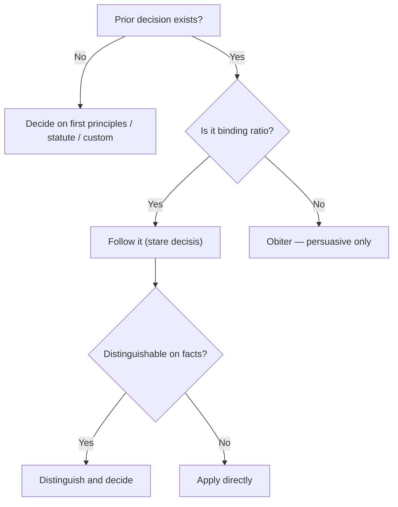

# 📚 Module 02 — Sources of Law

> Syllabus cluster: Custom • Legislation • Precedent (with **Article 141**, ratio/obiter, stare decisis, prospective overruling) • Juristic writings.

## 1. What is a "source" of law?

A **source** is anything from which a legal rule **derives binding force**. Salmond divides sources into **formal** (e.g. the sovereign or constitution that gives validity) and **material** (e.g. custom, legislation, precedent, juristic writings — the actual content).

> 🧠 **Mnemonic — CLPJ:** *"Courts Look at Past Judgments"*
> C = Custom, L = Legislation, P = Precedent, J = Juristic writings.

## 2. Custom

### Meaning and nature

A **custom** is a uniform practice followed in a community for so long that it has acquired the force of law. Custom is the **oldest source** — pre-statutory in every legal system.

### Essential conditions for a valid custom (COUNT = 6)

1. **Antiquity** — observed from time immemorial.
2. **Continuity** — without interruption.
3. **Peaceable enjoyment** — *nec vi, nec clam, nec precario* (without force, secrecy, or permission).
4. **Reasonableness** — courts test rationality.
5. **Certainty** — clear in its terms.
6. **Consistency** with statute and public policy.

> 🧠 **Mnemonic — ACPRCC:** *"All Citizens Practise Real Customs Carefully"*
> A = Antiquity, C = Continuity, P = Peaceable, R = Reasonable, C = Certain, C = Consistent with law.

### Volksgeist (Savigny)

Custom expresses the **Volksgeist** — the *spirit of the people*. Law grows organically with the nation; legislation is at best a tidy-up exercise.

### Kinds of custom

- **Legal custom** — operates as binding law (general or local).
- **Conventional custom (usage)** — binds only parties who knowingly adopt it (trade usage, family customs).

## 3. Legislation

### Meaning

The **deliberate making of legal rules** by an authority competent under the constitution. In a modern state, legislation is the **dominant source**.

### Kinds

- **Supreme legislation** — Parliament / state legislature within constitutional limits.
- **Subordinate legislation** — rules and bye-laws under delegated authority.

### Merits and demerits (COUNT = 4 + 3)

#### Merits

1. **Clarity** — written and codified.
2. **Speed** — can keep up with social change.
3. **Democratic** — flows from the representative legislature.
4. **Repeal and amendment** are easy.

#### Demerits

1. Risk of **rigidity** if drafted carelessly.
2. **Detached** from felt social practice (Savigny’s critique).
3. **Interpretation** problems — courts may distort intent.

> 🧠 **Mnemonic — CSDR:** *"Clear, Speedy, Democratic, Repealable"* — the four merits of legislation.

## 4. Precedent

### Meaning and theories

A **precedent** is a previously decided case that supplies authority for an identical or similar issue. Two competing theories:

1. **Declaratory theory** (Blackstone) — judges only *declare* pre-existing law.
2. **Constitutive (creative) theory** — judges actually *make* law in deciding novel cases.

### Doctrine of *stare decisis*

*"Stand by what has been decided."* Lower courts must follow the **ratio decidendi** of higher courts.

### Article 141 of the Constitution

*"The law declared by the Supreme Court shall be binding on all courts within the territory of India."* — the constitutional foundation of vertical *stare decisis* in India.

### Ratio decidendi vs obiter dicta

| 🎯 Aspect | Ratio decidendi | Obiter dicta |
|:---|:---|:---|
| Nature | Reason for the decision | Side remarks |
| Force | **Binding** on lower courts | Persuasive only |
| Identifying it | Material facts + legal reason | Anything else |

> 🧠 **Mnemonic — RB-OP:** *"Ratio Binds, Obiter Persuades."*

### Kinds of precedent

1. Authoritative vs persuasive.
2. Original vs declaratory.
3. Binding vs merely advisory.

### Prospective overruling

A judicial technique (recognised in India in **Golak Nath, 1967**) where a court changes the law **only for the future**, sparing past transactions. Protects settled expectations.

### Circumstances destroying binding force

- Ignored a relevant statute (*per incuriam*).
- Conflict with later constitution bench decision.
- Reversal or overruling.
- Subsequent change in statute.

*Diagram: applying precedent in court (Module 02).*

## 5. Juristic writings

Textbook writers and commentators (Salmond, Pollock, Mulla, Dias, Hart, Kelsen) influence courts as **persuasive secondary authority**. The Indian Supreme Court routinely cites *Pollock & Mulla*, *Halsbury’s Laws of England*, and academic articles in hard cases.

## 6. Comparative weight

*Diagram: layered authority of the four sources.*

## 7. Conclusion

In modern India, **legislation** sits at the top of routine output, **precedent** does the day-to-day work in courts, **custom** survives in personal laws and trade usage, and **juristic writings** fertilise the whole. A topper answer should name **all four**, state the **rank-order**, and finish with **Article 141**.
