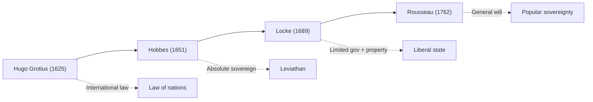

# ⚖️ Module 03 — Natural Law Theories and Revival of Natural Law

> Syllabus cluster: Classical natural law (Plato → Aquinas) • Social contract (Hugo Grotius, Hobbes, Locke, Rousseau) • Revival (Lon Fuller, H.L.A. Hart, John Finnis).

## 1. The natural-law core idea

**Natural law** holds that there exists a **higher moral order** — discoverable by reason — to which human (positive) law ought to conform. Unjust commands lose the *quality* of law: *lex iniusta non est lex*.

## 2. Classical natural law: Plato to Aquinas

### Plato

*Republic* — justice is **giving each their due**; the philosopher-king rules in accordance with the **Forms**.

### Aristotle

Distinguishes **natural justice** (universal) from **legal justice** (conventional). The first law is right reason in agreement with nature.

### Stoics and Cicero

Cicero: *true law is right reason in agreement with nature; universal, unchangeable, eternal* (*De Re Publica*).

### St. Augustine and St. Thomas Aquinas

Aquinas (*Summa Theologica*) gives the canonical **fourfold classification** of law:

1. **Eternal law** — divine reason governing the universe.
2. **Divine law** — revealed scripture.
3. **Natural law** — rational creature’s participation in eternal law.
4. **Human (positive) law** — derived from natural law by determination.

> 🧠 **Mnemonic — EDNH:** *"Every Devout Nun Helps"*
> E = Eternal, D = Divine, N = Natural, H = Human law.

## 3. Social contract and natural law

*Diagram: the social-contract pipeline (Module 03).*

### Grotius and the law of nations

Hugo Grotius (1583–1645), *De Jure Belli ac Pacis* — founder of modern **international law**. Natural law applies between sovereign states; its content is discovered by reason and is binding *etiamsi daremus non esse Deum* (“even if God did not exist”).

### Thomas Hobbes (*Leviathan*, 1651)

- **State of nature** is *solitary, poor, nasty, brutish, and short.*
- Rational individuals contract to surrender all rights to a **sovereign** (the *Leviathan*) in return for security.
- Civil law is the sovereign’s command; **no right to resist** except for self-preservation.

### John Locke (*Two Treatises*, 1689)

- State of nature is one of **liberty and equality**, governed by natural law.
- People contract to form government to better protect **life, liberty, and property**.
- A government that breaches the trust may be **lawfully resisted** — foundation of liberal constitutionalism.

### Jean-Jacques Rousseau (*Social Contract*, 1762)

- People are *born free* but everywhere in chains.
- Legitimacy flows from the **general will** — the people themselves are sovereign.
- Influenced democratic revolutions and the doctrine of popular sovereignty.

> 🧠 **Mnemonic — GHLR:** *"Grotius, Hobbes, Locke, Rousseau."*
> Order of social-contract thinkers as syllabus.

## 4. Revival of natural law (twentieth century)

After WWII, the **Nuremberg trials** and **Nazi-era statutes** revived interest in moral limits on positive law.

### Lon L. Fuller — internal morality of law

Law is a **purposive enterprise of subjecting human conduct to the governance of rules**. To count as law, a system must respect **eight principles of legality** (the *inner morality* of law):

1. **Generality** of rules.
2. **Publicity** — rules must be promulgated.
3. **Prospectivity** — no retroactive rules.
4. **Clarity**.
5. **Consistency** (non-contradiction).
6. **Possibility of compliance**.
7. **Constancy through time** — not changed too frequently.
8. **Congruence** between official action and declared rule.

> 🧠 **Mnemonic — GPPC-CPCC:** *"Good Public Policy Cuts Crime, Promotes Civil Conduct"*
> G = Generality, P = Publicity, P = Prospective, C = Clear, C = Consistent, P = Possible, C = Constant, C = Congruent.

### H.L.A. Hart — minimum content of natural law

Hart (positivist) concedes a **minimum content** of natural law for any viable legal system, given five *truisms* about human beings: human vulnerability, approximate equality, limited altruism, limited resources, limited understanding/will. Society needs minimum rules protecting persons, property, and promises.

### John Finnis — restatement of natural law

In *Natural Law and Natural Rights* (1980), Finnis lists **seven basic goods** that any reasonable plan of life pursues:

1. **Life**
2. **Knowledge**
3. **Play**
4. **Aesthetic experience**
5. **Sociability (friendship)**
6. **Practical reasonableness**
7. **Religion**

Law is sound when it serves these basic goods through **practical reasonableness** — Finnis rebuilds natural law without metaphysical baggage.

> 🧠 **Mnemonic — LKPASPR:** *"Lawyers Keep Practising And Studying Practical Reason"*
> L = Life, K = Knowledge, P = Play, A = Aesthetic, S = Sociability, P = Practical reasonableness, R = Religion.

## 5. Strengths and criticism

| 🎯 Strength | 🔻 Weakness |
|:---|:---|
| Supplies a **moral check** on legislation | Disagreement on **content** of natural law |
| Inspired **human-rights** discourse and Nuremberg | Risk of judicial subjectivism |
| Re-explains *lex iniusta* in twentieth-century terms (Fuller) | Hart: morality of *aspiration* ≠ legal validity |
| Finnis offers a workable list of basic goods | Goods list itself contested |

## 6. Conclusion

Natural law survives because positive law alone cannot answer **why** we should obey. The revival shows the theory updating itself: Fuller through procedure, Finnis through goods, both keeping morality in dialogue with law.
