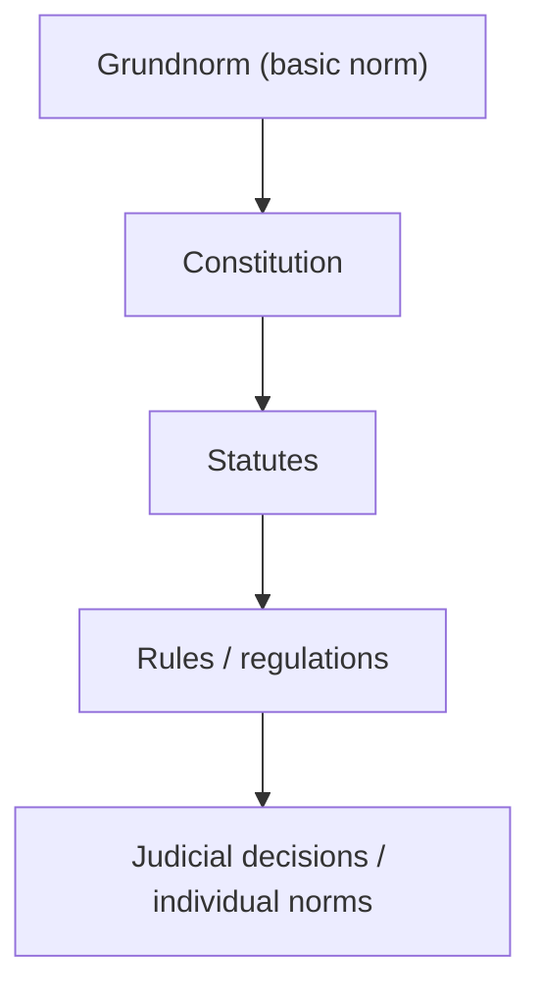

# 🏛️ Module 04 — Legal Positivism

> Syllabus cluster: Bentham and John Austin's theory of positivism • Hart's concept of law • Kelsen's Pure Theory of Law.

## 1. Core idea of positivism

**Legal positivism** insists on the **separation thesis** — *what the law is* is one question, *what the law ought to be* is another. The validity of a rule depends on its **social source**, not its moral content. There can be morally bad valid law.

> 🧠 **Mnemonic — BAHK:** *"Brains At Hard Knocks"*
> B = Bentham, A = Austin, H = Hart, K = Kelsen — the four positivists in syllabus order.

## 2. Jeremy Bentham (1748–1832)

### Two faces of Bentham

- **Expositorial jurisprudence** — what the law *is* (descriptive).
- **Censorial jurisprudence** — what the law *ought to be* (utilitarian critique).

### Utilitarian foundations

Law is justified by its capacity to promote the **greatest happiness of the greatest number**. Bentham called natural rights *"nonsense upon stilts"* — only rules with social-utility justification count.

### Influence

Codification movement, Indian Penal Code (drafted by Macaulay using Benthamite blueprints), reform of cruel punishments and procedure.

## 3. John Austin (1790–1859) — the command theory

### Core proposition

Law is **"a command issued by a sovereign, backed by a sanction."** Anything else is *positive morality*, not law.

### Four elements (COUNT = 4)

1. **Command** — expression of a wish.
2. **Sovereign** — determinate human superior receiving **habitual obedience** and not habitually obedient to any other.
3. **Sanction** — threatened evil for non-compliance.
4. **Duty** — addressee’s obligation to obey.

> 🧠 **Mnemonic — CSSD:** *"Common Sovereigns Set Duties"*
> C = Command, S = Sovereign, S = Sanction, D = Duty.

### Criticism

- Cannot explain **customary law** (no command).
- Cannot explain **constitutional limits on the sovereign**.
- Power-conferring rules (contract, marriage) are not commands backed by sanctions.
- Distinct sovereigns in federalism, IL, and divided polities.
- Hart’s most famous critique: a gunman’s order is also command-with-sanction, yet not law (*the gunman situation*).

## 4. H.L.A. Hart — *The Concept of Law* (1961)

### Union of primary and secondary rules

- **Primary rules** — impose duties (don’t kill, pay tax).
- **Secondary rules** — confer powers, identify and change primary rules.

Three categories of secondary rules:

| 🔹 Secondary rule | What it does |
|:---|:---|
| **Rule of recognition** | Tells us *which* rules count as law in this system |
| **Rule of change** | Power to enact, amend, repeal |
| **Rule of adjudication** | Power to determine and apply rules in disputes |

> 🧠 **Mnemonic — RCA:** *"Recognise, Change, Adjudicate."*

### Rule of recognition

The master test of validity — accepted by officials from an **internal point of view**. India’s rule of recognition is *roughly* the Constitution (validity flows from constitutional sources).

### Open texture of law

Language is irreducibly **vague at the margins**. Hard cases are decided by **judicial discretion**, not a built-in moral answer.

### Minimum content of natural law

Five truisms about humans (vulnerability, equality, altruism, scarcity, limited will/understanding) generate **minimum rules** about persons, property, promises that every legal system needs. Positivism can admit this without collapsing into natural law.

## 5. Hans Kelsen — Pure Theory of Law

### Purity

Kelsen strips law of **psychology, sociology, ethics, and politics** to study its specifically *normative* structure.

### Hierarchical structure (*Stufenbau*)

*Diagram: Kelsen’s pyramid of norms (Module 04).*

Each norm derives validity from a higher norm; the **Grundnorm** is a *presupposed* basic norm that cannot be derived from another legal norm.

### Norm types

- **Static system** — content-validity (norms derive from a basic value).
- **Dynamic system** — formal validity (norms derive from authorising procedure). Legal systems are predominantly **dynamic**.

### Grundnorm in revolutions

In *State v Dosso* (Pakistan, 1958) and *Madzimbamuto v Lardner-Burke* (Rhodesia, 1968), courts used Kelsen to explain how a successful revolution shifts the Grundnorm.

> 🧠 **Mnemonic — PHGN:** *"Pure Hierarchy → Grundnorm at the top, Norms below."*

## 6. Comparison snapshot

| 🔍 Aspect | Austin | Hart | Kelsen |
|:---|:---|:---|:---|
| Law is | Sovereign’s command | Union of primary + secondary rules | Hierarchy of norms |
| Validity from | Sanction + habit of obedience | Rule of recognition | Grundnorm |
| Source-thesis? | Yes | Yes (soft) | Yes |
| Role of judges | Apply command | Apply rules; discretion in hard cases | Apply individual norm derived from higher |

## 7. Conclusion

Positivism gives us **clarity about validity**. Austin’s blunt model is refined by Hart’s rule-of-recognition, and Kelsen pushes purity to a logical conclusion with the Grundnorm. Any positivism question should map the answer onto these three rungs.
