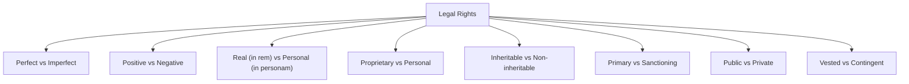

# 🧑‍⚖️ Module 06 — Concept of Person, Right, and Duties

> Syllabus cluster: Nature of personality (natural/legal); status of lower animals, dead persons, unborn; kinds of legal persons; theories of legal personality • Meaning of wrong, duty, right; characteristics and kinds of legal rights; theories of legal rights; Hohfeldian classification.

## 1. Concept of person

A **person** in law is **any entity capable of holding rights and bearing duties**. Personality is a *legal status*, not a natural fact — the law confers and withdraws it.

### Natural vs legal persons

| 🔹 Type | Examples |
|:---|:---|
| **Natural person** | Living human being |
| **Legal (artificial / juristic) person** | Companies, idols, partnerships (in some respects), states, universities |

### Legal status of difficult cases

1. **Lower animals** — not legal persons; cannot sue or be sued. Statutes (e.g., **Prevention of Cruelty to Animals Act, 1960**) protect them as *subject-matter*, not rights-bearers.
2. **Dead persons** — generally no rights (right ends with death). Limited statutory protection for reputation, sepulchre, and will/estate.
3. **Unborn persons** — capable of holding contingent property rights (e.g., **Section 13, Transfer of Property Act, 1882**), can be subject of injury (medical-negligence claims), but actionable personality crystallises on live birth.

### Kinds of legal persons (COUNT = 3)

1. **Corporations** — registered companies, statutory bodies.
2. **Institutions / endowments** — temples, idols (*Pramatha Nath Mullick* line), trusts.
3. **Funds and estates** — bankrupt’s estate, deceased’s estate.

> 🧠 **Mnemonic — CIF:** *"Corporations, Institutions, Funds"* — three classes of legal persons.

### Theories of legal personality (COUNT = 5)

1. **Fiction theory** (Savigny) — legal persons are creations of legal imagination.
2. **Concession theory** — personality is granted by the State.
3. **Realist theory** (Gierke) — corporations are real social organisms.
4. **Bracket theory** (Ihering) — corporate name is a bracket around real persons whose rights are aggregated.
5. **Purpose theory** (Brinz) — property held for an impersonal purpose.

> 🧠 **Mnemonic — FCRBP:** *"Five Clever Romans Built Persons"*
> F = Fiction, C = Concession, R = Realist, B = Bracket, P = Purpose.

## 2. Wrong, duty, right

- **Wrong** — an act forbidden by law.
- **Duty** — an obligation imposed by law.
- **Right** — an interest recognised and protected by law (Salmond) — every right corresponds to a duty.

### Characteristics of legal rights (COUNT = 5)

1. **Subject** — person of inherence (who has the right).
2. **Act/forbearance** — content (what is required).
3. **Object** — subject-matter (over what).
4. **Person of incidence** — bearer of correlative duty.
5. **Title** — facts giving rise to the right.

> 🧠 **Mnemonic — SAOPT:** *"Subject, Act, Object, Person, Title."*

### Kinds of legal rights

*Diagram: kinds of legal rights (Module 06).*

### Theories of rights (COUNT = 3)

1. **Will theory** (Kant, Hegel, Savigny) — right is a manifestation of human will.
2. **Interest theory** (Ihering, Salmond) — right is a legally protected *interest*.
3. **Composite / modern view** — both will and interest matter; rights enable choice **and** protect welfare.

## 3. Hohfeldian analysis (Wesley Newcomb Hohfeld, 1913)

Hohfeld unpacks the loose word *“right”* into **eight precise jural relations** — four pairs of **correlatives** (vertical) and **opposites** (diagonal).

| ⚖️ Right side | 🤝 Correlative (the other side) | ❌ Opposite (its negation) |
|:---|:---|:---|
| **Claim-right** | Duty | No-right |
| **Privilege (liberty)** | No-right | Duty |
| **Power** | Liability | Disability |
| **Immunity** | Disability | Liability |

> 🧠 **Mnemonic — CPPI:** *"Claim, Privilege, Power, Immunity"*
> The four "right" positions — pair each with its correlative duty/no-right/liability/disability.

### Worked illustration

- *A buys a watch from B.* A has a **claim** to delivery; B has a **duty** to deliver.
- *A walks on his own land.* A has a **privilege**; the world has a **no-right** to stop him.
- *Parliament enacts a tax statute.* Parliament exercises a **power**; taxpayers bear a **liability** to be taxed.
- *A diplomat enjoys sovereign immunity.* The diplomat has an **immunity**; the prosecuting State suffers a **disability** to proceed.

## 4. Conclusion

Personality is the **vehicle** that carries rights and duties. Hohfeld’s table is the **vocabulary** for stating any right precisely. Topper answers in Module 06 should always use Hohfeldian language for at least one paragraph.
