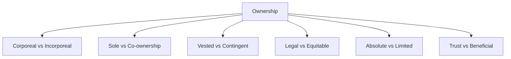

# 🏠 Module 07 — Ownership, Possession, and Title

> Syllabus cluster: Ownership (meaning, characteristics, subject-matter, kinds, modes of acquisition) • Possession (kinds, modes, possessory remedies, comparison with ownership) • Title (definition, classification, agreements).

## 1. Ownership

### Meaning

**Ownership** is the *de jure* recognition of an exclusive claim to a thing. Salmond: *"the relation between a person and any right that is vested in him."* Austin: *"a right indefinite in point of user, unrestricted in point of disposition, and unlimited in point of duration."*

### Characteristics (COUNT = 5)

1. **Indefinite user** — owner may use as she pleases within law.
2. **Unrestricted disposition** — power to alienate, transfer, mortgage.
3. **Right to possess** — usually but not necessarily.
4. **Residuary character** — what remains after lesser rights are carved out.
5. **Inheritable** — passes to heirs on death.

> 🧠 **Mnemonic — UUPRI:** *"Use, Use up, Possess, Residue, Inherit"*
> U = Indefinite user, U = Unrestricted disposition, P = Possess, R = Residuary, I = Inheritable.

### Subject-matter of ownership

Material things (land, goods), incorporeal things (debts, patents, shares), and even legal interests (life interest, lease).

### Kinds of ownership

*Diagram: kinds of ownership (Module 07).*

### Modes of acquiring ownership (COUNT = 4)

1. **Original** — first occupancy (*res nullius*), specification (creating a new thing from another’s material).
2. **Derivative** — transfer inter vivos (sale, gift, exchange).
3. **Inheritance** — succession testate or intestate.
4. **Prescription / adverse possession** — long uninterrupted enjoyment ripening into ownership against the true owner.

> 🧠 **Mnemonic — ODIP:** *"Original, Derivative, Inheritance, Prescription."*

## 2. Possession

### Meaning

**Possession** combines two elements — **corpus possessionis** (physical control) and **animus possidendi** (intention to hold for oneself).

> 🧠 **Mnemonic — CA:** *"Corpus + Animus"* — the two ingredients of possession.

### Kinds of possession

1. **Possession in fact** (de facto) vs **possession in law** (de jure).
2. **Mediate** vs **immediate**.
3. **Corporeal** vs **incorporeal**.
4. **Adverse possession** — possession against the true owner.
5. **Constructive possession** — control without physical custody (keys to a warehouse).

### Modes of acquiring possession

1. **Taking** — unilateral seizure.
2. **Delivery** — actual, symbolic, or constructive.

### Possessory remedies in India

- **Sections 5 and 6, Specific Relief Act, 1963** — suit for recovery of possession of immovable property; a person dispossessed otherwise than in due course of law may recover possession irrespective of title.
- **Section 9, CPC** — civil suit jurisdiction for declarations of possession.
- **Trespass** — common-law tort protecting possession.

### Ownership vs Possession (essence)

| 🔍 Aspect | Ownership | Possession |
|:---|:---|:---|
| Nature | *De jure* right | *De facto* control + intention |
| Duration | Permanent until alienated | May be temporary |
| Protection | Through title-based suits | Through possessory remedies |
| Maxim | *Dominium* | *Possessio* |
| Both together | Typical | Owner may not possess (e.g., lessor) |

## 3. Title

### Definition and nature

**Title** is the **legally recognised fact or set of facts** by which a right (especially ownership) is acquired or held. Salmond: *"every right has a title — the de facto antecedent of which it is the de jure consequent."*

### Classification of titles (COUNT = 4)

1. **Original** — by occupancy, specification, accession, prescription.
2. **Derivative** — by transfer inter vivos or succession.
3. **Vestitive facts** — create rights (e.g., birth, marriage, contract).
4. **Divestitive facts** — extinguish rights (death, release, expiry).

> 🧠 **Mnemonic — OD-VD:** *"Original-Derivative, Vestitive-Divestitive."*

### Agreements as title-creating facts

- **Importance** — bulk of titles in commerce are generated by contracts.
- **Kinds of agreements** — bilateral/unilateral, executed/executory, expressed/implied.
- **Validity** under **Section 10, Indian Contract Act, 1872** — competent parties, free consent, lawful object and consideration, not expressly declared void.

## 4. Conclusion

Module 07 ties the **right** of ownership to the **fact** of possession through the **bridge** of title. A topper answer always names *corpus + animus* for possession, the **five characteristics** of ownership, and at least one statutory possessory remedy (Specific Relief Act).
