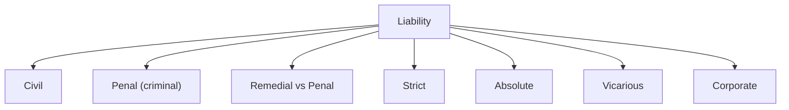

# ⚒️ Module 08 — Obligations and Liability

> Syllabus cluster: Definition and sources of obligation; solitary obligations • Nature and kinds of liability; conditions; measure of penal/civil liability; strict and absolute liability; vicarious liability; liability of corporations.

## 1. Obligations

### Definition

**Obligation** (from *obligare* — to bind) is *"a proprietary right in personam — a duty correlative to such a right"* (Salmond). It binds a determinate person to a specific course of conduct.

### Sources of obligation (COUNT = 4)

1. **Contract (ex contractu)** — voluntary agreement.
2. **Tort (ex delicto)** — wrongful act.
3. **Quasi-contract** — implied by law to prevent unjust enrichment (e.g., **Sections 68–72, Indian Contract Act, 1872**).
4. **Innominate** — operation of law (statutory duties, custom).

> 🧠 **Mnemonic — CTQI:** *"Civil Torts Quietly Imply obligations"*
> C = Contract, T = Tort, Q = Quasi-contract, I = Innominate.

### Solitary vs solidary obligations

- **Solitary** — single obligor and obligee.
- **Solidary (joint/several)** — multiple debtors or creditors, each fully liable.

## 2. Liability — nature and conditions

### Nature

**Liability** is "the bond of necessity that exists between the wrongdoer and the remedy of the wrong" (Salmond). It is the state of being subject to a legal obligation enforceable by sanction.

### General conditions (COUNT = 4)

1. **Act / omission** — voluntary conduct or culpable omission.
2. **Mens rea** — guilty mind (intent, knowledge, recklessness, negligence).
3. **Causation** — act must cause the harm/breach.
4. **Damage / breach** — recognised legal injury (except in *injuria sine damnum* situations).

> 🧠 **Mnemonic — AMCD:** *"Act, Mind, Cause, Damage."*

## 3. Kinds of liability

*Diagram: kinds of liability (Module 08).*

### Civil vs penal liability

| 🔍 Aspect | Civil liability | Penal liability |
|:---|:---|:---|
| Purpose | Restitution / compensation | Punishment / deterrence |
| Proof standard | Preponderance of probabilities | Beyond reasonable doubt |
| Initiated by | Aggrieved party | State |
| Outcome | Damages, injunction, specific relief | Imprisonment, fine, etc. |

### Measure of penal liability

Salmond: *"the gravity of an offence depends on the motive, magnitude, and character of the offence."* Modern factors: gravity of harm, degree of mens rea, motive, antecedents, deterrence and reformation.

### Measure of civil liability

Compensatory principle — restoration of the injured to the position they would have been in had the wrong not occurred (*restitutio in integrum*).

## 4. Strict and absolute liability

### Strict liability — *Rylands v Fletcher* (1868)

- Person who brings a **non-natural use** of land that escapes is liable for damage, even without fault.
- **Defences** available: act of God, plaintiff’s default, consent, third-party act, statutory authority.

### Absolute liability — *M.C. Mehta v Union of India* (1987)

- Indian SC (Bhagwati CJ) held that an enterprise engaged in a **hazardous or inherently dangerous activity** owes an **absolute and non-delegable** duty to the community.
- **No defences** available; liability is to compensate **in full** all those affected.

> 🧠 **Mnemonic — RF-MC:** *"Rylands-Fletcher Strict; Mehta Absolute."*

### Strict vs Absolute — at a glance

| 🔍 Basis | Strict liability | Absolute liability |
|:---|:---|:---|
| Source | *Rylands v Fletcher* | *M.C. Mehta* |
| Activity | Non-natural use | Hazardous/inherently dangerous |
| Defences | Available (5 classical) | None |
| Quantum | Compensatory | Exemplary, capacity-based |
| Burden | On enterprise | On enterprise (heavier) |

## 5. Vicarious liability

Liability of one person for the wrong of another, arising from a special **relationship** (COUNT = 4 typical):

1. **Master and servant** — for torts committed in the course of employment.
2. **Principal and agent** — for acts done within authority.
3. **Partners** — joint and several liability for firm torts.
4. **State / employer of public servants** — modern doctrines (*State of Rajasthan v Vidhyawati*, 1962; balanced by *Kasturilal*, 1965).

### Criminal vicarious liability

Generally **not** recognised except under specific statutes (e.g., **Section 154, IPC** for owner of land in unlawful assembly; food adulteration statutes; company directors under specific Acts).

## 6. Liability of corporations

Corporations are legal persons; their liability is mediated by the **directing mind** doctrine (alter-ego theory).

- **Civil** — fully liable on contracts and torts within objects.
- **Criminal** — historically doubted, now accepted in India (**Standard Chartered Bank v Directorate of Enforcement**, 2005; **Iridium India Telecom v Motorola Inc.**, 2011). Corporations can be punished by **fine**; mens rea is attributed via directing minds.

## 7. Conclusion

Module 08 closes the SPPU paper by translating theory into **remedy**. A topper answer pairs the conceptual structure (act + mens rea + cause + damage) with the right liability label (civil/penal/strict/absolute/vicarious/corporate) and a leading Indian case for at least one head.
