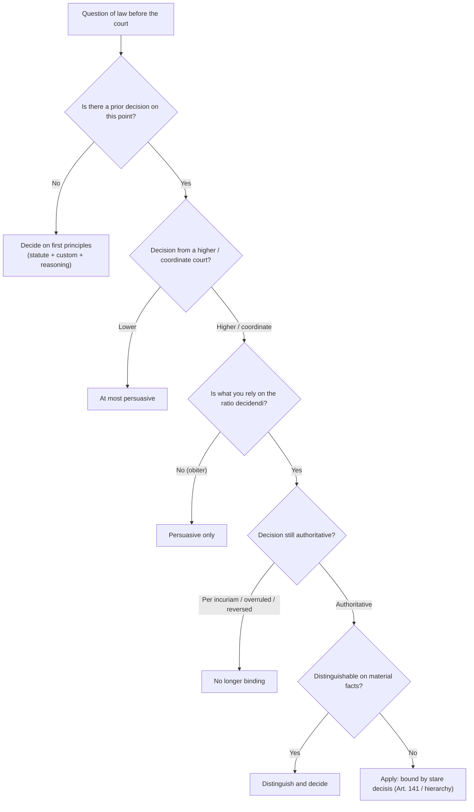

# 📐 Flowchart — applying precedent in court (Module 02)

**Reading guide:**

1. Always check **prior decisions first**.
2. The **ratio** binds — the *obiter* persuades.
3. Watch for *per incuriam*, **statutory change**, or a later **constitution-bench overruling**.
4. **Distinguishing** is the safe escape route; **overruling** requires equal or higher authority.
