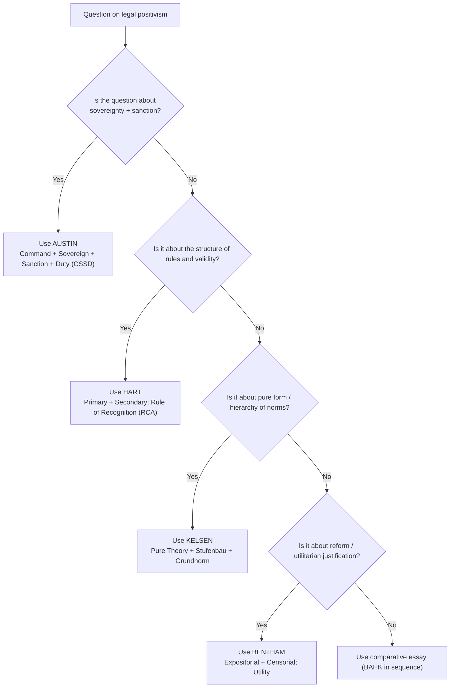

# 📐 Flowchart — choosing the right positivist (Module 04)

**Reading guide:**

- *“Define law”* type — start with **Austin**, then critique with **Hart**.
- *“Validity of law”* type — anchor on **Hart’s rule of recognition** or **Kelsen’s Grundnorm**.
- *“Punishment / reform of law”* type — bring in **Bentham’s utility**.
- **BAHK** is the safe sequence for any *“discuss positivism”* essay.
