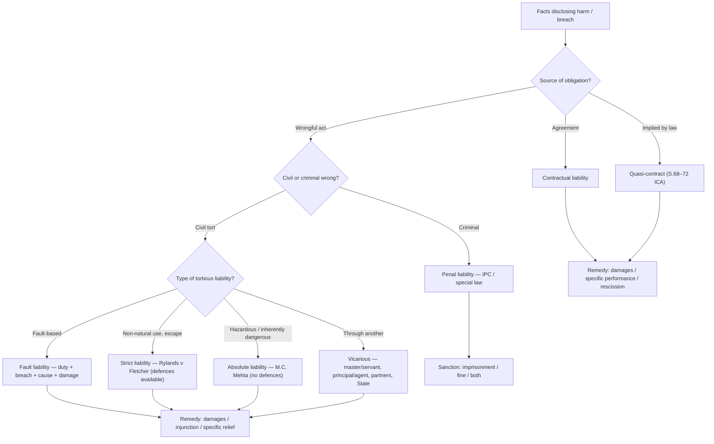

# 📐 Flowchart — routing a liability question (Module 08)

**Reading guide:**

1. First fix the **source** of obligation.
2. For tort, distinguish **fault**, **strict**, **absolute**, **vicarious**.
3. **Defences** drop away as you move from strict → absolute.
4. End the answer with the **remedy** appropriate to the head of liability.
