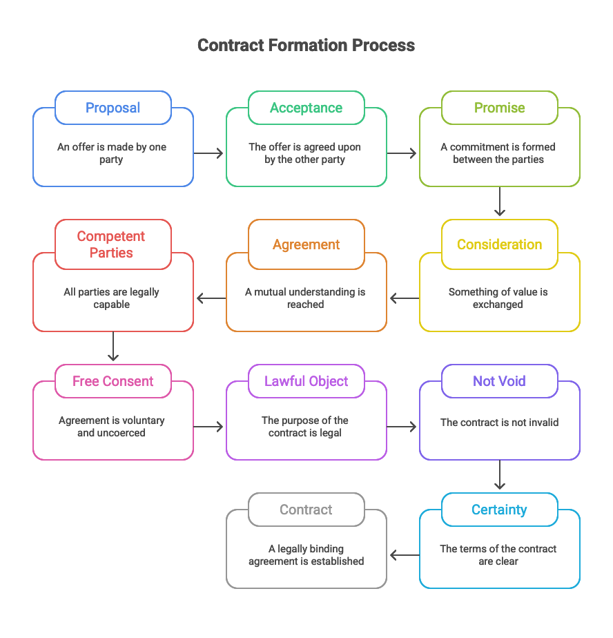
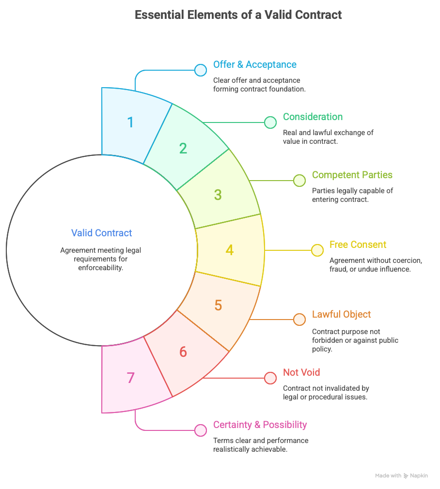

# Contract Law - Visual Study Cards
## 🎴 Quick Revision Cards with Visual Aids

---

## 📍 Table of Contents

1. [Contract Formation Cards](#contract-formation-cards)
2. [Essential Elements Cards](#essential-elements-cards)
3. [Vitiating Factors Cards](#vitiating-factors-cards)
4. [Remedies Cards](#remedies-cards)
5. [Section 2 Definitions Cards](#section-2-definitions-cards)
6. [Case Law Cards](#case-law-cards)
7. [Quick Reference Cards](#quick-reference-cards)

---

## 🎴 CONTRACT FORMATION CARDS

### Card 1: Contract Formation Process



**Key Formula:**
```
PROPOSAL (2a) + ACCEPTANCE (2b) = PROMISE (2b)
PROMISE (2b) + CONSIDERATION (2d) = AGREEMENT (2e)
AGREEMENT (2e) + ALL ESSENTIALS (10) = CONTRACT (2h)
```

**Quick Points:**
- **Proposal** (Section 2a): Willingness to do/abstain from doing something
- **Acceptance** (Section 2b): Acceptance of proposal
- **Promise** (Section 2b): Accepted proposal
- **Agreement** (Section 2e): Promise + Consideration
- **Contract** (Section 2h): Agreement enforceable by law

---

### Card 2: Communication Requirements

**Communication of Proposal (Section 3):**
- Must be communicated to the offeree
- Can be express or implied
- Must be definite and certain

**Communication of Acceptance (Section 4):**
- Must be communicated to the proposer
- Can be express or implied
- Must be absolute and unqualified

**Mnemonic:** **"PAC"** = Proposal Acceptance Communication

---

## 🎴 ESSENTIAL ELEMENTS CARDS

### Card 3: Essential Elements Visual



**The 7 Essential Elements (Section 10):**

**Mnemonic: OCCFLCN**
1. **O**ffer & Acceptance (Sections 2a, 2b)
2. **C**onsideration (Section 2d)
3. **C**ompetent Parties (Section 11)
4. **F**ree Consent (Section 14)
5. **L**awful Object (Section 23)
6. **C**ertainty (Section 29)
7. **N**ot Void (Sections 24-30)

**Memory Trick:** "Oh Can Can't Find Lost Contract Now"

---

### Card 4: Offer & Acceptance

**OFFER (Section 2a):**
- Definition: Proposal expressing willingness to do/abstain
- Must be: Definite, certain, communicated
- Types: Express, Implied, Specific, General

**ACCEPTANCE (Section 2b):**
- Definition: Acceptance of proposal
- Must be: Absolute, unqualified, communicated
- Communication: Section 4

**Key Case:** Lalman Shukla v. Gauri Dutt (1913)
- **Principle:** Acceptance must be communicated
- **Mnemonic:** **"AMC"** = Acceptance Must be Communicated

---

### Card 5: Consideration

**CONSIDERATION (Section 2d):**
- Definition: Something in return for promise
- Must move from promisee
- Can be past, present, or future

**Rules (Mnemonic: MPNRL):**
- **M**ust move from promisee
- **P**ast/Present/Future (all valid)
- **N**eed not be adequate
- **R**eal (not illusory)
- **L**awful

**Exceptions to No Consideration (Section 25):**
- **N**atural love & affection
- **P**ast voluntary act
- **T**ime-barred debt
- **G**ift (completed)

**Mnemonic:** **"NPTG"** = "No Payment, Take Gift"

---

### Card 6: Competent Parties

**COMPETENT PARTIES (Section 11):**
- Age: 18+ years
- Sound mind: Capable of understanding
- Not disqualified: By law

**Incompetent Parties:**
- Minor (below 18) → **VOID**
- Unsound mind → **VOID**
- Disqualified by law → **VOID**

**Key Case:** Nash v. Inman (1908)
- **Principle:** Minor's agreement is void
- **Mnemonic:** **"MV"** = Minor Void

---

### Card 7: Free Consent

**FREE CONSENT (Section 14):**
- Definition: Consent not caused by vitiating factors
- Required for valid contract

**Vitiating Factors (Mnemonic: CUFMM):**
- **C**oercion (Section 15) → VOIDABLE
- **U**ndue Influence (Section 16) → VOIDABLE
- **F**raud (Section 17) → VOIDABLE
- **M**isrepresentation (Section 18) → VOIDABLE
- **M**istake (Sections 20-22) → VOID (bilateral) / VALID (unilateral)

**Memory Trick:** "Can't Understand Fraudulent Misleading Mistakes"

---

### Card 8: Lawful Object

**LAWFUL OBJECT (Section 23):**
- Must not be forbidden by law
- Must not be immoral
- Must not be against public policy
- Must not be fraudulent

**If Unlawful:**
- Contract is **VOID**
- No legal effect from beginning

**Examples of Unlawful Objects:**
- Wagering agreements (Section 30)
- Restraint of trade (Section 27)
- Restraint of marriage (Section 26)

---

### Card 9: Certainty & Possibility

**CERTAINTY (Section 29):**
- Terms must be certain
- Must be capable of being made certain
- Uncertain agreements are void

**POSSIBILITY (Section 56):**
- Performance must be possible
- Impossible agreements are void
- Initial impossibility vs. subsequent impossibility

**Key Point:** Both certainty and possibility required for valid contract

---

## 🎴 VITIATING FACTORS CARDS

### Card 10: Coercion

**COERCION (Section 15):**
- Definition: Committing/threatening to commit act forbidden by IPC
- Effect: Contract is **VOIDABLE**
- Can be physical or legal threat

**Elements:**
- Threat of act forbidden by IPC
- Unlawful detention of property
- Threat to commit act forbidden by IPC

**Remedy:** Aggrieved party can avoid contract

---

### Card 11: Undue Influence

**UNDUE INFLUENCE (Section 16):**
- Definition: Dominant position used to obtain unfair advantage
- Effect: Contract is **VOIDABLE**
- Relationship-based pressure

**Presumptions:**
- Fiduciary relationship
- Mental/emotional pressure
- Unfair advantage obtained

**Remedy:** Aggrieved party can avoid contract

---

### Card 12: Fraud

**FRAUD (Section 17):**
- Definition: Intent to deceive
- Effect: Contract is **VOIDABLE**
- Requires intent to deceive

**Elements:**
- False statement of fact
- Concealment of material fact
- Promise without intention to perform
- Act to deceive

**Key Case:** Derry v. Peek (1889)
- **Principle:** Fraud needs intent to deceive
- **Mnemonic:** **"D"** = Deceive

---

### Card 13: Misrepresentation

**MISREPRESENTATION (Section 18):**
- Definition: False statement without intent to deceive
- Effect: Contract is **VOIDABLE**
- Innocent or negligent

**Types:**
- Innocent misrepresentation
- Negligent misrepresentation
- No intent to deceive (unlike fraud)

**Remedy:** Aggrieved party can avoid contract or claim damages

---

### Card 14: Mistake

**MISTAKE (Sections 20-22):**

**Bilateral Mistake (Section 20):**
- Both parties under mistake
- Effect: Contract is **VOID**
- About essential fact

**Unilateral Mistake (Section 22):**
- One party under mistake
- Effect: Contract is **VALID**
- No relief available

**Mistake of Law (Section 21):**
- No excuse
- Ignorance of law not excused

**Key Point:** Only bilateral mistake makes contract void

---

## 🎴 REMEDIES CARDS

### Card 15: Remedies Overview

**5 Main Remedies (Mnemonic: DSRIQ):**
- **D**amages (Section 73)
- **S**pecific Performance (SRA)
- **R**escission (Section 64)
- **I**njunction (SRA)
- **Q**uantum Meruit (Section 70)

**Memory Trick:** "Don't Stop Rescinding, Injunction Quickly"

---

### Card 16: Damages

**DAMAGES (Section 73):**
- Available for breach of contract
- Compensatory in nature
- Must be foreseeable

**Types (Mnemonic: OSNEL):**
- **O**rdinary damages (Section 73)
- **S**pecial damages
- **N**ominal damages
- **E**xemplary damages
- **L**iquidated damages (Section 74)

**Key Case:** Hadley v. Baxendale (1854)
- **Principle:** Foreseeable damages only
- **Mnemonic:** **"FDO"** = Foreseeable Damages Only

---

### Card 17: Specific Performance

**SPECIFIC PERFORMANCE (SRA Section 10):**
- Available when damages inadequate
- For immovable property
- For unique goods
- Discretionary remedy

**When Not Available:**
- Damages adequate
- Personal service contracts
- Continuous supervision required

---

### Card 18: Rescission

**RESCISSION (Section 64):**
- Cancellation of contract
- Available for voidable contracts
- Available for breach
- Must restore benefits received

**Effect:**
- Contract becomes void
- Parties restored to original position
- Benefits must be returned

---

### Card 19: Injunction

**INJUNCTION (SRA Sections 37-42):**
- Preventive remedy
- Prohibits breach
- Types: Temporary, Perpetual, Prohibitory, Mandatory

**When Available:**
- To prevent breach
- When damages inadequate
- For negative contracts

---

### Card 20: Quantum Meruit

**QUANTUM MERUIT (Section 70):**
- Reasonable value of work done
- When contract void/voidable
- Benefit received by other party

**Requirements:**
- Work done
- Benefit received
- Reasonable value

---

## 🎴 SECTION 2 DEFINITIONS CARDS

### Card 21: Section 2 Definitions

**Section 2 Definitions (Mnemonic: ABC DEGHI):**

| Letter | Section | Term | Quick Memory |
|--------|---------|------|--------------|
| (a) | 2(a) | Proposal/Offer | **A**sk |
| (b) | 2(b) | Promise/Acceptance | **B**uy |
| (c) | 2(c) | Promisor/Promisee | **C**ontract |
| (d) | 2(d) | Consideration | **D**eal |
| (e) | 2(e) | Agreement | **E**nd |
| (g) | 2(g) | Void Agreement | **G**one |
| (h) | 2(h) | Contract | **H**ere |
| (i) | 2(i) | Voidable Contract | **I**nvalid |

**Memory:** "Ask Buy Contract Deal End Gone Here Invalid"

**Note:** (f) doesn't exist - skip it!

---

## 🎴 CASE LAW CARDS

### Card 22: Top 5 Cases

**Top 5 Cases (Mnemonic: CHNLB):**
- **C**arlill v. Carbolic Smoke Ball Co. (1893)
- **H**adley v. Baxendale (1854)
- **N**ash v. Inman (1908)
- **L**alman Shukla v. Gauri Dutt (1913)
- **B**alfour v. Balfour (1919)

**Memory Trick:** "Can't Have No Legal Basis"

---

### Card 23: Carlill v. Carbolic Smoke Ball Co.

**Case:** Carlill v. Carbolic Smoke Ball Co. (1893)

**Principle:**
- Offer to world at large
- Acceptance by conduct
- Unilateral contract valid

**Mnemonic:** **"OWAC"** = Offer World Acceptance Conduct

**Key Point:** General offer can be accepted by anyone who performs conditions

---

### Card 24: Hadley v. Baxendale

**Case:** Hadley v. Baxendale (1854)

**Principle:**
- Foreseeable damages only
- Two rules of remoteness
- Special damages must be communicated

**Mnemonic:** **"FDO"** = Foreseeable Damages Only

**Key Point:** Damages must be reasonably foreseeable at time of contract

---

### Card 25: Nash v. Inman

**Case:** Nash v. Inman (1908)

**Principle:**
- Minor's agreement is void
- No contract with minor
- Exception: Necessaries

**Mnemonic:** **"MV"** = Minor Void

**Key Point:** Contracts with minors are void ab initio (except necessaries)

---

### Card 26: Lalman Shukla v. Gauri Dutt

**Case:** Lalman Shukla v. Gauri Dutt (1913)

**Principle:**
- Acceptance must be communicated
- Mental acceptance not sufficient
- Communication essential

**Mnemonic:** **"AMC"** = Acceptance Must be Communicated

**Key Point:** Mere mental acceptance without communication is not valid

---

### Card 27: Balfour v. Balfour

**Case:** Balfour v. Balfour (1919)

**Principle:**
- Domestic agreements
- No legal intention
- Not enforceable

**Mnemonic:** **"DNLI"** = Domestic No Legal Intention

**Key Point:** Agreements between spouses lack legal intention to create contract

---

## 🎴 QUICK REFERENCE CARDS

### Card 28: Contract Types

**CONTRACT TYPES:**

**VALID CONTRACT:**
- All 7 essentials present
- Enforceable by law
- Legal effect

**VOIDABLE CONTRACT (Section 2i):**
- Valid until avoided
- Can be avoided by aggrieved party
- Examples: Coercion, Fraud, Undue Influence

**VOID CONTRACT (Section 2g):**
- No legal effect
- From beginning
- Examples: Minor, Mistake (bilateral), Unlawful

**CONTINGENT CONTRACT (Section 31):**
- Depends on uncertain event
- Event happens → Valid
- Event doesn't happen → Void

---

### Card 29: Void vs Voidable

| Aspect | VOID (2g) | VOIDABLE (2i) |
|--------|-----------|---------------|
| **Effect** | No legal effect | Valid until avoided |
| **From** | Beginning | Valid initially |
| **Enforceable** | Never | Until avoided |
| **Examples** | Minor, Mistake (20), Unlawful (23) | Coercion (15), Fraud (17) |
| **Mnemonic** | **V**ery **O**ld **I**nvalid **D**ocument | **V**alid **O**nly **I**f **D**isputed |

---

### Card 30: Critical Sections

**Critical Sections (Mnemonic: 2-10-11-14-23-25-73):**

- **2** = Definitions (a,b,c,d,e,g,h,i)
- **10** = Essentials of valid contract
- **11** = Competent parties
- **14** = Free consent
- **23** = Lawful object
- **25** = No consideration (exceptions)
- **73** = Damages

**Memory Trick:** "Two Ten Eleven Fourteen Twenty-Three Twenty-Five Seventy-Three"

---

### Card 31: Last-Minute Checklist

**5 Minutes Before Exam:**

✅ **Section 2 Definitions** - "ABCDEGHI"
✅ **7 Essentials** - "OCCFLCN"
✅ **Vitiating Factors** - "CUFMM"
✅ **Remedies** - "DSRIQ"
✅ **Top Cases** - "CHNLB"

**Quick Memory Jog:**
1. Contract = Agreement + Enforceability (2h)
2. Agreement = Promise + Consideration (2e)
3. Promise = Accepted Proposal (2b)
4. 7 Essentials = OCCFLCN
5. Voidable = CUFMM (except Bilateral Mistake = Void)

---

## 🎯 HOW TO USE THESE CARDS

1. **Print or View Digitally:** Use these cards for quick revision
2. **Cover and Recall:** Cover the answer and try to recall the information
3. **Focus on Mnemonics:** Memorize the mnemonics for quick recall
4. **Visual Memory:** Use the images to create visual associations
5. **Regular Review:** Review cards daily before exam

---

## 📱 MOBILE-FRIENDLY TIPS

- View on phone for on-the-go revision
- Use images as visual memory triggers
- Focus on one card at a time
- Test yourself with mnemonics

---

**Good Luck with Your Exam! 🎓**

*Remember: Visual Cards + Mnemonics = Success!*
