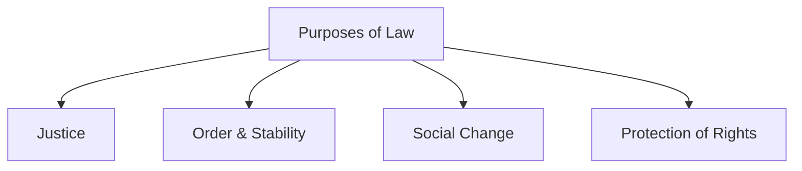

# 📘 Module 01: Introduction to Jurisprudence

🎚️ Difficulty: 🟢 Easy

---

### 🧠 Introduction

Jurisprudence is the "Grammar of Law." It is the study of the fundamental principles of legal systems. Unlike specific laws (like the IPC or Contract Act), Jurisprudence explores the *nature*, *source*, and *purpose* of law itself.

- **Meaning**: Derived from the Latin term *Jurisprudentia* (*Juris* = Law, *Prudentia* = Knowledge/Skill).
- **Context**: It is the "Eye of Law," providing the theoretical foundation for all legal subjects.
- **Importance**: It helps lawyers and judges interpret statutes and understand the social impact of legal rules.

---

### 📖 Main Content

#### 1. Definitions of Jurisprudence

Different jurists have defined Jurisprudence based on their schools of thought:

- **Ulpian**: "The observation of things human and divine; the knowledge of the just and the unjust."
- **Salmond**: "The science of the first principles of the civil law."
- **Austin**: "The philosophy of positive law."
- **Holland**: "The formal science of positive law."

🧠 **Mnemonic**: **U-S-A-H** (Ulpian, Salmond, Austin, Holland) - The "USA-H" of Jurisprudence definitions.

#### 2. Nature and Utility of Jurisprudence

- **Nature**: It is a *formal* science, not a *material* science. It deals with the structure and concepts of law rather than the specific rules of a particular country.
- **Utility**:
  - It sharpens the logical technique of lawyers.
  - It helps in the interpretation of laws.
  - It provides a bridge between law and other social sciences (Sociology, Ethics).

#### 3. Characteristics and Purposes of Law

Law is a set of rules created and enforced by social or governmental institutions to regulate behavior.

**Purposes of Law**:
1.  **Justice**: To ensure fairness and equity.
2.  **Order**: To maintain peace and stability in society.
3.  **Social Control**: To regulate human conduct.
4.  **Protection of Rights**: To safeguard individual liberties.

📐 **Diagram: Purposes of Law**

#### 4. Classification of Law

Law can be classified into several categories:
- **Public Law vs. Private Law**: Public law deals with the state (Constitutional, Administrative, Criminal), while Private law deals with individuals (Contract, Tort, Property).
- **Substantive Law vs. Procedural Law**: Substantive law defines rights and duties (IPC), while Procedural law defines the method of enforcement (CrPC).
- **International Law vs. Municipal Law**: International law governs relations between states, while Municipal law is the internal law of a state.

#### 5. Relationship between Law and Morality

Historically, law and morality were considered the same (e.g., Dharma). However, modern Jurisprudence distinguishes them:
- **Law**: Enforced by the state, objective, and has external sanctions.
- **Morality**: Enforced by conscience, subjective, and has internal sanctions.
- **Intersection**: Most laws have a moral foundation (e.g., "Thou shalt not kill" is both a moral and legal rule).

---

### ⚖️ Case Laws

- **Queen v. Dudley and Stephens (1884)**: Explored the conflict between law and morality in a case of necessity (cannibalism at sea). The court held that necessity is no defense to murder, emphasizing that law must uphold moral standards even in extreme cases.

---

### 🧾 Conclusion

Module 01 sets the stage for the entire subject. It teaches us that law is not just a collection of rules but a dynamic system rooted in philosophy, logic, and social needs.

---

### 🧠 Memorisation Toolkit

#### 🧩 Mnemonics
- **USA-H**: Ulpian (Divine), Salmond (Civil), Austin (Positive Philosophy), Holland (Formal Science).

#### ⚡ Quick Revision Points
- Jurisprudence = Knowledge of Law.
- It is a "Formal Science."
- Law vs Morality: External vs Internal sanctions.
- Classification: Public/Private, Substantive/Procedural.
