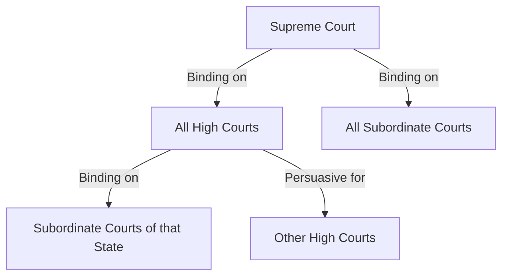

# 📘 Module 02: Sources of Law

🎚️ Difficulty: 🟡 Medium

---

### 🧠 Introduction

Where does law come from? In Jurisprudence, "Sources of Law" refers to the origins, authorities, and processes through which legal rules are created. Understanding these sources is crucial for determining the validity and hierarchy of laws.

---

### 📖 Main Content

#### 1. Custom

Custom is the oldest source of law. It consists of established patterns of behavior that can be objectively verified within a particular social setting.

**Essential Conditions for a Valid Custom**:
1.  **Antiquity**: It must be ancient (immemorial).
2.  **Continuity**: It must have been practiced without interruption.
3.  **Reasonableness**: It must not be contrary to justice or public policy.
4.  **Certainty**: It must be clear and unambiguous.
5.  **Compulsory Observance**: It must be followed as a right, not as a choice.

🧠 **Mnemonic**: **A-C-R-C-C** (Antiquity, Continuity, Reasonableness, Certainty, Compulsory).

**Concept of Volkgeist (Savigny)**:
Savigny, a leader of the Historical School, argued that law is not made by the state but grows out of the "spirit of the people" (*Volkgeist*). Custom is the primary evidence of this spirit.

#### 2. Legislation

Legislation is the "making of law" by a formal authority (Parliament/Legislature).

- **Supreme Legislation**: Enacted by the sovereign power (Parliament).
- **Subordinate Legislation**: Enacted by authorities other than the sovereign (e.g., Municipal rules, Executive regulations).

**Merits vs. Demerits**:
- **Merits**: Certainty, clarity, prospectivity (usually), and ease of change.
- **Demerits**: Can be rigid, may not reflect social needs if passed hastily.

#### 3. Precedent

Precedent refers to previous court decisions that serve as an authority for deciding subsequent cases with similar facts.

**Key Concepts**:
- **Doctrine of Stare Decisis**: "To stand by things decided." It ensures consistency and predictability.
- **Article 141 of the Constitution**: Law declared by the Supreme Court is binding on all courts in India.
- **Ratio Decidendi**: The "reason for the decision." This is the binding part of the judgment.
- **Obiter Dicta**: "Things said by the way." These are remarks not essential to the decision and are not binding (though persuasive).
- **Prospective Overruling**: A doctrine where the court overrules a previous decision but applies the new rule only to future cases (e.g., *Golaknath* case).

📐 **Diagram: Hierarchy of Binding Precedents in India**

#### 4. Juristic Writings

Writings of eminent legal scholars and thinkers. While not binding, they are highly persuasive in interpreting complex legal issues where statutes or precedents are silent.

---

### ⚖️ Case Laws

- **S.P. Gupta v. Union of India (1981)**: Discussed the importance of judicial interpretation and the role of the judiciary in a democracy.
- **Bengal Immunity Co. v. State of Bihar**: Held that the Supreme Court is not bound by its own previous decisions and can overrule them if necessary for the public good.

---

### 🧾 Conclusion

Sources of law provide the raw material for the legal system. While Custom was dominant in ancient times, Legislation and Precedent are the primary sources in modern democratic states like India.

---

### 🧠 Memorisation Toolkit

#### 🧩 Mnemonics
- **A-C-R-C-C**: Antiquity, Continuity, Reasonableness, Certainty, Compulsory (Essentials of Custom).
- **R-O**: Ratio (Binding) vs Obiter (Persuasive).

#### ⚡ Quick Revision Points
- Custom = Oldest source.
- Legislation = Law made by Parliament.
- Precedent = Judge-made law (Art 141).
- Ratio Decidendi = The binding logic.
- Volkgeist = Spirit of the people.
