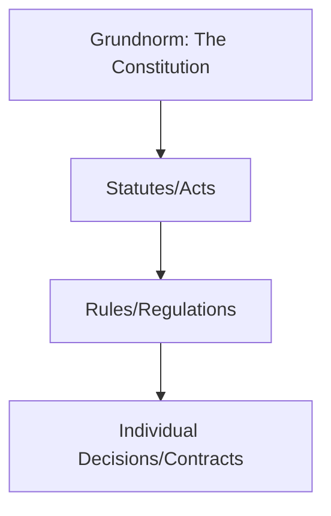

# 📘 Module 04: Legal Positivism

🎚️ Difficulty: 🔴 Hard

---

### 🧠 Introduction

Legal Positivism is the school of thought that treats law as it *is* (Positum), not as it *ought* to be. It separates law from morality.

- **Core Idea**: Law is a man-made construct, valid if it is created by a recognized authority through a recognized process.
- **Context**: It emerged as a reaction to the "vague" and "subjective" nature of Natural Law.

---

### 📖 Main Content

#### 1. Bentham and Austin: The Command Theory

- **Jeremy Bentham**: The "Father of English Jurisprudence." He advocated for **Utilitarianism** ("Greatest happiness of the greatest number"). He viewed law as an instrument of social reform.
- **John Austin**: Defined law as the **Command of the Sovereign backed by Sanction**.
  - **Elements of Law**:
    1.  **Command**: An order.
    2.  **Sovereign**: A person or body that is habitually obeyed and obeys no one else.
    3.  **Sanction**: Punishment for disobedience.
    4.  **Duty**: Obligation to follow the command.

🧠 **Mnemonic**: **C-S-S-D** (Command, Sovereign, Sanction, Duty).

#### 2. H.L.A. Hart: The Concept of Law

Hart criticized Austin's "Gunman Situation" (law is more than just a threat). He viewed law as a system of **Rules**.

- **Primary Rules**: Rules that impose duties (e.g., Criminal law).
- **Secondary Rules**: Rules about rules (how to change, adjudicate, or recognize primary rules).
  - **Rule of Recognition**: The ultimate rule that validates all other rules in a system (e.g., the Constitution).

#### 3. Hans Kelsen: Pure Theory of Law

Kelsen wanted to create a "science of law" free from ethics, politics, or sociology.

- **Normative Science**: Law is a system of "Oughts" (Norms).
- **Grundnorm**: The "Basic Norm" from which all other norms derive their validity. It is the starting point of the legal hierarchy.
- **Hierarchy of Norms**: A pyramid structure where each norm is validated by a higher norm, ending at the Grundnorm.

📐 **Diagram: Kelsen's Pyramid of Norms**

---

### ⚖️ Case Laws

- **State of Rajasthan v. Union of India**: Discussed the nature of the Grundnorm in the Indian context, identifying the Constitution as the ultimate source of legal validity.

---

### 🧾 Conclusion

Legal Positivism provides clarity and certainty. By focusing on the "is" of law, it allows for a systematic and objective study of legal structures, though it is often criticized for ignoring the "moral" soul of justice.

---

### 🧠 Memorisation Toolkit

#### 🧩 Mnemonics
- **C-S-S-D**: Austin's Law (Command, Sovereign, Sanction, Duty).
- **P-S**: Hart's Rules (Primary + Secondary).

#### ⚡ Quick Revision Points
- Positivism = Law as it *is*.
- Austin: Law is a command.
- Hart: Law is a union of primary and secondary rules.
- Kelsen: Pure Theory and Grundnorm.
- Utilitarianism: Bentham's "Greatest Happiness."
