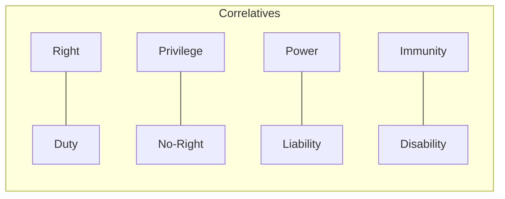

# 📘 Module 06: Concept of Person, Right and Duties

🎚️ Difficulty: 🟡 Medium

---

### 🧠 Introduction

In law, a "Person" is not just a human being. It is any entity that the law recognizes as having rights and duties. Similarly, "Rights" and "Duties" are the fundamental units of legal relationships.

---

### 📖 Main Content

#### 1. Nature of Personality

- **Natural Persons**: Human beings.
- **Legal/Juridical Persons**: Entities treated as persons by the law (e.g., Corporations, Idols, Trade Unions).

**Legal Status of Special Entities**:
- **Lower Animals**: Not legal persons. They are objects of rights, not subjects.
- **Dead Persons**: Have limited rights (e.g., right to decent burial, protection of reputation/libel).
- **Unborn Persons**: Have rights (e.g., can inherit property under the Transfer of Property Act).

**Theories of Legal Personality**:
1.  **Fiction Theory**: A corporation is a mere fiction created by the state.
2.  **Realist Theory**: A corporation is a real, living organism with its own will.
3.  **Bracket Theory**: Personality is just a "bracket" around the members to simplify legal dealings.

#### 2. Rights and Duties

- **Duty**: An obligatory act or omission.
- **Right**: An interest recognized and protected by the law.

**Hohfeldian Classification of Legal Rights**:
Wesley Hohfeld identified that the word "Right" is used loosely. He broke it down into four pairs of **Jural Correlatives** (if I have X, you have Y) and **Jural Opposites** (if I have X, I don't have Y).

| Jural Correlatives | Jural Opposites |
| :--- | :--- |
| Right ↔ Duty | Right ↔ No-Right |
| Privilege ↔ No-Right | Privilege ↔ Duty |
| Power ↔ Liability | Power ↔ Disability |
| Immunity ↔ Disability | Immunity ↔ Liability |

🧠 **Mnemonic**: **R-P-P-I** (Right, Privilege, Power, Immunity).

**Kinds of Legal Rights**:
- **Perfect vs. Imperfect**: Perfect rights have a remedy; imperfect rights do not (e.g., time-barred debt).
- **Right in Rem vs. Right in Personam**: In Rem is against the whole world (e.g., property); In Personam is against a specific person (e.g., contract).
- **Proprietary vs. Personal**: Proprietary relates to wealth/property; Personal relates to status/body.

📐 **Diagram: Hohfeldian Table**

---

### ⚖️ Case Laws

- **Salomon v. Salomon & Co. Ltd. (1897)**: Established the principle of "Separate Legal Entity" for corporations. A company is a separate person from its shareholders.
- **Shiromani Gurdwara Parbandhak Committee v. Som Nath Dass**: Held that the Guru Granth Sahib (Holy Book) is a legal person capable of holding property.

---

### 🧾 Conclusion

The concepts of personality, rights, and duties form the "legal geometry" of society. They define who can participate in the legal system and how they must interact with one another.

---

### 🧠 Memorisation Toolkit

#### 🧩 Mnemonics
- **R-P-P-I**: Right, Privilege, Power, Immunity (Hohfeld).
- **F-R-B**: Fiction, Realist, Bracket (Theories of Personality).

#### ⚡ Quick Revision Points
- Legal Person = Subject of rights/duties.
- Unborn child = Can inherit.
- Right in Rem = Against the world.
- Ratio: Right ↔ Duty.
- Salomon Case: Separate Legal Entity.
