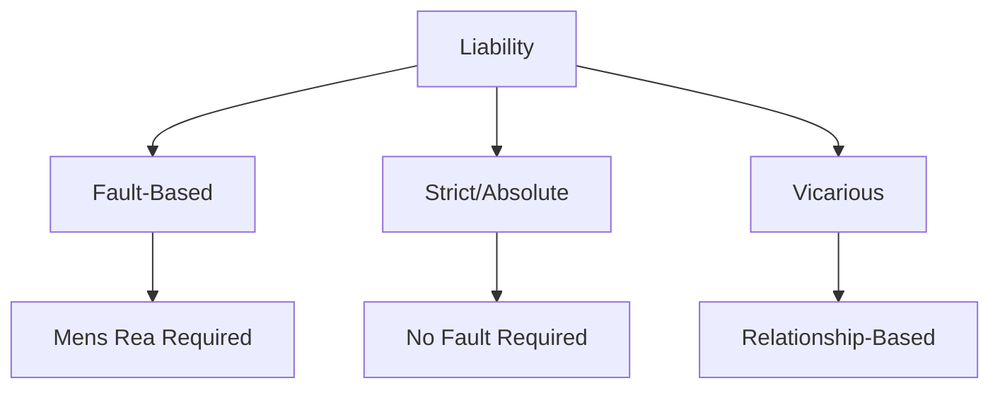

# 📘 Module 08: Obligations and Liability

🎚️ Difficulty: 🟡 Medium

---

### 🧠 Introduction

Liability is the "bond of legal necessity" that exists between the wrongdoer and the remedy of the wrong. Obligations are the duties that one person owes to another.

---

### 📖 Main Content

#### 1. Obligations

An obligation is a legal tie (*vinculum juris*) by which one person is bound to perform something for another.

**Sources of Obligations**:
1.  **Contractual**: Arising from agreements (e.g., to pay for goods).
2.  **Delictual/Tortious**: Arising from civil wrongs (e.g., to pay damages for negligence).
3.  **Quasi-Contractual**: Arising from circumstances where one person is unjustly enriched at the expense of another.
4.  **Innominate**: Other miscellaneous sources.

#### 2. Liability

Liability arises when a legal duty is breached.

**Kinds of Liability**:
- **Civil vs. Criminal**: Civil liability results in damages/compensation; Criminal liability results in punishment (fine/imprisonment).
- **Remedial vs. Penal**: Remedial liability forces the defendant to do what they should have done; Penal liability punishes the defendant for what they did.

**General Conditions of Liability**:
- **Damnum Sine Injuria**: Damage without injury (no liability).
- **Injuria Sine Damnum**: Injury without damage (liability exists, e.g., trespass).
- **Mens Rea**: "Guilty mind." Essential for most criminal liabilities.

**Theories of Liability**:
1.  **Strict Liability**: Liability without fault. If you bring something dangerous onto your land and it escapes, you are liable regardless of negligence (*Rylands v. Fletcher*).
2.  **Absolute Liability**: An Indian innovation (*MC Mehta v. Union of India*). For hazardous industries, liability is absolute and has no exceptions (unlike Strict Liability).
3.  **Vicarious Liability**: Liability for the acts of another (e.g., Master for Servant, Principal for Agent).

📐 **Diagram: Types of Liability**

---

### ⚖️ Case Laws

- **Rylands v. Fletcher (1868)**: Established the rule of Strict Liability.
- **M.C. Mehta v. Union of India (Oleum Gas Leak Case)**: Established the rule of Absolute Liability in India.
- **Donoghue v. Stevenson**: The "Snail in the Bottle" case. Established the modern law of negligence and the "Neighbor Principle."

---

### 🧾 Conclusion

Liability ensures accountability. Whether through fault-based systems or strict liability for dangerous activities, the law seeks to balance individual freedom with the protection of others from harm.

---

### 🧠 Memorisation Toolkit

#### 🧩 Mnemonics
- **S-A-V**: Strict, Absolute, Vicarious (Special Types of Liability).
- **D-S-I vs I-S-D**: Damnum Sine Injuria vs Injuria Sine Damnum.

#### ⚡ Quick Revision Points
- Obligation = Vinculum Juris (Legal Bond).
- Mens Rea = Guilty Mind.
- Strict Liability: Rylands v. Fletcher.
- Absolute Liability: M.C. Mehta (No exceptions).
- Vicarious Liability: Qui facit per alium facit per se (He who acts through another acts himself).
