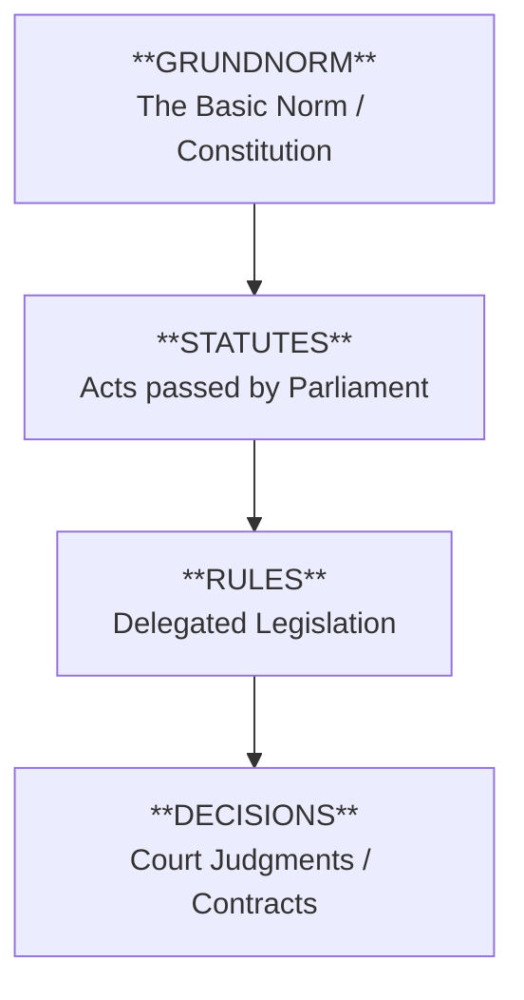
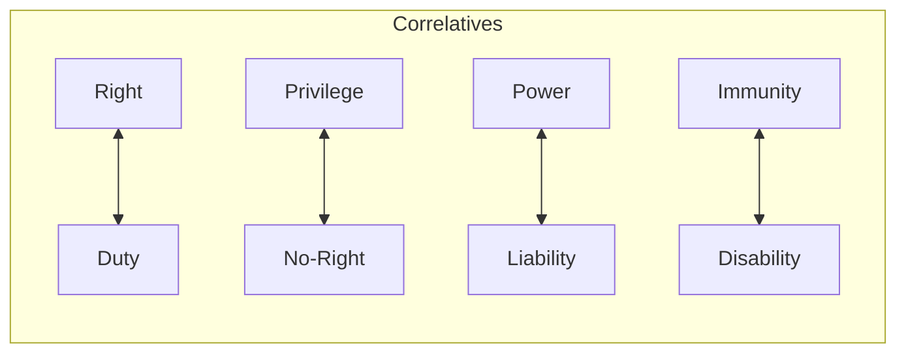
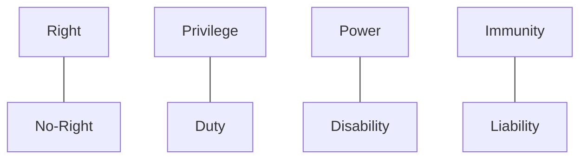
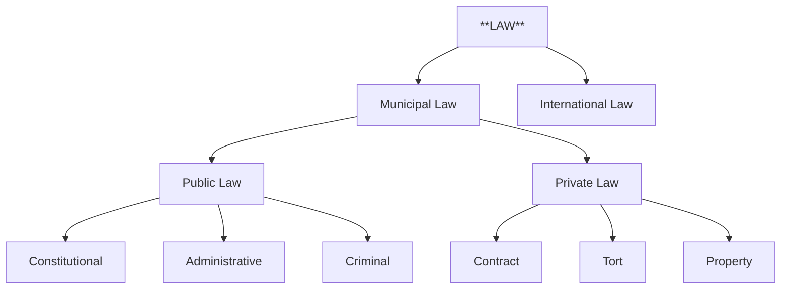

# 📐 Flowcharts and Diagrams - Jurisprudence

## 1. Kelsen's Hierarchy of Norms (The Pyramid)

This diagram illustrates how laws derive their validity from a single "Basic Norm."

💡 **Exam Tip**: Draw this pyramid when explaining Kelsen's "Pure Theory of Law."

---

## 2. Hohfeldian Jural Relations

Hohfeld's system explains the precise relationship between legal concepts.

### Jural Correlatives (Vertical Pairs)
If A has a Right, B has a Duty.

### Jural Opposites (Diagonal Pairs)
If A has a Right, A cannot have a No-Right.

💡 **Exam Tip**: This is high-scoring for 10-mark questions on "Rights and Duties."

---

## 3. Classification of Law

💡 **Exam Tip**: Use this to show the "Generous Frontiers" of Jurisprudence.
