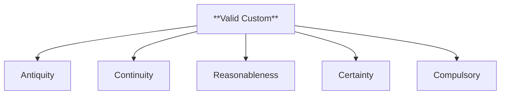

# Q01: Essentials of a Valid Custom

## 📝 Question
Explain the essential conditions for a valid custom as a source of law. (10 Marks)

---

## 🧾 MODEL ANSWER

### 1. 🧾 Answer Synopsis
- **Introduction**: Custom as the oldest source of law.
- **Essentials**: Antiquity, Continuity, Reasonableness, Certainty, Compulsory.
- **Conclusion**: Custom must align with public policy.

### 2. 🧠 Introduction
Custom is a rule of conduct which has been followed by a community for a long time. In Jurisprudence, for a custom to be recognized as a valid source of law, it must satisfy certain legal tests.

### 3. 📖 Body
A valid custom must possess the following characteristics:

1.  **Antiquity**: The custom must be "immemorial." In English law, this means it must have existed since 1189 AD. In India, the court looks for a "long period of time."
2.  **Continuity**: The practice must have been continuous and uninterrupted. Any break in the practice destroys its validity.
3.  **Reasonableness**: The custom must not be contrary to justice, equity, or good conscience. It should not be irrational or harmful to society.
4.  **Certainty**: The custom must be clear, definite, and unambiguous. A vague practice cannot be a law.
5.  **Compulsory Observance**: It must be followed as a matter of right (*Opinio Juris*), not as a matter of grace or choice.
6.  **Consistency**: It must not conflict with other established customs or statutes.
7.  **Public Policy**: It must not be immoral or opposed to public policy.

### 4. ⚖️ Case Laws
- **Collector of Madura v. Moottoo Ramalinga**: The Privy Council held that "clear proof of usage will outweigh the written text of the law."
- **Gopi v. Musammat Hira**: Emphasized that a custom must be ancient and certain to be binding.

### 5. 📊 Diagram: Essentials of Custom

### 6. 🧾 Conclusion
Custom is the foundation of many legal systems. However, in modern times, it is subordinate to Legislation. A custom is valid only as long as it does not violate the law of the land or the basic principles of humanity.
