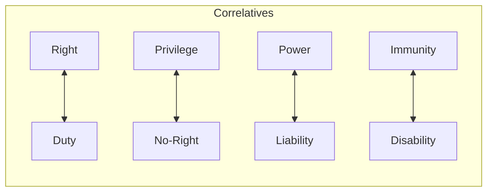

# Q03: Hohfeldian Classification of Rights

## 📝 Question
Explain Hohfeld's classification of legal rights with suitable examples. (10 Marks)

---

## 🧾 MODEL ANSWER

### 1. 🧾 Answer Synopsis
- **Introduction**: Wesley Hohfeld's analysis of "Right."
- **Categories**: Right, Privilege, Power, Immunity (**R-P-P-I**).
- **Relations**: Correlatives and Opposites.

### 2. 🧠 Introduction
Wesley Hohfeld, an American jurist, argued that the word "Right" is used too broadly. He identified four distinct legal concepts, which he called "Jural Relations."

### 3. 📖 Body
Hohfeld's four pairs of relations are:

1.  **Right ↔ Duty**: If I have a right to my property, you have a duty not to trespass. (Correlatives).
2.  **Privilege ↔ No-Right**: I have a privilege to walk on my own land; you have no-right to stop me. (Correlatives).
3.  **Power ↔ Liability**: A judge has the power to pass a sentence; the prisoner is under a liability to receive it. (Correlatives).
4.  **Immunity ↔ Disability**: An MP has immunity from arrest in certain cases; the police have a disability to arrest them. (Correlatives).

**Jural Opposites**:
- Right vs No-Right.
- Privilege vs Duty.
- Power vs Disability.
- Immunity vs Liability.

### 4. 📊 Diagram: Hohfeld's Table

### 5. 🧾 Conclusion
Hohfeld's analysis is essential for legal precision. It helps lawyers and judges identify exactly what kind of "right" is being discussed and who is affected by it.
