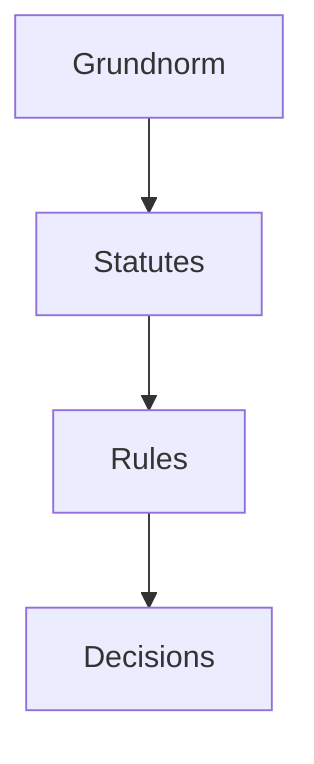

# Q02: Kelsen's Pure Theory of Law

## 📝 Question
Discuss Hans Kelsen's Pure Theory of Law and the concept of 'Grundnorm'. (15 Marks)

---

## 🧾 MODEL ANSWER

### 1. 🧾 Answer Synopsis
- **Introduction**: Normative science, "Pure" theory.
- **Grundnorm**: The Basic Norm.
- **Hierarchy**: The Pyramid of Norms.
- **Conclusion**: Scientific approach to law.

### 2. 🧠 Introduction
Hans Kelsen, a 20th-century jurist, sought to create a "Pure Theory" of law—a theory free from ethics, sociology, history, or politics. He viewed law as a system of **Norms** (Oughts).

### 📖 Body
#### A. The "Pure" Nature
Kelsen argued that law should be studied as a science. It is "pure" because it excludes all non-legal elements. A law is valid not because it is "good" or "just," but because it is derived from a higher norm.

#### B. The Grundnorm (Basic Norm)
The **Grundnorm** is the starting point of the legal system. It is not created by any other norm; it is "presumed" to be valid.
- It is the "fountainhead" of all legal validity.
- In India, the **Constitution** is considered the Grundnorm.
- If the Grundnorm changes (e.g., through a revolution), the entire legal system changes.

#### C. The Hierarchy of Norms (Stufenbau)
Kelsen visualized law as a pyramid:
1.  **Grundnorm** (Top)
2.  **Statutes/Acts**
3.  **Rules/Regulations**
4.  **Individual Acts** (Contracts, Judgments)

#### D. Criticisms
- It is impossible to separate law from social and moral values.
- The concept of Grundnorm is vague—who decides what the basic norm is?
- It ignores the "content" of law and focuses only on the "form."

### 4. ⚖️ Case Laws
- **State of Rajasthan v. Union of India**: The Supreme Court discussed the Grundnorm concept in the context of the Indian Constitution.

### 5. 📊 Diagram: Kelsen's Pyramid

### 6. 🧾 Conclusion
Kelsen's theory provides a highly logical and structural understanding of the legal system. It is particularly useful in understanding the validity of laws in modern constitutional democracies.
