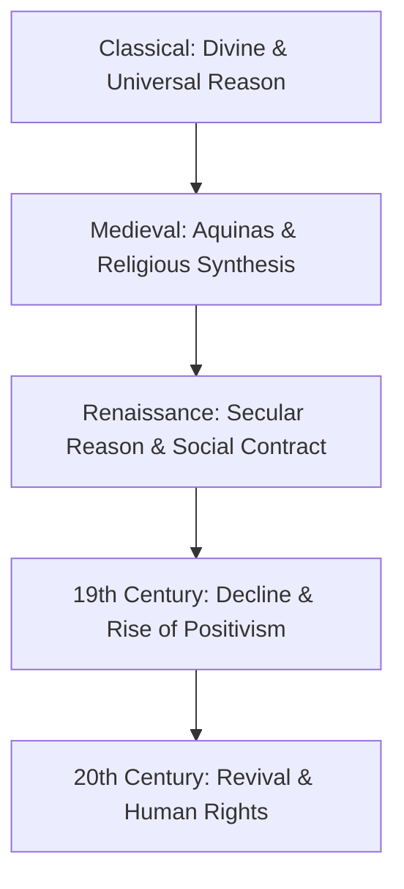
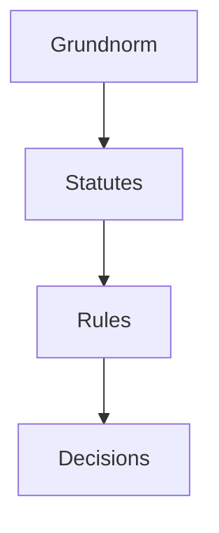
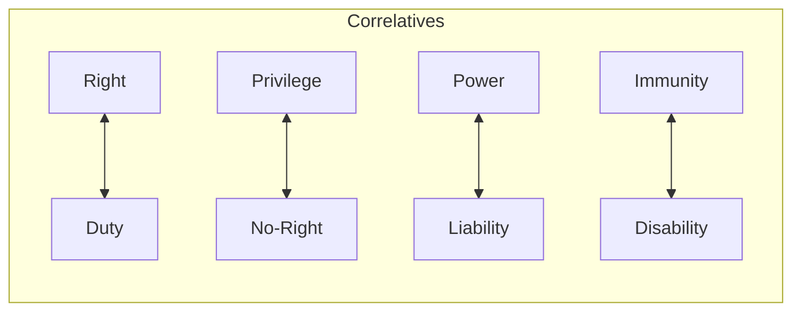
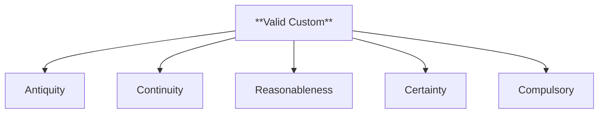

# 📘 Master Question Bank - Jurisprudence (LCC 0604)

This document contains the most probable questions for the SPPU Jurisprudence exam, sorted by probability and categorized by marks. All answers follow the **SPPU Topper-Style Model Answer Format**.

---

## 🔴 15-Mark Questions (Long Answers)

### Q01: Natural Law Theories
**Question**: Trace the evolution of Natural Law theories from the classical period to its modern revival. (15 Marks)

#### 1. 🧾 Answer Synopsis
- **Introduction**: Definition of Natural Law as a universal, moral "Higher Law."
- **Classical Period**: The foundation of reason (Plato, Aristotle) and the medieval synthesis (Aquinas).
- **Social Contract Period**: The secularization of Natural Law (Grotius) and the theories of Hobbes, Locke, and Rousseau.
- **Decline (19th Century)**: The rise of Legal Positivism and the scientific method.
- **Modern Revival (20th Century)**: Post-WWII return to morality (Fuller, Finnis, Hart).
- **Conclusion**: Integration into modern Human Rights and Constitutional Law.

#### 2. 🧠 Introduction
Natural Law is the philosophy that certain rights, values, and ethical standards are inherent by virtue of human nature and can be universally understood through human reason. It is often called the "Higher Law" or "Divine Law" because it serves as a moral benchmark for man-made (positive) laws. The core principle of Natural Law is that a law which is fundamentally unjust or contrary to reason is not a valid law (*Lex iniusta non est lex*).

#### 3. 📖 Body
The evolution of Natural Law is a journey from divine origins to secular reason, and finally to modern human rights.

**A. Ancient and Classical Period (Greek & Roman)**
During this period, Natural Law was seen as a part of the natural order of the universe.
- **Plato**: Argued that "Ideal Justice" exists in a higher realm, and human laws are but shadows of this ideal.
- **Aristotle**: Known as the father of Natural Law, he distinguished between **Natural Justice** (which is universal and unchanging) and **Conventional Justice** (which is created by the state for specific needs).
- **St. Thomas Aquinas (Medieval Period)**: He provided the most comprehensive medieval synthesis of reason and faith. He classified law into four categories:
  1. **Eternal Law**: God's plan for the universe.
  2. **Natural Law**: Human participation in the eternal law through the gift of reason.
  3. **Divine Law**: Revealed through scriptures.
  4. **Human Law**: Man-made laws, which must conform to Natural Law to be valid.

**B. The Renaissance and Social Contract Period**
As society shifted away from the Church, Natural Law became secularized—based on human reason rather than divine command.
- **Hugo Grotius**: He argued that Natural Law would exist even if God did not exist (*etiamsi daremus*), making it a product of pure human reason.
- **Thomas Hobbes**: Viewed man as inherently selfish. He used Natural Law to justify an absolute sovereign (*Leviathan*) as the only way to ensure security and peace.
- **John Locke**: Proposed that man has inalienable natural rights to **Life, Liberty, and Property**. The social contract is an agreement to protect these rights; if the state fails, the people have a right to revolt.
- **Jean-Jacques Rousseau**: Believed in the **General Will**. The social contract is an agreement where individuals surrender their rights to the community to achieve true freedom through collective self-rule.

**C. The Decline (19th Century)**
With the rise of the Industrial Revolution and the scientific method, Natural Law was attacked for being "unscientific" and "vague."
- **Legal Positivism**: Thinkers like Austin and Bentham argued that law is simply the command of a sovereign. Bentham famously called natural rights "nonsense upon stilts."

**D. The Modern Revival (20th Century)**
The atrocities of World War II and the Nazi regime proved that "law as it is" (Positivism) could lead to total tyranny. This led to a revival of Natural Law.
- **Lon Fuller**: Proposed the **Internal Morality of Law**. He argued that for a legal system to be valid, it must follow eight procedural principles (e.g., laws must be clear, public, and not retroactive).
- **John Finnis**: Restated Natural Law in modern terms, identifying **7 Basic Human Goods** (Life, Knowledge, Play, etc.) that are essential for human flourishing.
- **H.L.A. Hart**: Even as a positivist, he admitted a **"Minimum Content of Natural Law"** based on the fact that humans are vulnerable and need certain rules to survive together.

#### 4. ⚖️ Case Laws
- **Nuremberg Trials**: Nazi officials were punished for "crimes against humanity" despite their actions being legal under German law at the time. This was a triumph of Natural Law over extreme Positivism.
- **A.K. Gopalan v. State of Madras**: In the Indian context, this case initiated the debate between "procedure established by law" and "due process," eventually leading to the recognition of Natural Justice as a part of Article 21.

#### 5. 📊 Flowchart: Evolution of Natural Law

#### 6. 🧾 Conclusion
Natural Law has evolved from a religious doctrine to a secular philosophy of human rights. Today, it lives on through the "Basic Structure" doctrine in India and International Human Rights Law, ensuring that the state's power is always limited by the higher principles of justice and human dignity.

---

### Q02: Kelsen's Pure Theory of Law
**Question**: Discuss Hans Kelsen's Pure Theory of Law and the concept of 'Grundnorm'. (15 Marks)

#### 1. 🧾 Answer Synopsis
- **Introduction**: Normative science, "Pure" theory.
- **Grundnorm**: The Basic Norm.
- **Hierarchy**: The Pyramid of Norms.
- **Conclusion**: Scientific approach to law.

#### 2. 🧠 Introduction
Hans Kelsen, a 20th-century jurist, sought to create a "Pure Theory" of law—a theory free from ethics, sociology, history, or politics. He viewed law as a system of **Norms** (Oughts).

#### 3. 📖 Body
**A. The "Pure" Nature**
Kelsen argued that law should be studied as a science. It is "pure" because it excludes all non-legal elements. A law is valid not because it is "good" or "just," but because it is derived from a higher norm.

**B. The Grundnorm (Basic Norm)**
The **Grundnorm** is the starting point of the legal system. It is not created by any other norm; it is "presumed" to be valid.
- It is the "fountainhead" of all legal validity.
- In India, the **Constitution** is considered the Grundnorm.
- If the Grundnorm changes (e.g., through a revolution), the entire legal system changes.

**C. The Hierarchy of Norms (Stufenbau)**
Kelsen visualized law as a pyramid:
1.  **Grundnorm** (Top)
2.  **Statutes/Acts**
3.  **Rules/Regulations**
4.  **Individual Acts** (Contracts, Judgments)

**D. Criticisms**
- It is impossible to separate law from social and moral values.
- The concept of Grundnorm is vague—who decides what the basic norm is?
- It ignores the "content" of law and focuses only on the "form."

#### 4. ⚖️ Case Laws
- **State of Rajasthan v. Union of India**: The Supreme Court discussed the Grundnorm concept in the context of the Indian Constitution.

#### 5. 📊 Diagram: Kelsen's Pyramid

#### 6. 🧾 Conclusion
Kelsen's theory provides a highly logical and structural understanding of the legal system. It is particularly useful in understanding the validity of laws in modern constitutional democracies.

---

### Q03: Precedent as a Source of Law
**Question**: Discuss Precedent as a source of law with special reference to Article 141 of the Constitution of India. (15 Marks)

#### 1. 🧾 Answer Synopsis
- **Introduction**: Judge-made law, *Stare Decisis*.
- **Article 141**: Binding nature of SC judgments.
- **Concepts**: Ratio Decidendi, Obiter Dicta, Prospective Overruling.
- **Conclusion**: Consistency and evolution.

#### 2. 🧠 Introduction
Precedent refers to the practice of following previous judicial decisions in similar cases. It is based on the doctrine of **Stare Decisis** ("To stand by things decided"). In India, Precedent is a primary source of law.

#### 3. 📖 Body
**A. Article 141 of the Constitution**
Article 141 states: "The law declared by the Supreme Court shall be binding on all courts within the territory of India."
- This ensures uniformity of law across the country.
- High Courts are bound by SC decisions, and Subordinate Courts are bound by both SC and their respective HC decisions.

**B. Ratio Decidendi vs Obiter Dicta**
- Only the **Ratio Decidendi** (the reason for the decision) is binding under Art 141.
- **Obiter Dicta** (remarks by the way) are not binding but have high persuasive value.

**C. Prospective Overruling**
The Supreme Court has the power to overrule its own previous decisions. In the **Golaknath** case, it introduced "Prospective Overruling," meaning the new rule applies only to future cases, not past ones.

**D. Merits and Demerits**
- **Merits**: Certainty, predictability, flexibility (judges can adapt law to new situations).
- **Demerits**: Can be rigid, depends on the quality of the judgment, can lead to complexity.

#### 4. ⚖️ Case Laws
- **Bengal Immunity Co. v. State of Bihar**: SC is not bound by its own decisions.
- **Union of India v. Raghubir Singh**: Discussed the importance of a larger bench in overruling a smaller bench.

#### 5. 🧾 Conclusion
Precedent is the "living" part of the law. While Legislation provides the skeleton, Precedent provides the flesh and blood, allowing the law to evolve with society.

---

### Q04: Liability: Strict, Absolute, and Vicarious
**Question**: Explain the theories of Strict, Absolute, and Vicarious Liability with landmark cases. (15 Marks)

#### 1. 🧾 Answer Synopsis
- **Strict**: Liability without fault (*Rylands*).
- **Absolute**: Indian innovation for hazardous industries (*M.C. Mehta*).
- **Vicarious**: Liability for another's acts (Master-Servant).
- **Conclusion**: Balancing interests.

#### 2. 🧠 Introduction
Liability is the legal bond that arises when a duty is breached. While liability is usually based on "fault" (negligence or intent), the law recognizes special cases where liability exists even without fault.

#### 3. 📖 Body
**A. Strict Liability**
Established in **Rylands v. Fletcher (1868)**.
- **Rule**: If a person brings something dangerous onto their land, and it escapes and causes damage, they are liable even if they were not negligent.
- **Exceptions**: Act of God, Plaintiff's own fault, Statutory authority.

**B. Absolute Liability**
Established in **M.C. Mehta v. Union of India (1987)**.
- **Rule**: For enterprises engaged in inherently dangerous or hazardous activities, liability is absolute.
- **Difference**: Unlike Strict Liability, there are **no exceptions**. It was created to address industrial disasters like the Bhopal Gas Leak.

**C. Vicarious Liability**
Liability of one person for the acts of another based on a relationship.
- **Master-Servant**: The master is liable for the torts committed by the servant in the course of employment.
- **Maxims**: *Respondeat Superior* (Let the superior answer) and *Qui facit per alium facit per se*.

#### 4. ⚖️ Case Laws
- **Rylands v. Fletcher**: Strict Liability.
- **M.C. Mehta v. Union of India**: Absolute Liability.
- **State of Rajasthan v. Vidhyawati**: Vicarious liability of the State for the acts of its driver.

#### 5. 🧾 Conclusion
These theories ensure that victims are compensated even when "fault" is hard to prove, especially in modern industrial and complex social settings.

---

### Q05: Schools of Jurisprudence: A Comparative Study
**Question**: Provide a comparative study of the Analytical, Historical, and Sociological schools of Jurisprudence. (15 Marks)

#### 1. 🧾 Answer Synopsis
- **Analytical**: Law as it is (Sovereign).
- **Historical**: Law as it was (Tradition).
- **Sociological**: Law as it does (Society).
- **Conclusion**: Synthesis of schools.

#### 2. 🧠 Introduction
Jurisprudence is divided into several "schools," each viewing law from a different perspective. The three most influential schools are the Analytical, Historical, and Sociological schools.

#### 3. 📖 Body
**A. Analytical School (Austin, Bentham, Hart)**
- **Focus**: The structure and logic of the legal system.
- **Source**: The Sovereign (State).
- **Method**: Analysis of existing rules.
- **Motto**: "Law is the command of the sovereign."

**B. Historical School (Savigny, Maine)**
- **Focus**: The origin and evolution of law.
- **Source**: Custom and the spirit of the people (Volkgeist).
- **Method**: Historical research.
- **Motto**: "Law is found, not made."

**C. Sociological School (Pound, Ihering)**
- **Focus**: The social function and impact of law.
- **Source**: Social needs and interests.
- **Method**: Functional analysis.
- **Motto**: "Law is a tool for social engineering."

**D. Comparison Table**

| Feature | Analytical | Historical | Sociological |
| :--- | :--- | :--- | :--- |
| **Origin** | State/Sovereign | Custom/Volkgeist | Social Interests |
| **Timeline** | Present (Is) | Past (Was) | Future (Function) |
| **Key Thinker** | Austin | Savigny | Pound |
| **Law is...** | A Command | A Growth | An Instrument |

#### 4. 🧾 Conclusion
None of these schools is complete on its own. Modern legal systems are a synthesis: they have the logic of the Analytical school, the roots of the Historical school, and the social purpose of the Sociological school.

---

## 🟠 10-Mark Questions (Medium Answers)

### Q02: Austin's Command Theory of Law
**Question**: Critically examine Austin's Command Theory of Law. (10 Marks)

#### 1. 🧾 Answer Synopsis
- **Introduction**: Analytical Positivism.
- **Elements**: Command, Sovereign, Sanction, Duty (**C-S-S-D**).
- **Criticism**: Gunman situation, ignores custom and international law.

#### 2. 🧠 Introduction
John Austin, the "Father of English Jurisprudence," defined law as the **"Command of the Sovereign backed by Sanction."** His theory is known as the Imperative Theory or Analytical Positivism.

#### 3. 📖 Body
Austin's theory rests on four pillars:
1.  **Command**: Law is an expression of desire by a superior to an inferior.
2.  **Sovereign**: The source of the command. A sovereign is someone who is habitually obeyed by the bulk of society and does not obey any other superior.
3.  **Sanction**: The evil or punishment that follows if the command is disobeyed.
4.  **Duty**: The obligation of the subject to obey the command.

**Criticisms**:
- **Gunman Situation**: H.L.A. Hart argued that Austin's theory makes no distinction between a law and a threat by a bank robber.
- **Ignores Custom**: Most laws (like personal laws) are rooted in custom, not commands.
- **International Law**: Austin dismissed International Law as "positive morality" because it lacks a sovereign.
- **Constitutional Law**: It doesn't explain how the sovereign itself is bound by law.

#### 4. 🧾 Conclusion
Despite its flaws, Austin's theory brought clarity and logic to legal study by separating law from morality. It remains the starting point for understanding modern legal structures.

---

### Q03: Hohfeldian Classification of Rights
**Question**: Explain Hohfeld's classification of legal rights with suitable examples. (10 Marks)

#### 1. 🧾 Answer Synopsis
- **Introduction**: Wesley Hohfeld's analysis of "Right."
- **Categories**: Right, Privilege, Power, Immunity (**R-P-P-I**).
- **Relations**: Correlatives and Opposites.

#### 2. 🧠 Introduction
Wesley Hohfeld, an American jurist, argued that the word "Right" is used too broadly. He identified four distinct legal concepts, which he called "Jural Relations."

#### 3. 📖 Body
Hohfeld's four pairs of relations are:

1.  **Right ↔ Duty**: If I have a right to my property, you have a duty not to trespass. (Correlatives).
2.  **Privilege ↔ No-Right**: I have a privilege to walk on my own land; you have no-right to stop me. (Correlatives).
3.  **Power ↔ Liability**: A judge has the power to pass a sentence; the prisoner is under a liability to receive it. (Correlatives).
4.  **Immunity ↔ Disability**: An MP has immunity from arrest in certain cases; the police have a disability to arrest them. (Correlatives).

**Jural Opposites**:
- Right vs No-Right.
- Privilege vs Duty.
- Power vs Disability.
- Immunity vs Liability.

#### 4. 📊 Diagram: Hohfeld's Table

#### 5. 🧾 Conclusion
Hohfeld's analysis is essential for legal precision. It helps lawyers and judges identify exactly what kind of "right" is being discussed and who is affected by it.

---

### Q04: Ownership vs Possession
**Question**: Compare and contrast the concepts of Ownership and Possession. (10 Marks)

#### 1. 🧾 Answer Synopsis
- **Ownership**: De Jure (Legal right).
- **Possession**: De Facto (Physical fact).
- **Key Differences**: Duration, Proof, Remedies.

#### 2. 🧠 Introduction
Ownership and Possession are the two most fundamental concepts in property law. While they often go together, they can exist independently.

#### 3. 📖 Body
1.  **Nature**: Ownership is a right (*De Jure*); Possession is a fact (*De Facto*).
2.  **Elements**: Possession requires **Corpus** (physical control) and **Animus** (intention). Ownership requires a valid **Title**.
3.  **Duration**: Ownership is permanent; Possession is temporary and can be lost easily.
4.  **Protection**: Ownership is protected by proprietary remedies (e.g., suit for title). Possession is protected by possessory remedies (e.g., Section 6 of the Specific Relief Act).
5.  **Transfer**: Ownership is transferred through legal deeds (Sale, Gift). Possession is transferred through physical delivery.

#### 4. ⚖️ Case Laws
- **Armory v. Delamirie**: Possession is protected even against those who have no title.

#### 5. 🧾 Conclusion
Possession is the "prima facie" evidence of ownership. The law protects possession to maintain peace, but ownership is the ultimate legal goal.

---

### Q01: Essentials of a Valid Custom
**Question**: Explain the essential conditions for a valid custom as a source of law. (10 Marks)

#### 1. 🧾 Answer Synopsis
- **Introduction**: Custom as the oldest source of law.
- **Essentials**: Antiquity, Continuity, Reasonableness, Certainty, Compulsory.
- **Conclusion**: Custom must align with public policy.

#### 2. 🧠 Introduction
Custom is a rule of conduct which has been followed by a community for a long time. In Jurisprudence, for a custom to be recognized as a valid source of law, it must satisfy certain legal tests.

#### 3. 📖 Body
A valid custom must possess the following characteristics:

1.  **Antiquity**: The custom must be "immemorial." In English law, this means it must have existed since 1189 AD. In India, the court looks for a "long period of time."
2.  **Continuity**: The practice must have been continuous and uninterrupted. Any break in the practice destroys its validity.
3.  **Reasonableness**: The custom must not be contrary to justice, equity, or good conscience. It should not be irrational or harmful to society.
4.  **Certainty**: The custom must be clear, definite, and unambiguous. A vague practice cannot be a law.
5.  **Compulsory Observance**: It must be followed as a matter of right (*Opinio Juris*), not as a matter of grace or choice.
6.  **Consistency**: It must not conflict with other established customs or statutes.
7.  **Public Policy**: It must not be immoral or opposed to public policy.

#### 4. ⚖️ Case Laws
- **Collector of Madura v. Moottoo Ramalinga**: The Privy Council held that "clear proof of usage will outweigh the written text of the law."
- **Gopi v. Musammat Hira**: Emphasized that a custom must be ancient and certain to be binding.

#### 5. 📊 Diagram: Essentials of Custom

#### 6. 🧾 Conclusion
Custom is the foundation of many legal systems. However, in modern times, it is subordinate to Legislation. A custom is valid only as long as it does not violate the law of the land or the basic principles of humanity.

---

### Q05: Theories of Legal Personality
**Question**: Discuss the various theories of legal personality. (10 Marks)

#### 1. 🧾 Answer Synopsis
- **Introduction**: Legal fiction of personality.
- **Theories**: Fiction, Realist, Bracket, Concession, Purpose.
- **Conclusion**: Practical utility.

#### 2. 🧠 Introduction
Legal personality is an artificial creation of the law. Various theories have been propounded to explain how a non-human entity (like a company) can have rights and duties.

#### 3. 📖 Body
1.  **Fiction Theory (Savigny & Salmond)**: A corporation is a mere fiction. It has no real will or soul. It exists only in the eyes of the law.
2.  **Realist Theory (Gierke)**: A corporation is a real, living organism. It has a collective will and a life of its own, independent of its members.
3.  **Bracket Theory (Ihering)**: Personality is just a "bracket" put around the members of a group to simplify legal dealings. The law "looks through" the bracket to the real people inside.
4.  **Concession Theory**: Personality is a "concession" or gift from the State. No entity can be a person without the State's permission.
5.  **Purpose Theory**: Personality is attached to property or a fund that is dedicated to a specific "purpose" (e.g., a charitable trust).

#### 4. ⚖️ Case Laws
- **Salomon v. Salomon**: Reflects the Fiction and Concession theories.

#### 5. 🧾 Conclusion
No single theory is perfect. The law uses different theories depending on the situation to ensure that corporations and other entities can function effectively in society.

---

## 🟡 5-Mark Questions (Short Notes)

### Q05: Social Engineering
**Question**: Write a short note on Roscoe Pound's theory of 'Social Engineering'. (5 Marks)

#### 1. 🧾 Answer Synopsis
- **School**: Sociological School.
- **Meaning**: Balancing competing interests.
- **Goal**: Maximum satisfaction with minimum friction.

#### 2. 🧠 Introduction
Roscoe Pound, an American jurist, viewed law as a tool for **Social Engineering**. He believed that the task of law is to build a structure of society where all competing interests are balanced.

#### 3. 📖 Body
- **Concept**: Just as an engineer builds a bridge to withstand pressure, a "social engineer" (the jurist/legislator) builds a legal system to withstand social pressure.
- **Interests to be Balanced**:
  1.  **Individual Interests**: Privacy, property, freedom of belief.
  2.  **Public Interests**: State security, administration of justice.
  3.  **Social Interests**: General health, peace, morality.
- **Jural Postulates**: These are the basic assumptions of a civilized society (e.g., no intentional aggression, protection of property) that help in balancing these interests.

#### 4. 🧾 Conclusion
Pound's theory is highly pragmatic. It shifts the focus from "what law is" to "what law does" in society.

---

### Q01: Concept of Volkgeist
**Question**: Write a short note on the concept of 'Volkgeist'. (5 Marks)

#### 1. 🧾 Answer Synopsis
- **Introduction**: Origin in the Historical School of Jurisprudence.
- **Meaning**: "Spirit of the People."
- **Key Thinker**: Friedrich Carl von Savigny.
- **Core Idea**: Law is not made, but grows with the people.

#### 2. 🧠 Introduction
The concept of **Volkgeist** is the cornerstone of the Historical School of Jurisprudence. It was propounded by **Savigny** as a reaction against the French Revolution and the drive for universal codification of laws.

#### 3. 📖 Body
- **Meaning**: *Volk* means people, and *Geist* means spirit. Thus, Volkgeist refers to the collective consciousness or "spirit" of a particular nation or community.
- **Evolution**: Savigny argued that law, like language, manners, and constitution, has no separate existence. It is found in the common conviction of the people.
- **Growth**: Law grows with the growth of the people, strengthens with their strength, and finally dies away as the nation loses its nationality.
- **Role of Custom**: Custom is the primary evidence of Volkgeist. Legislation is only valid if it reflects the existing spirit of the people.

#### 4. ⚖️ Case Laws
- While primarily a theoretical concept, the recognition of **Customary Laws** in the Indian Constitution (e.g., Article 13) reflects the essence of Volkgeist.

#### 5. 🧾 Conclusion
Volkgeist emphasizes that law must be rooted in the history and culture of the people. While criticized for being too romantic and ignoring the role of the state, it remains a vital concept in understanding why laws differ across nations.

---

### Q02: Obiter Dicta
**Question**: Write a short note on 'Obiter Dicta'. (5 Marks)

#### 1. 🧾 Answer Synopsis
- **Meaning**: "Things said by the way."
- **Nature**: Non-binding but persuasive.
- **Contrast**: Ratio Decidendi.

#### 2. 🧠 Introduction
In a judicial judgment, not everything said by the judge is law. **Obiter Dicta** refers to those remarks or observations made by a judge which are not essential to the decision of the case.

#### 3. 📖 Body
- **Definition**: It is an opinion expressed by a court upon some question of law which is not necessary to the decision of the case before it.
- **Binding Force**: Unlike the *Ratio Decidendi*, an Obiter Dictum has no binding authority. It does not create a precedent.
- **Persuasive Value**: However, it carries great weight and is often cited in future cases. If the dictum comes from a higher court (like the Supreme Court), it is highly persuasive for lower courts.
- **Purpose**: Judges use obiter to illustrate their reasoning, provide context, or suggest how the law might apply to hypothetical situations.

#### 4. ⚖️ Case Laws
- **Mohandas Issardas v. A.N. Sattanathan**: The court clarified that a casual observation on a point not raised or argued cannot be considered a binding precedent.

#### 5. 🧾 Conclusion
Obiter Dicta serves as a guide for future legal developments. While it doesn't "make" law, it often "shapes" the direction in which the law might evolve.

---

### Q03: Legal Status of Unborn Person
**Question**: Discuss the legal status of an unborn person. (5 Marks)

#### 1. 🧾 Answer Synopsis
- **General Rule**: A person is a living human being.
- **Exception**: Unborn child (*Nasciturus*).
- **Legal Rights**: Property, Tort, Criminal Law.

#### 2. 🧠 Introduction
In Jurisprudence, the term "Person" usually refers to a living human being. However, the law extends certain rights to an unborn person (a child in the mother's womb) through a legal fiction.

#### 3. 📖 Body
The legal status of an unborn person is recognized in several areas:
1.  **Property Law**: Under the Transfer of Property Act (Section 13) and Hindu Law, property can be transferred for the benefit of an unborn person, provided it is through a trust and the child is born alive.
2.  **Law of Torts**: An unborn child can sue for injuries sustained while in the womb (e.g., due to medical negligence), provided the child is born alive.
3.  **Criminal Law**: Killing an unborn child (feticide) is a serious offense under the IPC (Sections 312-316).
4.  **Succession**: An unborn child is considered "in existence" for the purpose of inheritance.

#### 4. ⚖️ Case Laws
- **Montreal Tramways v. Leveille**: The court recognized the right of a child to sue for prenatal injuries.

#### 5. 🧾 Conclusion
The law treats an unborn child as a person for the purpose of protecting its future interests. However, these rights are "contingent"—they only become "vested" if the child is born alive.

---

### Q04: Jural Correlatives
**Question**: Explain the concept of 'Jural Correlatives' with examples. (5 Marks)

#### 1. 🧾 Answer Synopsis
- **Meaning**: Mutual relationship between two legal concepts.
- **Pairs**: Right/Duty, Privilege/No-Right, Power/Liability, Immunity/Disability.

#### 2. 🧠 Introduction
Jural Correlatives are pairs of legal relations where the presence of one in one person implies the presence of the other in another person. It was propounded by **Hohfeld**.

#### 3. 📖 Body
The four pairs are:
1.  **Right and Duty**: If X has a right to receive $100 from Y, Y has a duty to pay $100 to X.
2.  **Privilege and No-Right**: If X has a privilege to eat his own apple, Y has a no-right to stop X from eating it.
3.  **Power and Liability**: If X (a donor) has the power to make a gift, Y (the donee) has a liability to have his legal position changed by the gift.
4.  **Immunity and Disability**: If X (a diplomat) has immunity from prosecution, the State has a disability to prosecute X.

#### 4. 🧾 Conclusion
Jural Correlatives show that legal relations are always bilateral—they involve at least two people.
