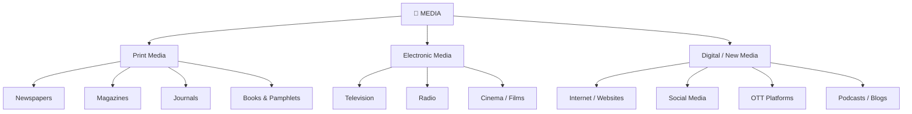

# Module 01: Introduction to Media and Communication

## 📖 Overview
This module introduces the concept of media and communication, examines the importance of media in a democratic setup, classifies the various kinds of media, and analyses the core functions that media performs in society.

---

## 1. Introduction to Media and Communication

### 1.1 Meaning of Media
The word **"media"** is derived from the Latin word **"medius"** meaning "middle" or "in between." Media refers to the **channels or instruments** through which information, ideas, opinions, and entertainment are communicated to large audiences.

The word **"communication"** is derived from the Latin root **"communicare"** meaning "to share" or "to make common."

📖 **Definition**: According to the *Oxford Advanced Learner's Dictionary*, "media" refers to the main ways through which large numbers of people receive information and entertainment — including television, radio, newspapers, and the internet.

### 1.2 Communication Process
Communication is the process by which we exchange information through various methods. It involves:
1. **Sender** — the originator of the message
2. **Message** — the content being communicated
3. **Channel/Medium** — the instrument used (print, electronic, digital)
4. **Receiver** — the audience or recipient
5. **Feedback** — response from the receiver

> 🧠 **Mnemonic — SMCRF:** "**S**mart **M**edia **C**reates **R**eal **F**reedom"
> S = Sender, M = Message, C = Channel, R = Receiver, F = Feedback

### 1.3 Relationship Between Media and Communication
Media is the **vehicle** through which communication takes place. While communication is the broader process, media is the **tool or platform** that facilitates the dissemination of information to the masses. Media is often referred to as **"mass media"** when it reaches a large, heterogeneous, and geographically dispersed audience simultaneously.

---

## 2. Importance of Media in Democracy

### 2.1 Media as the "Fourth Estate"
Media is widely regarded as the **"Fourth Estate"** of democracy, alongside the Legislature, Executive, and Judiciary. This term was coined by **Edmund Burke** in the 18th century, referring to the press gallery of the British Parliament. The concept underscores the media's role as a **watchdog** that monitors the functioning of the three organs of the State.

### 2.2 Why Media is Vital to Democracy
Democracy is government **"of the people, by the people, and for the people"** (Abraham Lincoln). For such a system to function effectively, the people must be:
1. **Informed** about public affairs and government actions
2. **Empowered** to form opinions and participate in governance
3. **Protected** from the abuse of power by public authorities

Media serves all three purposes. Without a free media, democracy becomes a hollow exercise.

### 2.3 Key Roles of Media in a Democratic Setup

| Role | Description |
|:---|:---|
| **Watchdog** | Monitors government actions, exposes corruption and abuse of power |
| **Information Provider** | Informs citizens about policies, laws, events, and public affairs |
| **Platform for Debate** | Provides a forum for diverse viewpoints and public discourse |
| **Voice of the Voiceless** | Represents marginalized sections of society |
| **Accountability Tool** | Holds public officials accountable through investigative journalism |
| **Educator** | Spreads awareness on rights, duties, health, environment, etc. |
| **Bridge** | Connects the government and the governed |

> 🧠 **Mnemonic — WIPE BAB:** "**W**atchdog **I**nformation **P**latform **E**ducator **B**ridge **A**ccountability **B**oost"
> W = Watchdog, I = Information, P = Platform for debate, E = Educator, B = Bridge, A = Accountability, B = Voice (Boost the voiceless)

### 2.4 Constitutional Recognition
In India, while the Constitution does not expressly mention "freedom of press," the Supreme Court has consistently held that **freedom of press is implicit in Article 19(1)(a)** — Freedom of Speech and Expression.

**Key Case**: In ***Romesh Thappar v. State of Madras*** (AIR 1950 SC 124), the Supreme Court held that freedom of the press is an essential component of the freedom of speech and expression guaranteed under Article 19(1)(a).

---

## 3. Kinds of Media

Media can be broadly classified into the following categories:

### 3.1 Classification by Medium

### 3.2 Detailed Classification

#### A. Print Media
- **Oldest form** of mass media
- Includes newspapers, magazines, journals, books, pamphlets, leaflets
- Governed by: Press and Registration of Books Act, 1867; Press Council Act, 1978
- **First Indian newspaper**: *The Bengal Gazette* (1780) by James Augustus Hickey

#### B. Electronic Media
- Includes television, radio, and cinema
- Television has the **widest reach** in India
- Governed by: Cable Television Networks (Regulation) Act, 1995; Prasar Bharti Act, 1990; Cinematograph Act, 1952
- All India Radio (AIR) and Doordarshan are the public broadcasters

#### C. Digital / New Media
- Internet-based media including websites, social media, blogs, OTT platforms
- Fastest growing segment of media in India
- Governed by: Information Technology Act, 2000; IT (Intermediary Guidelines and Digital Media Ethics Code) Rules, 2021
- Poses new challenges: fake news, online defamation, data privacy

> 🧠 **Mnemonic — PED:** "**P**rint **E**lectronic **D**igital" — The three pillars of media

### 3.3 Other Classifications
- **By Ownership**: Government-owned (Doordarshan, AIR) vs. Private (NDTV, Times of India)
- **By Reach**: National vs. Regional vs. Local
- **By Content**: News media vs. Entertainment media vs. Educational media
- **By Language**: English, Hindi, Regional language media

---

## 4. Functions of Media

Media performs several vital functions in society. The SPPU syllabus identifies the following key functions:

### 4.1 Information
- The **primary function** of media is to inform the public about events, developments, and matters of public interest
- Media acts as a **bridge** between the government and the people
- Includes: news reporting, current affairs, investigative journalism, data journalism

### 4.2 Surveillance
- Media acts as a **sentinel** or watchdog, monitoring the environment and alerting society to threats, dangers, and opportunities
- **Harold Lasswell** identified surveillance as a core function of media
- Includes: monitoring government, exposing corruption, early warning about disasters

### 4.3 Service the Economic System
- Media facilitates economic activity by providing:
  - **Market information** (stock prices, business news)
  - **Advertising** (connecting producers with consumers)
  - **Consumer awareness** (product reviews, comparisons)
  - **Employment information** (job listings)
- Advertising is the **primary revenue source** for most media organizations

### 4.4 Hold Society Together (Correlation and Integration)
- Media serves a **binding function** by:
  - Creating **shared experiences** (national events, festivals)
  - Promoting **national integration** across linguistic, cultural, and regional divides
  - Building **consensus** on important social issues
  - Preserving **cultural heritage** through documentation and transmission

### 4.5 Entertain
- Entertainment is one of the **most consumed** functions of media
- Includes: films, music, drama, sports, comedy, reality shows, web series
- Entertainment also serves an **educational purpose** (edutainment)
- The entertainment industry is one of the largest in India

### 4.6 Act as a Community Forum
- Media provides a **platform for public discourse** and debate
- Citizens can express their views, grievances, and opinions through:
  - Letters to the editor
  - Op-eds and columns
  - Social media discussions
  - Talk shows and debates
- This function is essential for **participatory democracy**

### 4.7 Service the Political System
- Media plays a crucial role in the **political process** by:
  - Covering elections and political campaigns
  - Providing a platform for political debate
  - Educating voters about candidates and issues
  - Acting as a check on political power
  - Enabling transparency in governance

### 4.8 Other Functions
- **Education**: Spreading literacy, awareness, and knowledge
- **Socialization**: Transmitting values, norms, and culture to new generations
- **Mobilization**: Galvanizing public action for social causes
- **Agenda Setting**: Determining which issues receive public attention

> 🧠 **Mnemonic — I SEE CAPS:** "**I** **S**ee **E**very **E**vening **C**ommunity **A**nd **P**olitics on **S**creen"
> I = Information, S = Surveillance, E = Economic service, E = Entertainment, C = Community forum, A = (Hold society together) Aggregation, P = Political system service, S = Socialization

---

## 5. Theories Related to Functions of Media

### 5.1 Harold Lasswell's Functions (1948)
Lasswell identified three core functions of mass communication:
1. **Surveillance** of the environment
2. **Correlation** of parts of society in responding to the environment
3. **Transmission** of social heritage from one generation to the next

### 5.2 Charles Wright's Addition (1959)
Wright added a fourth function:
4. **Entertainment**

### 5.3 Agenda-Setting Theory
- Proposed by **Maxwell McCombs and Donald Shaw** (1972)
- The media may not tell people *what* to think, but it tells them *what to think about*
- Issues given prominence by media tend to be perceived as important by the public

---

## 6. Media in India — A Snapshot

| Aspect | Details |
|:---|:---|
| **First Newspaper** | *The Bengal Gazette* (1780) — James Augustus Hickey |
| **Constitutional Basis** | Article 19(1)(a) — Freedom of Speech and Expression |
| **Key Regulatory Bodies** | Press Council of India, CBFC, TRAI, ASCI |
| **Public Broadcaster** | Prasar Bharti (AIR + Doordarshan) |
| **Press Freedom Index** | India ranked 159th in 2024 (RSF World Press Freedom Index) |
| **Major Challenges** | Fake news, paid news, media trials, journalist safety |

---

## 📝 Key Takeaways

1. Media is the **"Fourth Estate"** of democracy — vital for informed citizenry and accountability.
2. Media freedom in India is derived from **Article 19(1)(a)** but is not absolute — subject to reasonable restrictions under **Article 19(2)**.
3. Media is classified into **Print, Electronic, and Digital** — each governed by distinct regulatory frameworks.
4. The **7 core functions** of media are: Information, Surveillance, Economic service, Social cohesion, Entertainment, Community forum, and Political service.
5. Modern challenges include fake news, digital regulation, media convergence, and balancing freedom with responsibility.

---

## 📚 References
- P.M. Bakshi, *Press Law – An Introduction* (1985)
- D.D. Basu, *Law of the Press*, LexisNexis
- Harold Lasswell, "The Structure and Function of Communication in Society" (1948)
- SPPU Syllabus LGE 0609 (Revised 2023-24)
