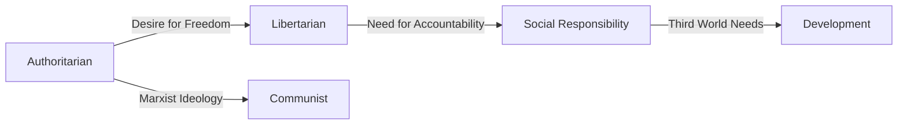

# 📘 Module 02: History of Press and Theories of Press

🎚️ Difficulty: 🟡 Medium

---

### 🧠 Introduction

The freedom of the press has evolved significantly over centuries, transitioning from strict state control to modern democratic freedoms. Understanding the history and the theoretical models of the press helps in analyzing how different political systems view the role of media.

---

### 📖 Main Content

#### 1. Historical Foundations of Media Laws
- **United Kingdom**: The history of press freedom in the UK is marked by the struggle against the Licensing Act and the Star Chamber. The abolition of licensing in 1695 was a major milestone. John Milton's *Areopagitica* (1644) was a seminal defense of free expression.
- **United States**: The First Amendment to the US Constitution (1791) explicitly guarantees freedom of speech and of the press: "Congress shall make no law... abridging the freedom of speech, or of the press."
- **India (Pre-Independence)**: The British enacted several restrictive laws to control the nationalist press, such as the Vernacular Press Act (1878) and the Indian Press (Emergency Powers) Act (1931).
- **India (Post-Independence)**: The Constitution of India (1950) guaranteed freedom of speech and expression under Article 19(1)(a), subject to reasonable restrictions under Article 19(2).

#### 2. International Law and Freedom of Media
- **UDHR (1948)**: Article 19 states that everyone has the right to freedom of opinion and expression; this right includes freedom to hold opinions without interference and to seek, receive and impart information.
- **ICCPR (1966)**: Article 19(2) legally binds state parties to protect the freedom of expression, including the freedom to seek, receive, and impart information of all kinds.

#### 3. Theories of Press
These theories, originally proposed by Siebert, Peterson, and Schramm (and later expanded), describe how media operates under different political philosophies.

1.  **Authoritarian Theory**:
    - **Concept**: The press is a servant of the state. Truth is the monopoly of those in power.
    - **Control**: Censorship, licensing, and strict punishment for criticizing the government.
2.  **Libertarian Theory**:
    - **Concept**: The press is a free marketplace of ideas. Truth will emerge from the clash of opinions.
    - **Control**: Minimal state intervention. The press acts as a watchdog.
3.  **Communist Theory (Soviet Media Theory)**:
    - **Concept**: The press is an instrument of the ruling party (the State) to achieve societal goals and educate the masses in socialist values.
    - **Control**: State ownership of media; no private ownership.
4.  **Theory of Social Responsibility**:
    - **Concept**: Freedom comes with obligations. The press must be free but should act responsibly towards society.
    - **Control**: Self-regulation, professional ethics, and public accountability.
5.  **Development Media Theory**:
    - **Concept**: Emerged for developing nations. Media should support national development, economic growth, and nation-building.
    - **Control**: State may intervene to ensure media aligns with development goals.
6.  **Democratic Participant Media Theory**:
    - **Concept**: Rejects commercialization and state control. Advocates for grassroots, community-based media where citizens actively participate.
    - **Control**: Decentralized, community-driven.

🧠 **Mnemonic**: **A-L-C-S-D-D** (Authoritarian, Libertarian, Communist, Social Responsibility, Development, Democratic Participant).

📐 **Diagram: Evolution of Press Theories**

---

### ⚖️ Case Laws

- **Romesh Thappar v. State of Madras (1950)**: The Supreme Court held that freedom of speech and of the press lay at the foundation of all democratic organizations, for without free political discussion no public education, so essential for the proper functioning of the processes of popular government, is possible.

---

### 🧾 Conclusion

The theories of the press provide a lens to evaluate media systems globally. While India leans towards the Social Responsibility and Libertarian models, the historical context reminds us of the constant tension between state control and press freedom.

---

### 🧠 Memorisation Toolkit

#### 🧩 Mnemonics
- **A-L-C-S-D-D**: The 6 Theories of Press.

#### ⚡ Quick Revision Points
- US First Amendment: Absolute freedom (textually).
- UDHR Art 19: Universal right to seek/impart info.
- Authoritarian = State Control.
- Libertarian = Free Marketplace.
- Social Responsibility = Freedom + Ethics.
