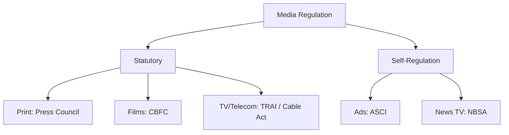

# 📘 Module 05: Regulatory Framework of Media

🎚️ Difficulty: 🟡 Medium

---

### 🧠 Introduction

With the massive expansion of media, regulation is necessary to ensure ethical standards, protect vulnerable audiences, and maintain fair competition. This module explores the statutory bodies and self-regulatory mechanisms governing different media sectors in India.

---

### 📖 Main Content

#### 1. Methods of Regulation
- **Statutory Regulation**: Imposed by the State through laws and government bodies (e.g., CBFC, TRAI).
- **Self-Regulation**: Industry-created bodies that set ethical codes and resolve complaints (e.g., ASCI, NBSA).

#### 2. Key Statutory Frameworks
- **The Cinematograph Act, 1952**: Establishes the Central Board of Film Certification (CBFC). Films must be certified (U, UA, A, S) before public exhibition.
- **The Cable Television Networks (Regulation) Act, 1995**: Regulates cable operators. Contains the Programme Code and Advertising Code which all broadcasters must follow.
- **The Prasar Bharti Act, 1990**: Grants autonomy to Doordarshan and All India Radio, separating them from direct government control.
- **The Press Council of India Act, 1978**: Establishes the PCI, a statutory, quasi-judicial body acting as a watchdog for the print media. It can warn, admonish, or censure newspapers but lacks punitive powers (often called a "toothless tiger").
- **The Telecom Regulatory Authority of India (TRAI) Act, 1997**: Regulates telecom services, including broadcasting and cable services, ensuring fair competition and consumer protection.
- **The Indecent Representation of Women (Prohibition) Act, 1986**: Prohibits indecent representation of women through advertisements, publications, writings, or paintings.

#### 3. Self-Regulatory Bodies
- **Advertising Standards Council of India (ASCI)**: A voluntary self-regulatory council. Its code ensures ads are truthful, not offensive, and not harmful to consumers (especially children).

#### 4. Contemporary Issues in Media Law
- **Free Speech and Fair Trial (Media Trial)**: Media coverage can prejudice public opinion and judges, violating the accused's right to a fair trial under Article 21.
- **Sting Operations**: Acceptable if in public interest, but illegal if used for extortion or violating privacy without cause.
- **Paid News**: The practice of passing off advertisements as editorial news. The PCI has strongly condemned this as it deceives the electorate and undermines democracy.
- **Media and Convergence**: The merging of telecom, broadcasting, and IT requires unified regulatory approaches.
- **Internet and Freedom of Media**: Regulated by the Information Technology Act, 2000 (e.g., Section 69A for blocking websites). Intermediary Guidelines (2021) impose strict compliance on social media platforms and OTTs.

📐 **Diagram: Media Regulation Matrix**

---

### ⚖️ Case Laws

- **Hamdard Dawakhana v. Union of India (1960)**: The Supreme Court held that commercial advertisements promoting self-medication of certain diseases are not protected under Article 19(1)(a) as they do not propagate social, political, or economic ideas.
- **Shreya Singhal v. Union of India (2015)**: Struck down Section 66A of the IT Act for being vague and creating a "chilling effect" on free speech on the internet.

---

### 🧾 Conclusion

Media regulation in India is a complex mix of statutory laws and self-regulatory codes. The challenge for the future is regulating the borderless and dynamic digital media (OTT and Social Media) without compromising the democratic ethos of free speech.

---

### 🧠 Memorisation Toolkit

#### 🧩 Mnemonics
- **C-C-P-P-T-I**: Cinematograph, Cable, Prasar Bharti, Press Council, TRAI, Indecent Representation (Key Statutes).

#### ⚡ Quick Revision Points
- CBFC certifies films (U, UA, A, S).
- PCI regulates Print Media (Toothless Tiger).
- ASCI regulates Advertisements (Self-regulation).
- Paid News threatens electoral integrity.
- Shreya Singhal case protects Internet Free Speech.
