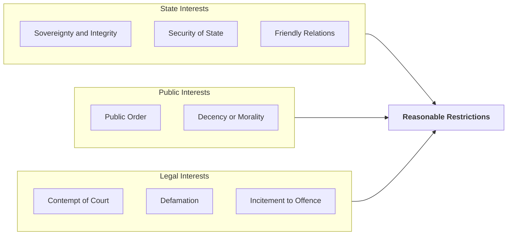
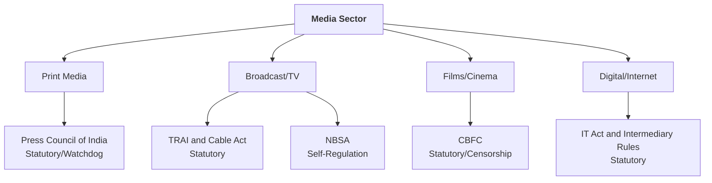

# 📐 Flowcharts and Diagrams - Media Laws

## 1. Facets of Article 19(1)(a)

This diagram illustrates the various rights implicitly included within the Freedom of Speech and Expression for the media.

```mermaid
graph TD
    A[<b>Article 19(1)(a)</b><br/>Freedom of Speech and Expression] --> B[Freedom of Press]
    A --> C[Right to Circulation]
    A --> D[Right to Receive Information]
    A --> E[Right to Advertise<br/>Commercial Speech]
    A --> F[Right to Telecast/Broadcast]
    A --> G[Freedom from Pre-Censorship]
```

💡 **Exam Tip**: Draw this when answering any question on the Constitutional Framework of Media.

---

## 2. The 8 Grounds of Reasonable Restrictions (Art 19(2))



💡 **Exam Tip**: Use the mnemonic **S-S-F-P-D-C-D-I** to remember these exactly as written in the Constitution.

---

## 3. Hierarchy of Media Regulation



💡 **Exam Tip**: Use this to show the fragmented nature of media regulation in India.
