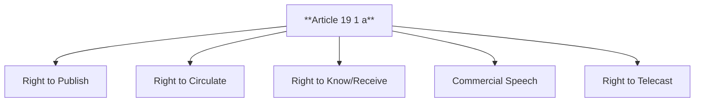

# Q01: Freedom of Speech and Expression (Art 19(1)(a))

## 📝 Question
"Freedom of the Press is implicit in the Freedom of Speech and Expression." Discuss the various facets of this freedom under Article 19(1)(a) with the help of landmark Supreme Court judgments. (15 Marks)

---

## 🧾 MODEL ANSWER

### 1. 🧾 Answer Synopsis
- **Introduction**: Art 19(1)(a) and the Constituent Assembly's view.
- **Facets**: Right to print, circulate, receive info, advertise, telecast.
- **Key Cases**: *Romesh Thappar*, *Sakal Papers*, *Bennett Coleman*, *Tata Press*.
- **Conclusion**: Expansive interpretation by the judiciary.

### 2. 🧠 Introduction
The Constitution of India does not contain a specific provision guaranteeing the freedom of the press. During the Constituent Assembly debates, Dr. B.R. Ambedkar stated that the press has no special rights distinct from those of a citizen. Therefore, the freedom of the press is implicitly guaranteed under **Article 19(1)(a)**, which grants all citizens the "Right to Freedom of Speech and Expression."

### 3. 📖 Body
The Supreme Court of India has given a very wide and expansive interpretation to Article 19(1)(a). It encompasses several distinct facets:

#### A. Freedom of Publication and Circulation
Freedom of speech is meaningless if the ideas cannot be communicated to a wide audience.
- **Romesh Thappar v. State of Madras (1950)**: The SC struck down a ban on the entry and circulation of a journal, holding that freedom of circulation is as essential as the freedom of publication.
- **Sakal Papers v. Union of India (1962)**: The state tried to regulate the number of pages a newspaper could publish based on its price. The SC struck it down, stating that restricting pages directly restricts the dissemination of news and views.
- **Bennett Coleman & Co. v. UOI (1972)**: The Newsprint Control Order was struck down because it interfered with the newspaper's right to determine its page limit and circulation volume.

#### B. Right to Receive Information
Freedom of speech is a two-way street. It includes the right of the speaker to speak and the right of the listener to hear.
- **State of UP v. Raj Narain (1975)**: The SC recognized the "Right to Know" as a fundamental right. Citizens have a right to know every public act, everything that is done in a public way, by their public functionaries.

#### C. Commercial Speech (Right to Advertise)
- **Tata Press Ltd. v. MTNL (1995)**: The SC held that commercial advertisements are a part of freedom of speech. The public has a right to receive commercial information to make informed economic choices.

#### D. Right to Telecast and Broadcast
- **Ministry of I&B v. Cricket Association of Bengal (1995)**: The SC held that airwaves are public property. The right to impart and receive information includes the right to telecast sporting events.

#### E. Freedom from Pre-Censorship
Prior restraint is generally considered unconstitutional for print media.
- **Brij Bhushan v. State of Delhi**: Pre-censorship of an English weekly was struck down.
- *(Exception)* **K.A. Abbas v. UOI**: Pre-censorship is valid for films due to their mass impact.

### 4. 📊 Diagram: Facets of Art 19(1)(a)

### 5. 🧾 Conclusion
The judiciary has transformed Article 19(1)(a) from a simple right to speak into a comprehensive umbrella that protects the entire media industry. By recognizing circulation, advertising, and broadcasting as fundamental rights, the courts have ensured that the press remains a robust pillar of Indian democracy.
