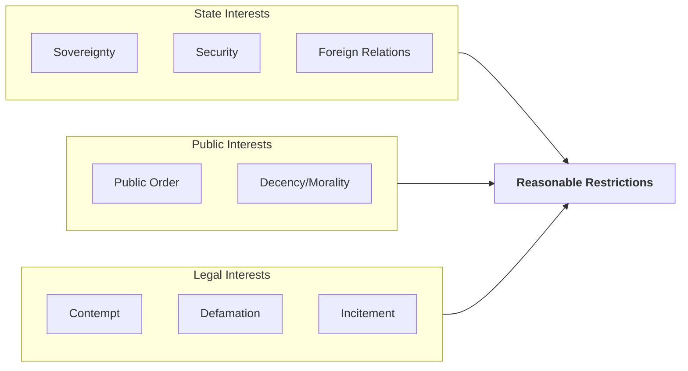

# Q03: Reasonable Restrictions (Art 19(2))

## 📝 Question
"Freedom of the Press is not absolute." Discuss the grounds on which reasonable restrictions can be imposed on the media under Article 19(2) of the Constitution. (15 Marks)

---

## 🧾 MODEL ANSWER

### 1. 🧾 Answer Synopsis
- **Introduction**: Balance between liberty and social order.
- **The 8 Grounds**: Sovereignty, Security, Friendly relations, Public order, Decency, Contempt, Defamation, Incitement.
- **Test of Reasonableness**: Must not be arbitrary or excessive.
- **Conclusion**: Restrictions must be strictly within the 8 grounds.

### 2. 🧠 Introduction
While Article 19(1)(a) guarantees freedom of speech and expression, it is not an absolute right. Absolute freedom leads to anarchy. Therefore, Article 19(2) permits the State to impose "reasonable restrictions" on this freedom to balance individual liberty with social order and national security.

### 3. 📖 Body
The restrictions must satisfy two tests: they must be "reasonable" and they must fall *strictly* within one of the 8 grounds mentioned in Article 19(2).

#### The 8 Grounds of Restriction (S-S-F-P-D-C-D-I)

1.  **Sovereignty and Integrity of India**: Added by the 16th Amendment (1963) to prevent media from inciting secession or demanding separation of any part of India.
2.  **Security of the State**: Refers to serious and aggravated forms of public disorder, such as rebellion, waging war against the state, or inciting violent overthrow of the government.
3.  **Friendly Relations with Foreign States**: To prevent media from publishing malicious propaganda against a foreign nation that could jeopardize India's diplomatic relations.
4.  **Public Order**: Added by the 1st Amendment (1951) after the *Romesh Thappar* case. It covers acts that disturb public peace and tranquility (e.g., inciting communal riots).
5.  **Decency or Morality**: Restricts the publication of obscene materials. The standard of obscenity is judged by the "Community Standards Test" (Section 292 of IPC).
6.  **Contempt of Court**: Media cannot publish anything that scandalizes the court, prejudices a fair trial, or interferes with the administration of justice (Contempt of Courts Act, 1971).
7.  **Defamation**: Freedom of press does not give a license to ruin a person's reputation. Civil and criminal defamation laws act as a restriction.
8.  **Incitement to an Offence**: Media cannot be used to instigate people to commit crimes or violence.

#### Concept of "Reasonable" Restriction
The Supreme Court in *Chintaman Rao v. State of MP* held that a restriction is "reasonable" only if it strikes a proper balance between the freedom guaranteed and the social control permitted. It must not be arbitrary or excessively harsh.

### 4. ⚖️ Case Laws
- **Kedar Nath Singh v. State of Bihar**: Sedition (Sec 124A) is a valid restriction under the ground of "Security of the State" and "Public Order", provided it involves incitement to violence.
- **Ranjit D. Udeshi v. State of Maharashtra**: Banning the book *Lady Chatterley's Lover* was upheld as a reasonable restriction on the ground of "Decency and Morality."

### 5. 📊 Diagram: Art 19(2) Grounds

### 6. 🧾 Conclusion
The grounds under Article 19(2) are exhaustive. The government cannot invent new grounds (like "public interest" or "business regulation") to restrict the press. This ensures that the media remains free from arbitrary state censorship.
