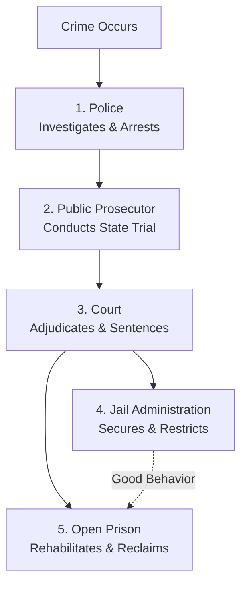

# 📘 Module 01: Penology - Introduction

🎚️ Difficulty: 🟢 Easy  
⏳ Study Time: ~2 Hours  

---

### 🧠 Introduction

**Penology** is a key branch of criminology that focuses on the systematic study of the methods, theories, and institutions of punishment, along with the treatment and rehabilitation of offenders. The term is derived from the Latin word ***Poena*** (meaning punishment or penalty) and the Greek suffix ***Logia*** (meaning study). 

While criminology asks *"Why do people commit crimes?"*, Penology asks *"What should we do with those who commit crimes?"*. It deals directly with the administration of criminal justice, the prevention of crime, and the reformative structures designed to reclaim offenders as law-abiding members of society.

---

### 📖 Main Syllabus Content

#### 1. Definition, Nature, and Scope of Penology

##### A. Definitions of Penology
*   **Dr. N.V. Paranjpe**: *"Penology is the study of the principles and methods of punishment, the policies governing the administration of prisons, and the reformatory measures adopted for the rehabilitation of criminals."*
*   **Donald Taft**: *"Penology is the study of the methods of punishment and of the prevention of crime, along with the treatment of prisoners."*
*   **Sutherland**: *"Penology refers to the policy of penal treatment, which is designed to prevent crime and to reform criminals."*

##### B. Nature of Penology
Penology is an **applied and interdisciplinary science**. It is not purely theoretical; it bridges sociology, psychology, law, administrative science, and human rights. It is dynamic, evolving from a retributive focus (barbaric physical torture) in ancient times to a modern reformative and rehabilitative focus (correctional administration).

##### C. Scope of Penology
The scope of penology is broad and covers the entire lifespan of penal administration:
1.  **Philosophical Underpinnings**: Defining the rationale and theories of punishment.
2.  **Statutory Rules**: Section 53 of the IPC (forms of punishment) and legal mandates of jail administration.
3.  **Prison Administration**: Standardizing prison conditions, health, hygiene, and discipline.
4.  **Alternatives to Incarceration**: Systems of Parole, Probation, Furlough, and Community Service.
5.  **Rehabilitative Structures**: Open prisons, borstal institutions, and vocational training facilities.

> 🧠 **Mnemonic — P-A-P-E-R:** "Penology Always Promotes Effective Reforms"
> *   **P** = Philosophical underpinnings of punishment
> *   **A** = Alternatives to traditional incarceration (Parole, Probation)
> *   **P** = Prison administration and conditions
> *   **E** = Evolving penal policies in India
> *   **R** = Rehabilitation and social reintegration mechanisms

---

#### 2. Crime Control Mechanism

The Crime Control Mechanism is a multi-layered structure comprising five major organs that work in tandem to prevent crime, investigate offenses, prosecute suspects, adjudicate guilt, and correct behavior.

##### A. The Police (First Responders)
*   **Role**: The police force is the primary agency for maintaining law and order, preventing crime, and investigating offenses.
*   **Legal Hook**: Governed by the **Police Act of 1861** and the investigative procedural rules under Chapter XII of the CrPC / BNSS.
*   **Functions**: 
    1. Registering the First Information Report (FIR) under Section 154 CrPC.
    2. Conducting investigations, collecting physical/forensic evidence, and apprehending accused persons.
    3. Filing a final police report (Charge-sheet) under Section 173 CrPC.

##### B. The Public Prosecutor (State Representatives)
*   **Role**: In any criminal offense, the State is the injured party. The Public Prosecutor acts as an officer of the court to represent the interests of society and present the case against the accused impartially.
*   **Legal Hook**: Appointed under Section 24 of the CrPC.
*   **Functions**:
    1. Conducting prosecutions and leading evidence in sessions/magistrate trials.
    2. Balancing the scale by ensuring that an innocent person is not wrongfully convicted.

##### C. The Court (The Adjudicating Authority)
*   **Role**: Courts act as impartial arbiters of justice. They evaluate the evidence presented by the prosecution and defense to determine the guilt or innocence of the accused and pronounce sentences.
*   **Legal Hook**: Constituted under the Indian Constitution and Section 6 of the CrPC.
*   **Functions**:
    1. Ensuring a fair trial under Article 21 of the Indian Constitution.
    2. Directing legal representation for indigent accused (Article 39A).
    3. Determining appropriate sentencing based on established legal principles.

##### D. Jail Administration (The Custodial Institution)
*   **Role**: Primarily custodial and secure. Jails are designed to hold under-trial prisoners safely during trials and execute sentences of imprisonment pronounced by courts.
*   **Legal Hook**: Governed by the **Prisons Act of 1894** and individual State Prison Manuals.
*   **Functions**:
    1. Restricting the physical mobility of offenders to prevent further crimes (Preventive function).
    2. Providing safe custody, basic amenities, and ensuring discipline within prison walls.

##### E. Open Prison (The Rehabilitative Pathway)
*   **Role**: Represents the pinnacle of modern reformative penology. Open prisons operate on minimum security and high trust, preparing well-behaved, long-term prisoners for life in society.
*   **Philosophy**: *"Man is sent to prison to be reformed, not to be broken."*
*   **Functions**:
    1. Allowing prisoners to live with minimal security barriers, work in agriculture or industries, and earn wages.
    2. Gradually easing the transition from confinement to complete freedom.

---

### ⚖️ Landmark Case Laws

*   **State of Punjab v. Baldev Singh (1999)**: The Supreme Court emphasized that while crime control is a fundamental obligation of the state, it cannot be achieved by violating due process. The Court held that the police must strictly adhere to statutory safeguards to protect the fundamental rights of individuals.
*   **D.K. Basu v. State of West Bengal (1997)**: A seminal judgment in which the Supreme Court intervened to check police excesses, laying down mandatory guidelines for arrests and custodial interrogations, ensuring that the police function within the rule of law.

---

### 🧾 Conclusion

Module 01 establishes that Penology is not merely a study of cells and bars, but a comprehensive science of crime control. The five organs of the Crime Control Mechanism—Police, Public Prosecutor, Court, Jail, and Open Prison—must function as an integrated ecosystem to maintain public peace, uphold human rights, and ensure the rehabilitation of the offender.

---

### 🧠 Memorisation Toolkit

#### 🧩 Mnemonics
*   **P-A-P-E-R**: Philosophical underpinnings, Alternatives (Parole/Probation), Prison administration, Evolving policy, Rehabilitation.
*   **P-C-P-J-O**: Police, Court, Prosecutor, Jail, Open Prison (The Crime Control roster).

#### ⚡ Quick Revision Points
*   **Penology**: Derived from *Poena* (Punishment) and *Logia* (Study).
*   **Nature**: Dynamic, interdisciplinary, transitioning from retribution to reformation.
*   **Organ 1 (Police)**: Investigates under Chapter XII of CrPC/BNSS.
*   **Organ 2 (Prosecutor)**: Officer of the court, represents the State (Sec 24 CrPC).
*   **Organ 3 (Court)**: Adjudicates trials and guarantees fair hearings (Art 21).
*   **Organ 4 (Jail)**: Custodial holding under the Prisons Act of 1894.
*   **Organ 5 (Open Prison)**: Corrective and trust-based rehabilitation.
