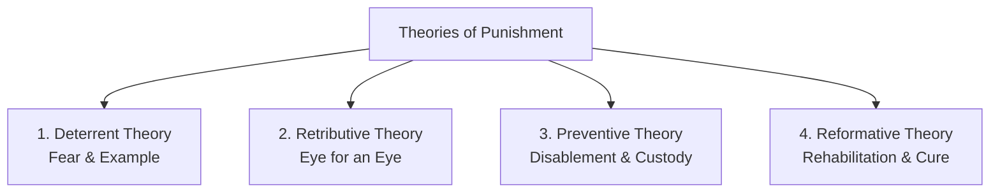

# 📘 Module 02: Punishment & Indian Penal Policy

🎚️ Difficulty: 🔴 Hard (High exam weightage)  
⏳ Study Time: ~3 Hours  

---

### 🧠 Introduction

**Punishment** is an essential instrument of social control used by the state to enforce the rule of law. It involves the intentional infliction of pain, suffering, or deprivation of rights upon an individual who has been adjudicated guilty of violating criminal laws. 

From a legal standpoint, punishment serves two primary purposes:
1.  **Protective**: Shielding society from dangerous elements.
2.  **Pedagogical**: Directing the offender and society toward lawful behavior.

---

### 📖 Main Syllabus Content

#### 1. Concept of Punishment
Philosophical jurisprudence defines punishment through five essential elements:
1.  It must involve pain or other consequences normally considered unpleasant.
2.  It must be for an offense against legal rules.
3.  It must be imposed on an actual or supposed offender for their offense.
4.  It must be intentionally administered by human beings other than the offender.
5.  It must be imposed and administered by an authority constituted by a legal system (the State).

---

#### 2. Theories of Punishment

There are four classical theories of punishment, each presenting a distinct philosophical rationale for why the state should penalize offenders.

##### A. Deterrent Theory (Punishment as an Example)
*   **Philosophy**: Retrospective deterrence (*Specific*) and prospective deterrence (*General*). The goal is to create fear in the mind of the offender and prospective wrongdoers to show that crime is unprofitable.
*   **Slogan**: *"I do not punish you for stealing sheep, but so that sheep may not be stolen."*
*   **Jurists**: Jeremy Bentham, John Austin.
*   **Criticism**: Hardened criminals are rarely deterred by fear. Severe deterrent punishments (such as public executions) can brutalize society rather than reform it.

##### B. Retributive Theory (Punishment as Deserved Suffering)
*   **Philosophy**: Based on the ancient doctrine of ***Lex Talionis*** ("An eye for an eye, a tooth for a tooth"). It asserts that moral order is restored only when the offender suffers pain proportionate to the crime they committed.
*   **Slogan**: *"Let the punishment fit the crime."*
*   **Jurists**: Immanuel Kant, G.W.F. Hegel.
*   **Criticism**: It is often viewed as legalized revenge. It lacks compassion, ignores the root causes of crime, and offers no path for rehabilitation.

##### C. Preventive Theory (Punishment as Disablement)
*   **Philosophy**: The goal is to disable the offender physically from repeating the crime, protecting society through exclusion. This is achieved through incarceration, death penalty, or forfeiture of occupational licenses.
*   **Slogan**: *"Lock them up and throw away the key."*
*   **Jurists**: John Paton, Jeremy Bentham.
*   **Criticism**: Total isolation in closed prisons can harden first-time offenders. Prolonged isolation also shifts the economic burden of supporting the prisoner onto law-abiding taxpayers.

##### D. Reformative Theory (Punishment as a Cure)
*   **Philosophy**: Views crime as a disease and the criminal as a patient who needs clinical treatment, vocational training, and psychological counseling rather than physical pain.
*   **Slogan**: *"Hate the crime, not the criminal."*
*   **Jurists**: Mahatma Gandhi, Justice V.R. Krishna Iyer.
*   **Criticism**: Extremely lenient sentences can undermine public confidence in the justice system. Hardened, habitual white-collar criminals may abuse reformative structures (like parole or probation) to escape accountability.

> 🧠 **Mnemonic — D-R-P-R:** "Do Right, Prevent Ruin"
> *   **D** = Deterrent (Create fear in others)
> *   **R** = Retributive (Proportionate deserved suffering - Lex Talionis)
> *   **P** = Preventive (Physically disable the offender)
> *   **R** = Reformative (Cure and rehabilitate the offender)

---

#### 3. Forms of Punishment

In India, **Section 53 of the Indian Penal Code (IPC)** (and its modern equivalent in the Bharatiya Nyaya Sanhita - BNS) prescribes six distinct forms of punishments that courts can award:

1.  **Death Penalty (Capital Punishment)**: Reserved for the "rarest of rare cases."
2.  **Imprisonment for Life**: Imprisonment for the remainder of the offender's natural life, subject to executive remission.
3.  **Imprisonment (Rigorous or Simple)**:
    *   *Rigorous*: Prisoner is subjected to hard physical labor.
    *   *Simple*: Prisoner is confined without compulsory hard labor.
4.  **Forfeiture of Property**: The state confiscates the offender's assets (sparingly used, chiefly for offenses against the State).
5.  **Fine**: Financial penalty, which can be awarded independently or in addition to imprisonment.
6.  **Community Service (Newly introduced under BNS)**: Unpaid work for the benefit of the community, designed for petty offenses.

> 🧠 **Mnemonic — D-L-I-F-P-C:** "Don't Let Ill Deeds Fool People Constantly"
> *   **D** = Death Penalty
> *   **L** = Life Imprisonment
> *   **I** = Imprisonment (Simple/Rigorous)
> *   **F** = Forfeiture of Property
> *   **P** = Pecuniary Fine
> *   **C** = Community Service (BNS addition)

---

#### 4. Penal Policy in India

India’s penal policy is a hybrid system that balances deterrence with reformation, evolving through four distinct historical phases:

##### A. Ancient Penal Policy (*Danda*)
Ancient law givers like Manu and Kautilya (*Arthashastra*) regarded *Danda* (punishment) as a divine instrument to preserve *Dharma* (righteousness). 
*   **Four forms of ancient punishment**:
    1.  *Vakdanda* (Admonition/Warning)
    2.  *Prayaschitta* (Remonstrance/Penance)
    3.  *Arthadanda* (Fine)
    4.  *Vadhadanda* (Corporal punishment, mutilation, or death)

##### B. Medieval Muslim Penal Policy
Introduced Islamic jurisprudence (*Sharia*) classified into three categories:
1.  *Qisas* (Retaliation - eye for an eye)
2.  *Diyya* (Blood money paid to the victim's family)
3.  *Tazir* (Discretionary punishment awarded by the Qazi)

##### C. British Colonial Penal Policy
Constructed a uniform codification (drafted by Lord Macaulay in 1860). It emphasized strict deterrence, using forms of punishment like transportation across the sea (*Kalapani*), solitary confinement, and public whipping (later abolished by the Whipping Act of 1955).

##### D. Post-Independence Modern Penal Policy
Emphasizes correctional jurisprudence, seeking to humanize penal treatment. It introduces reformative measures like the **Probation of Offenders Act, 1958**, the expansion of Open Prisons, Parole/Furlough rules, and a focus on restorative justice.

---

### ⚖️ Landmark Case Laws

*   **Bachan Singh v. State of Punjab (1980)**: The constitutionality of the death penalty was challenged. The Supreme Court upheld it but ruled that capital punishment must only be imposed in the **"rarest of rare cases"** where the alternative of life imprisonment is unquestionably foreclosed.
*   **Mithu v. State of Punjab (1983)**: The Supreme Court struck down Section 303 of the IPC, which mandated a compulsory death sentence for murder committed by a person undergoing life imprisonment. The Court held that a mandatory death penalty is unconstitutional as it strips courts of their sentencing discretion, violating Articles 14 and 21.
*   **Dr. Jacob George v. State of Kerala (1994)**: The Supreme Court held that no single theory of punishment should be applied in isolation. An ideal sentencing policy must combine deterrent, preventive, reformative, and compensatory principles to achieve balanced justice.

---

### 🧾 Conclusion

Module 02 highlights that punishment is a complex socio-legal tool. While ancient and colonial systems relied heavily on retribution and strict deterrence, modern Indian penal policy aims to strike a balance: employing deterrence for grave, heinous offenses (exemplified by the "rarest of rare" doctrine in *Bachan Singh*) while expanding reformative and community-based measures for petty and first-time offenders.

---

### 🧠 Memorisation Toolkit

#### 🧩 Mnemonics
*   **D-R-P-R**: Deterrent, Retributive, Preventive, Reformative.
*   **D-L-I-F-P-C**: Death, Life, Imprisonment, Forfeiture, Pecuniary fine, Community service.

#### ⚡ Quick Revision Points
*   **Concept**: Unpleasant consequences imposed by the State for a legal breach.
*   **Deterrent**: Bentham's utility - creating fear as a warning.
*   **Retributive**: Kant's moral desert - *Lex Talionis*.
*   **Preventive**: Disabling the offender (incarceration).
*   **Reformative**: Krishna Iyer's healing philosophy - *"Hate the crime, reform the criminal."*
*   **Bachan Singh**: Establishes the "rarest of rare cases" doctrine.
*   **Mithu**: Striking down mandatory death sentences under Section 303 IPC.
