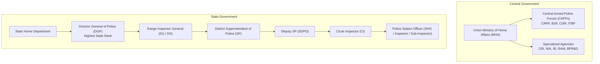

# 📘 Module 03: Police System in India & Reforms

🎚️ Difficulty: 🔴 Hard (Extensive syllabus syllabus coverage)  
⏳ Study Time: ~3 Hours  

---

### 🧠 Introduction

The **Police System** is the executive civil force of the State charged with maintaining public order, preventing crime, and enforcing laws. In India, policing carries a historical legacy of colonial rule, designed originally by the British to suppress dissent rather than serve the public. 

Modern democratic policing requires a shift from a **"ruler-centric force"** to a **"citizen-centric service"**. Achieving this transition remains one of the most critical challenges in contemporary Indian administrative and penological reforms.

---

### 📖 Main Syllabus Content

#### 1. History and Development of Indian Police

##### A. Ancient & Medieval Roots
*   **Ancient India**: Elaborated in Kautilya's *Arthashastra*. The *Gramini* (village headman) and *Chaukidars* (watchmen) maintained local peace. City administration was overseen by the *Kotwal* (chief of police).
*   **Medieval India**: The Kotwali system expanded under the Mughals. Kotwals held extensive police, municipal, and judicial powers, backed by the *Zamindars* in rural areas.

##### B. British Colonial Era (The Origin of Modern Police)
Following the Revolt of 1857, the British colonial administration sought to establish a highly disciplined, centralized police force to maintain imperial control.
*   **Police Commission of 1860**: Led directly to the passage of the **Police Act of 1861**, which established the structural framework of the Indian police force that persists to this day.
*   **Colonial Character**: Designed as a weapon of state control rather than a citizen-friendly public service, establishing a top-down, command-oriented hierarchy.

---

#### 2. Structure & Organization of Indian Police

Under the Constitution of India, the "Police" and "Public Order" are subjects under the **State List** (Entry 2, List II of the Seventh Schedule).



##### A. Police Administration under the State Government
Each state maintains its own police force, headed by a **Director General of Police (DGP)**.
1.  **State Level**: DGP assisted by Additional DGPs, IGs, and DIGs.
2.  **Range Level**: Groups of districts headed by an Inspector General (IG) or Deputy IG (DIG).
3.  **District Level**: Headed by the **Superintendent of Police (SP)**, who co-operates with the District Magistrate (DM) under a dual-control framework.
4.  **Sub-Divisional Level**: Under a Deputy SP or Assistant SP.
5.  **Station Level**: The basic unit of policing is the Police Station, commanded by a **Station House Officer (SHO)** (usually an Inspector or Sub-Inspector).

##### B. Police Administration under the Central Government
The Central Government, through the **Ministry of Home Affairs (MHA)**, administers central police forces and specialized investigative bodies:
1.  **Central Armed Police Forces (CAPFs)**: BSF (border security), CRPF (internal security and riot control), CISF (critical infrastructure security), ITBP, and SSB.
2.  **Specialized Investigating & Intelligence Agencies**: Central Bureau of Investigation (CBI), National Investigation Agency (NIA), Intelligence Bureau (IB), Research and Analysis Wing (RAW), and the Bureau of Police Research and Development (BPR&D).

---

#### 3. Principles of Policing

Democratic policing is guided by the Nine Principles formulated by Sir Robert Peel (the father of modern democratic policing):
1.  To prevent crime and disorder, as an alternative to their repression by military force.
2.  To recognize always that the power of the police to fulfill their functions and duties is dependent on public approval.
3.  To secure and maintain the respect and approval of the public by maintaining the laws.
4.  To recognize that the extent of co-operation of the public diminishes proportionately to the necessity of the use of physical force.
5.  To seek and preserve public favor not by catering to public opinion, but by constantly demonstrating absolute impartial service to the law.
6.  To use physical force only when the exercise of persuasion, advice, and warning is found to be insufficient.
7.  To maintain at all times a relationship with the public that gives reality to the historic tradition that **"the police are the public and the public are the police."**
8.  To direct their action strictly towards their functions, and never appear to usurp the powers of the judiciary.
9.  To recognize always that the test of police efficiency is the absence of crime and disorder, not the visible evidence of police action in dealing with them.

> 🧠 **Mnemonic — P-E-E-L-F-O-R-C-E:** "Peelian Ethics Ensure Lawful Force Only, Respecting Citizens Everywhere"
> *   **P** = Prevention of crime (primary objective)
> *   **E** = Ethical public approval dependence
> *   **E** = Efficiency test (absence of crime, not police action)
> *   **L** = Limits on physical force (used only as a last resort)
> *   **F** = Impartial enforcement of law
> *   **O** = Officer-public partnership ("the police are the public")
> *   **R** = Respecting judicial boundaries (no usurpation)
> *   **C** = Constant public co-operation seeking
> *   **E** = Empathy and community service

---

#### 4. Legal Functions of Police & Administration

The core duties of the police are codified under the Police Act of 1861 and the CrPC/BNSS:
1.  **Crime Prevention**: Patrolling, collecting local intelligence, and taking preventive actions under Section 149–153 CrPC.
2.  **Crime Investigation**: 
    *   Registering the FIR under Section 154 CrPC.
    *   Arresting suspects (Sec 41 CrPC) and conducting searches.
    *   Interrogating witnesses (Sec 161 CrPC).
    *   Filing the charge-sheet in court (Sec 173 CrPC).
3.  **Maintenance of Order**: Regulating public assemblies, managing traffic, and controlling crowds or riots.

---

#### 5. Police Reforms & Judicial Approaches

##### A. Major Committees on Police Reforms
*   **National Police Commission (NPC) (1977-81)**: Chaired by Dharam Vira, it produced eight landmark reports. The primary recommendation was to insulate the police from illegitimate political interference and separate investigation duties from law and order functions.
*   **Ribeiro Committee (1998)** and **Padmanabhaiah Committee (2000)**: Reiterated the need for a State Security Commission to oversee police appointments.
*   **Soli Sorabjee Model Police Act Drafting Committee (2006)**: Drafted a modern model law to replace the outdated Police Act of 1861.

##### B. The Prakash Singh Directives (2006)
In the landmark case of **Prakash Singh v. Union of India (2006)**, the Supreme Court issued seven binding directives to all State Governments and the Union to kickstart police reforms:

```text
1. State Security Commission (SSC) ───> Insulate police from political pressure
2. Director General of Police (DGP) ───> Merit-based selection & fixed 2-year tenure
3. Field Officers (SP & SHOs)       ───> Fixed 2-year tenure for operational stability
4. Separation of Functions          ───> Separate Investigation from Law & Order
5. Police Establishment Board (PEB) ───> Oversee transfers, postings, and promotions
6. Police Complaints Authority (PCA)───> State & District level citizen grievance redressal
7. National Security Commission     ───> Central level panel to select heads of CAPFs
```

> 🧠 **Mnemonic — S-T-A-B-L-E-S:** "Supervising Transfers And Boards Limits Executive Sway"
> *   **S** = State Security Commission (SSC)
> *   **T** = Tenure of 2 years for DGP and field officers
> *   **A** = Authority for public complaints (PCA)
> *   **B** = Board for police establishments (PEB)
> *   **L** = Law & order separated from investigation
> *   **E** = Executive insulation from political interference
> *   **S** = Selection of DGP based on merit via UPSC panel

##### C. NHRC Guidelines on Police-Public Relations
The National Human Rights Commission (NHRC) has issued guidelines to reduce custodial violence and build public trust:
*   Mandatory reporting of any custodial death to the NHRC within 24 hours.
*   Conducting video-recorded autopsies for custodial deaths.
*   Encouraging community policing initiatives (such as *Mohalla Committees*) to improve dialogue between police and citizens.

---

### ⚖️ Landmark Case Laws

*   **Prakash Singh v. Union of India (2006)**: The foundational judgment on police reforms. The Supreme Court took notice of the executive's failure to implement reform committee recommendations and issued seven binding directives to institutionalize police autonomy and accountability.
*   **D.K. Basu v. State of West Bengal (1997)**: To check custodial violence and torture, the Supreme Court laid down 11 mandatory guidelines governing arrests. These include:
    *   Arresting officers must wear clear identification tags showing their name and designation.
    *   Preparing a formal memo of arrest witnessed by at least one family member or respected citizen.
    *   Mandating a medical examination of the arrested person every 48 hours during custody.
*   **Lalita Kumari v. Government of U.P. (2014)**: The Supreme Court held that the registration of an FIR under Section 154 of the CrPC is **mandatory** if the information discloses the commission of a cognizable offense, leaving no discretion with the police to conduct a preliminary inquiry.

---

### 🧾 Conclusion

Module 03 highlights that the Indian police system, while structurally robust, remains constrained by an outdated legislative framework (the Police Act of 1861) and political interference. Through landmark judgments like *D.K. Basu* and *Prakash Singh*, the judiciary has established clear constitutional standards for police conduct. Implementing these directives is essential to transform the police force into a modern, accountable, and citizen-friendly public service.

---

### 🧠 Memorisation Toolkit

#### 🧩 Mnemonics
*   **S-T-A-B-L-E-S**: State Security Commission, Tenure of 2 years, Authority for complaints, Board for establishments, Law & order separation, Executive insulation, Selection of DGP.
*   **P-E-E-L-F-O-R-C-E**: Peelian principles of public approval, minimal force, and community policing.

#### ⚡ Quick Revision Points
*   **Seventh Schedule**: Police and Public Order are on the State List (List II).
*   **D.K. Basu Guidelines**: 11 mandatory arrest rules to prevent custodial violence.
*   **Prakash Singh (2006)**: 7 binding directives on tenures, commissions, and boards.
*   **Lalita Kumari**: Mandatory registration of FIRs for cognizable offenses.
*   **Sorabjee Committee**: Drafted the Model Police Act of 2006 to replace the colonial 1861 Act.
