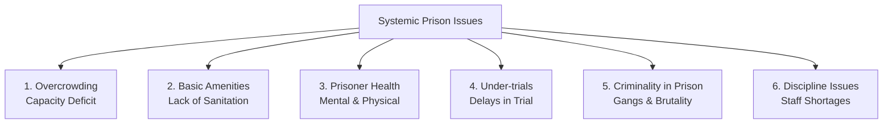

# 📘 Module 04: Prison System in India & Reforms

🎚️ Difficulty: 🔴 Hard (High exam weightage)  
⏳ Study Time: ~3 Hours  

---

### 🧠 Introduction

The **Prison System** is the primary institutional mechanism used by the state to execute sentences of imprisonment pronounced by courts. Under the Constitution of India, "Prisons, reformatories, borstal institutions, and other institutions of a like nature" fall under **Entry 4 of the State List** (Seventh Schedule).

Historically, prisons were purely punitive institutions designed to inflict hardship on inmates. However, modern penology views prisons as **correctional and rehabilitative centers**. The objective is to secure the offender, reform their character, and prepare them for a productive life after release.

---

### 📖 Main Syllabus Content

#### 1. History of Prison System in India

##### A. Ancient & Medieval Prisons
*   **Ancient Period**: Prisons (*Bandhanagara*) were purely custodial. Their main purpose was to hold offenders securely until corporal punishments or executions could be carried out.
*   **Medieval Period**: Fortresses and dungeons were used to confine political adversaries and serious offenders. Conditions were harsh, characterized by dark, poorly ventilated cells and minimal concern for inmate welfare.

##### B. Prisons in British India (The Modern Genesis)
The modern Indian prison system was shaped significantly by British administrators in the 19th century:
*   **First Prison Discipline Committee (1838)**: Chaired by Lord Macaulay, it criticized the lack of discipline in Indian prisons and recommended centralized administration, cellular confinement, and strict labor.
*   **Second Prison Committee (1864)** and **Third Committee (1877)**: Recommended separate confinement for female and juvenile prisoners, along with basic medical standards.
*   **The Prisons Act, 1894**: This legislation remains the core statute governing prisons in India today. It focused heavily on security, strict discipline, and administrative custody, with minimal emphasis on rehabilitation.

---

#### 2. Role of Prison in Modern Penology

Modern penology views prisons as correctional institutions rather than purely punitive facilities:
1.  **Custodial Security**: Ensuring the safe custody of under-trials and sentenced prisoners.
2.  **Rehabilitation**: Utilizing vocational training, educational programs, and psychological counseling to address the root causes of criminal behavior.
3.  **Social Reintegration**: Helping prisoners transition back into society to reduce recidivism rates.

---

#### 3. Types of Prisons and Prisoners

##### A. Classification of Prisons
1.  **Central Jails**: Large institutions that house prisoners sentenced to long terms of imprisonment (usually exceeding two years).
2.  **District Jails**: Regional facilities that secure under-trials and prisoners serving shorter sentences.
3.  **Sub-Jails**: Local lock-ups that secure individuals during preliminary remand or very short sentences.
4.  **Open Jails**: Minimum-security, trust-based institutions for selected, well-behaved long-term prisoners.
5.  **Special Jails**: High-security facilities designed for high-risk prisoners, terrorists, or violent offenders.
6.  **Women Jails**: Dedicated facilities staffed entirely by female personnel to ensure the safety and rehabilitation of female inmates.

##### B. Classification of Prisoners
1.  **Convicted Prisoners**: Individuals formally sentenced by a competent court of law.
2.  **Under-trial Prisoners**: Accused individuals held in custody while their trials are pending.
3.  **Detenus**: Persons held under preventive detention laws without formal trials.
4.  **Civil Prisoners**: Individuals confined for non-criminal breaches, such as civil debt or contempt of court.

---

#### 4. Critical Problems of Prisons

Indian prisons face six severe systemic challenges:

1.  **Severe Overcrowding**: The average occupancy rate in Indian prisons regularly exceeds 120% of sanctioned capacity, with some facilities reaching over 200%.
2.  **Inadequate Basic Amenities**: Lack of proper sanitation, poor ventilation, and low-quality food.
3.  **Neglected Prisoner Health**: Limited medical facilities, inadequate access to doctors, and a lack of mental health care, which is exacerbated by overcrowding.
4.  **High Ratio of Under-trial Prisoners**: Over 70% of all inmates in Indian prisons are under-trials who have not yet been convicted of any crime.
5.  **Criminality Within Prisons**: First-time offenders are often housed alongside hardened criminals, turning prisons into "schools of crime" rather than centers of reform.
6.  **Inconsistent Prison Discipline**: Abuse of authority by staff, inmate violence, and significant staff shortages, particularly in specialized medical and correctional roles.

> 🧠 **Mnemonic — O-B-D-H-C-U:** "Overcrowding Blurs Dignity, Hindering Correctional Upliftment"
> *   **O** = Overcrowding (Occupancy > 120%)
> *   **B** = Basic amenities deficit (sanitation, hygiene, food)
> *   **D** = Discipline issues and staff abuse
> *   **H** = Health challenges (physical and mental neglect)
> *   **C** = Criminality inside prisons (contamination of first-timers)
> *   **U** = Under-trials dominate prison population (over 70%)

---

#### 5. Prison Reforms & Jurisprudence

##### A. The All-India Committee on Prison Reforms (Mulla Committee, 1980-83)
Chaired by Justice A.N. Mulla, this committee provided the most comprehensive blueprint for prison reform in India:
1.  **National Prison Policy**: Formulate a national policy treating prisons as correctional institutions.
2.  **Separate Under-trials**: House under-trial prisoners completely separate from convicted prisoners.
3.  **Modernize Recruitment**: Standardize the recruitment, training, and working conditions of prison staff.
4.  **Expand Alternatives**: Expand the use of open prisons, parole, furlough, and probation to reduce overcrowding.
5.  **Focus on Rehabilitation**: Introduce vocational training and educational programs to aid reintegration.

##### B. Jurisprudence of Prison Reforms
The Supreme Court has read fundamental rights into the prison system, establishing three core principles:
1.  A prisoner does not lose their fundamental rights upon entering prison, except those restricted by the fact of confinement.
2.  A prisoner is entitled to be treated with human dignity, and torture or cruel treatment is prohibited.
3.  The primary purpose of imprisonment is reform and rehabilitation, not retribution.

---

### ⚖️ Landmark Case Laws

*   **Sunil Batra v. Delhi Administration (1978 & 1980)**: The Supreme Court struck down the practice of keeping under-death-sentence prisoners in solitary confinement and using bar-fetters on inmates. Justice Krishna Iyer held that **"prisons are not places to bury human rights"** and that Article 21 protects prisoners from cruel and degrading treatment.
*   **Hussainara Khatoon v. State of Bihar (1979)**: This landmark public interest litigation exposed the plight of under-trial prisoners in Bihar, many of whom had spent longer in prison awaiting trial than the maximum sentence for their alleged offenses. The Supreme Court held that the **right to a speedy trial** is a fundamental right implicit under Article 21, leading to the release of thousands of under-trials.
*   **Sheela Barse v. State of Maharashtra (1983)**: The Supreme Court addressed the safety of female prisoners, laying down mandatory guidelines. These included housing female prisoners in separate lock-ups staffed entirely by female police officers and prohibiting the interrogation of women after sunset.
*   **Ramamurthy v. State of Karnataka (1997)**: The Supreme Court synthesized the jurisprudence of prison reforms, identifying nine major issues (including overcrowding, lack of hygiene, and inadequate medical care) and directing all states to implement Mulla Committee recommendations to humanize prison administration.

---

### 🧾 Conclusion

Module 04 highlights that while the legal framework of Indian prisons is rooted in colonial legislation (the Prisons Act of 1894), the judiciary has worked to align the system with constitutional values. Landmark judgments like *Sunil Batra* and *Hussainara Khatoon* have established that prisoners retain their fundamental rights to dignity and speedy justice. Achieving comprehensive reform requires addressing the root causes of overcrowding and shifting prison administration from a punitive approach to a modern, rehabilitative model.

---

### 🧠 Memorisation Toolkit

#### 🧩 Mnemonics
*   **O-B-D-H-C-U**: Overcrowding, Basic amenities, Discipline, Health, Criminality, Under-trials (The six core ailments of Indian prisons).
*   **M-U-L-L-A**: Modernization, Under-trial separation, Legal rights, Life skills, Alternatives (Core principles of the Mulla Committee).

#### ⚡ Quick Revision Points
*   **Entry 4, List II**: Prisons are a State subject under the Seventh Schedule.
*   **The Prisons Act, 1894**: The primary colonial statute governing prisons.
*   **Mulla Committee (1980-83)**: Recommended a National Prison Policy and separating under-trials from convicted inmates.
*   **Sunil Batra**: Confirmed that prisoners retain their fundamental rights under Article 21.
*   **Hussainara Khatoon**: Established the right to a speedy trial as a core element of Article 21.
