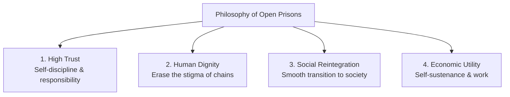

# 📘 Module 05: Open Prisons Philosophy & Working

🎚️ Difficulty: 🟢 Easy (Highly descriptive and scoring)  
⏳ Study Time: ~2 Hours  

---

### 🧠 Introduction

**Open Prisons** represent the pinnacle of modern reformative penology and correctional administration. Operating on a philosophy of trust and minimal physical security, they serve as a transition point between closed confinement and social reintegration.

Unlike traditional closed prisons characterized by high walls, iron bars, armed guards, and strict surveillance, open prisons rely on the self-discipline of carefully selected, well-behaved long-term inmates, allowing them to live and work under near-normal social conditions.

---

### 📖 Main Syllabus Content

#### 1. Definition and Origin of Open Prison

##### A. Definition
*   **United Nations (Geneva Congress on Prevention of Crime, 1955)**: *"An open institution is characterized by the absence of material or physical precautions against escape (such as walls, locks, bars, or armed guards), and by a system based on self-discipline and the inmate's sense of responsibility towards the community in which he lives."*
*   **Core Concept**: A minimum-security correctional institution where prisoners live, work in agricultural or industrial activities, receive vocational training, and earn wages under minimal supervision.

##### B. Origin
*   **International Origin**: The open prison movement began in the late 19th and early 20th centuries. Key milestones include the establishment of the *Witzwil Open Colony* in Switzerland (1891) and *Wakefield Prison* in England (1933).
*   **Origin in India**:
    *   The first open prison camp in India was established in **1953 at Chunar, Uttar Pradesh**, to house inmates selected to construct a dam over the Chandraprabha River.
    *   This was followed by the landmark **Sanganer Open Prison in Rajasthan (1955)** (Anupgarh Model), which allowed prisoners to live with their families in independent huts, work in the local community, and earn their own livelihood. Today, Sanganer remains a model for open prisons globally.

---

#### 2. The Philosophy Underlying the Open Prison

The open prison system is built on four core philosophical principles:

1.  **Trust-Based Discipline**: Rather than imposing discipline from the outside through bars and armed guards, open prisons encourage inmates to develop **self-discipline and personal responsibility**.
2.  **Human Dignity**: Physical barriers like high walls, iron bars, and handcuffs are replaced by moral boundaries. This helps preserve the prisoner's self-esteem and reduces the psychological trauma associated with traditional closed confinement.
3.  **Social Reintegration**: Traditional closed incarceration isolates offenders from their families and communities, which often makes successful reintegration difficult. Open prisons bridge this gap, helping prisoners ease back into normal social and family life.
4.  **Correctional Medicine**: Aligned with the reformative slogan: *"Hate the crime, cure the criminal."* The system views crime as a social disease, treating open prisons as convalescent homes where offenders can recover their civic sense before complete release.

---

#### 3. Main Characteristics of Open Prisons

Open prisons have six defining characteristics:
1.  **Absence of Physical Barriers**: No high security walls, barbed wires, locked cells, or armed guards.
2.  **Rigorous Selection Criteria**: Only long-term convicts who have served a substantial portion of their sentence (often one-third or half) in closed prisons and have shown excellent behavior and reform are eligible.
3.  **Near-Normal Social Life**: Inmates are allowed to live with their families in designated campus quarters (such as in the Sanganer model).
4.  **Vocational Independence**: Inmates can work in agriculture, local industries, or shops outside the camp, earning wages comparable to free laborers.
5.  **Community-Based Supervision**: A small administrative staff oversees operations, acting as advisors and counselors rather than traditional guards.
6.  **Minimal Escape Rates**: In practice, escape rates are extremely low, as inmates understand that escaping would result in losing their privileges and being returned to a high-security closed prison.

> 🧠 **Mnemonic — F-R-E-E-D-O-M:** "Family Reintegration, Economic Independence, Erasing Chains, Easing Daily Operations Mindfully"
> *   **F** = Family reintegration allowed (co-habitation in Sanganer model)
> *   **R** = Rigorous selection process for eligible inmates
> *   **E** = Economic self-sustenance through vocational work
> *   **E** = Erasing physical barriers (no walls, bars, or armed guards)
> *   **D** = Development of self-discipline and personal responsibility
> *   **O** = Open to community-based, non-punitive supervision
> *   **M** = Minimal escape rates due to valued privileges

---

#### 4. Advantages of Open Prisons

Open prisons offer significant benefits across three key areas:

##### A. Advantages to the Prisoner
*   **Mental & Physical Health**: Reduces the stress, anxiety, and depression associated with long-term confinement.
*   **Family Security**: Allows inmates to maintain family bonds and support their children's education, preventing the social isolation of the offender's family.
*   **Dignity & Self-Worth**: Erases the stigma of incarceration and rebuilds self-confidence.

##### B. Advantages to the State & Administration
*   **Cost-Effective Operations**: The cost of maintaining an open prison is a fraction of that of a closed jail, as it requires fewer security personnel and less physical infrastructure.
*   **Economic Productivity**: Inmates contribute to the agricultural and industrial output of the state, paying taxes and supporting their own maintenance.
*   **Alleviates Overcrowding**: Safely redirects a significant number of well-behaved prisoners away from overcrowded closed facilities.

##### C. Advantages to Society
*   **Lower Recidivism**: By easing the transition back into society, open prisons help reduce the likelihood of reoffending, promoting long-term social stability.

---

#### 5. Critical Appreciation & Challenges

While open prisons have been highly successful, they also face three notable challenges:
1.  **Public Apprehension**: Local communities are often hesitant to have open prisons nearby, fearing safety risks despite the rigorous screening processes for inmates.
2.  **Underutilized Capacity**: Due to overly strict eligibility criteria and administrative caution, many open prisons remain under-occupied, even as traditional closed jails face severe overcrowding.
3.  **Restrictive Selection Rules**: Habitual offenders, white-collar criminals, and individuals convicted of certain classes of offenses are often excluded, preventing reform-oriented opportunities for inmates who might otherwise benefit from the system.

---

### ⚖️ Landmark Case Laws

*   **Sangat Singh v. State of Rajasthan (1984)**: The Supreme Court praised the Sanganer model, noting that allowing well-behaved prisoners to live with their families under minimal security is one of the most effective ways to promote rehabilitation and prevent reoffending.
*   **Bhim Singh v. State of Haryana (1980)**: The Supreme Court emphasized the need for a uniform legislative policy across all states to expand open prisons, highlighting that minimum-security institutions should be the norm for reformed, non-violent long-term prisoners.
*   **In Re: Contagion of COVID-19 Virus in Prisons (2020)**: During the pandemic, the Supreme Court directed states to utilize parole, probation, and open prison facilities to reduce overcrowding in traditional closed jails and protect inmate health.

---

### 🧾 Conclusion

Module 05 shows that open prisons are a highly effective application of reformative penology. Operating on a model of trust and responsibility, they have proven that rehabilitation is often more successful when it respects human dignity rather than relying on strict physical confinement. To fully realize their potential, states must work to standardise selection criteria, address public concerns, and expand these facilities to help reduce overcrowding in traditional closed jails.

---

### 🧠 Memorisation Toolkit

#### 🧩 Mnemonics
*   **F-R-E-E-D-O-M**: Family reintegration, Rigorous selection, Economic independence, Erasing physical barriers, Development of self-discipline, Open supervision, Minimal escape rates.
*   **T-R-U-S-T**: Transition ease, Rehabilitation focus, Utilization of skills, Social integration, Trust-based discipline.

#### ⚡ Quick Revision Points
*   **UN Geneva Congress (1955)**: Defined open prisons by their absence of material security precautions.
*   **Sanganer Camp (1955)**: India's landmark open prison model in Rajasthan, permitting families to live inside.
*   **Core Philosophy**: Trust-based discipline, preserving dignity, and easing social reintegration.
*   **Cost Efficiency**: Open prisons are significantly less expensive to construct and operate than closed jails.
*   **Rigorous Screening**: Inmates are carefully screened in closed jails before transfer to ensure public safety.
