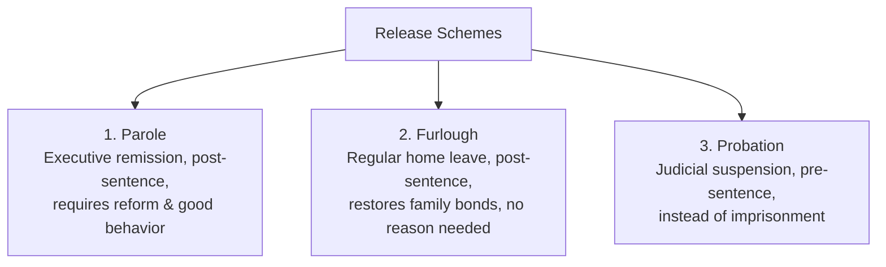

# 📘 Module 06: Parole System in India

🎚️ Difficulty: 🔴 Hard (High technical and comparative complexity)  
⏳ Study Time: ~3 Hours  

---

### 🧠 Introduction

**Parole** is an essential instrument of correctional administration that allows for the conditional release of a prisoner before they have completed their full sentence. The term is derived from the French phrase ***Parole d'honneur*** (meaning "word of honor"), reflecting its trust-based origin.

From a penological standpoint, parole is not a right but a privilege. It is designed to act as a bridge between structured confinement and free society, encouraging prisoners to maintain good behavior and offering them an opportunity to ease back into community life under supervision.

---

### 📖 Main Syllabus Content

#### 1. Meaning, Definition, and Concept of Parole

##### A. Definitions
*   **Donald Taft**: *"Parole is the release of an inmate from a correctional institution after he has served a part of his sentence, under the continued custody of the State and under conditions that permit his re-confinement in case of violation."*
*   **Black’s Law Dictionary**: *"The conditional release of a prisoner from imprisonment before the full sentence has been served, usually for good behavior, under the supervision of a parole officer."*

##### B. Philosophy and Concept
Parole is built on three core penological principles:
1.  **Sentence Optimization**: Confinement is minimized once a prisoner has shown clear signs of reform, reducing the cost to the state.
2.  **Mitigating Confinement Effects**: Minimizes the negative psychological impact of long-term isolation from family and community.
3.  **Behavioral Incentive**: Serves as a strong motivation for prisoners to maintain discipline and good behavior while incarcerated.

---

#### 2. Key Legal Distinctions

##### A. Parole vs. Furlough
*   **Parole**:
    *   *Purpose*: Granted for specific, urgent personal needs (e.g., family illness, marriage, or death).
    *   *Legal Nature*: A discretionary executive privilege; it does not count as part of the sentence served.
    *   *Frequency*: Granted on an as-needed basis, subject to strict eligibility criteria.
*   **Furlough**:
    *   *Purpose*: A regular home leave scheme designed to help long-term prisoners maintain family and social connections.
    *   *Legal Nature*: Considered a right of the prisoner (subject to good behavior); the period spent on furlough counts as part of the sentence served.
    *   *Frequency*: Granted at regular, pre-determined intervals (e.g., annually) without requiring a specific personal emergency.

##### B. Parole vs. Probation
*   **Parole**:
    *   *Timing*: Granted **post-sentence** after the offender has served a portion of their imprisonment in jail.
    *   *Authority*: An **executive decision** made by state parole boards and prison administrations.
    *   *Target Group*: Long-term, serious offenders who have demonstrated reform in confinement.
*   **Probation**:
    *   *Timing*: Granted **pre-sentence** by a court of law, suspending imprisonment entirely in favor of community supervision.
    *   *Authority*: A **judicial decision** governed by the Probation of Offenders Act, 1958.
    *   *Target Group*: First-time, youthful, or petty offenders, keeping them out of prison entirely.

---

#### 3. Parole in India & Structural Setup of Parole Boards

Under the Seventh Schedule of the Constitution, prisons and penal administration are State subjects. Consequently, **each state has its own distinct Parole Rules**.

##### A. Structural Setup of State Parole Boards
1.  **Composition**: Chaired by the State Home Secretary or a District Magistrate, and includes the Inspector General of Prisons, senior police officers, and independent social workers or psychologists.
2.  **Procedure**:
    *   The prisoner submits an application to the Jail Superintendent.
    *   The police conduct a local inquiry to assess the risk of reoffending and check for public safety concerns.
    *   The Parole Board reviews the police report, jail behavior records, and medical histories to make a decision.

##### B. Common Conditions of Parole
If parole is approved, the parolee must adhere to five standard conditions:
1.  **Reporting**: Report regularly to the designated local police station or parole officer.
2.  **Residence**: Live within the geographical limits specified in the parole order.
3.  **Good Behavior**: Maintain peaceful, lawful conduct and avoid any criminal association.
4.  **No Contact**: Refrain from contacting or intimidating victims, witnesses, or co-defendants.
5.  **Re-confinement**: Acknowledge that any violation of these conditions will lead to immediate revocation of parole and return to a closed prison.

> 🧠 **Mnemonic — P-A-R-O-L-E:** "Privilege Applied, Restoring Order, Limiting Executions"
> *   **P** = Post-sentence release scheme (granted after serving jail time)
> *   **A** = Administrative/Executive decision (overseen by Parole Boards)
> *   **R** = Regular reporting and strict geographic boundaries
> *   **O** = Only granted for specific, validated reasons or good behavior
> *   **L** = Loss of privileges if parole violations occur (re-confinement)
> *   **E** = Erasing the negative psychological impact of long-term isolation

---

#### 4. Essentials of an Ideal Parole System

An effective, rehabilitation-focused parole system relies on five key elements:
1.  **Indeterminate Sentencing**: Incorporating flexible sentencing ranges to allow for release once reform is demonstrated.
2.  **Objective Evaluation**: Using structured risk-assessment models rather than relying entirely on subjective police reports.
3.  **Dedicated Parole Officers**: Employing trained, professional parole officers to support and guide parolees rather than relying solely on local police monitoring.
4.  **Impartial Parole Boards**: Insulating parole boards from political interference or public pressure.
5.  **Support Programs**: Providing transitional housing, employment assistance, and social support to help parolees reintegrate into society and reduce recidivism.

---

#### 5. Parole Violation & Revocation

If an inmate violates their parole conditions, the following procedures apply:
*   **Immediate Arrest**: The local police or parole officer can arrest the violator without a warrant under state prison rules.
*   **Sentence Forfeiture**: The time spent on parole is forfeited, and the inmate must serve the remainder of their original sentence in jail.
*   **Disqualification**: The offender is disqualified from applying for parole or furlough in the future, and their prison privileges are reduced.

---

### ⚖️ Landmark Case Laws

*   **Asfaq v. State of Haryana (2017)**: The Supreme Court clarified the distinction between parole and furlough. The Court held that parole is granted for specific emergencies, whereas furlough is a right aimed at preventing the negative effects of long-term confinement. The Court emphasized that reformative penology requires a humane approach, and parole should not be denied arbitrarily based on vague police reports.
*   **Budhi v. State of Rajasthan (2005)**: The Rajasthan High Court held that parole is a crucial tool to help reform prisoners and reduce recidivism. The Court directed state administrations to streamline parole procedures and avoid unnecessary delays in processing applications.
*   **State of Haryana v. Mohinder Singh (2000)**: The Supreme Court held that while parole is a highly effective reformative tool, it remains a discretionary privilege rather than an absolute right. The state must balance the interest of the prisoner's rehabilitation with public safety and order.

---

### 🧾 Conclusion

Module 06 shows that parole is a highly effective tool in modern reformative penology. By providing a managed path for reintegration, it helps preserve family bonds and encourages good behavior within prisons. To ensure its success, parole systems must balance rehabilitation with public safety, employing objective risk assessments and professional supervision to help parolees successfully transition back into society.

---

### 🧠 Memorisation Toolkit

#### 🧩 Mnemonics
*   **P-A-R-O-L-E**: Post-sentence, Administrative decision, Regular reporting, Objective criteria, Loss of privileges for violations, Easing social reintegration.
*   **P-v-P-v-F**: Parole (Urgent/Executive), Probation (Judicial/Pre-sentence), Furlough (Routine leave/Inmate right).

#### ⚡ Quick Revision Points
*   **French Origin**: *Parole d'honneur* ("word of honor").
*   **Discretionary**: Parole is a privilege, not a fundamental right.
*   **Parole vs. Furlough**: Parole requires a specific reason and does not count toward the sentence; Furlough is a routine break that counts toward the sentence.
*   **Parole vs. Probation**: Parole is post-sentence (executive); Probation is an alternative to sentencing (judicial).
*   **Asfaq (2017)**: The landmark Supreme Court ruling defining the distinct roles of parole and furlough.
