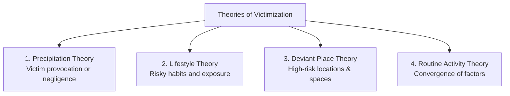

# 📘 Module 07: Victimology - Victim and Victimization

🎚️ Difficulty: 🔴 Hard (High theoretical and exam value)  
⏳ Study Time: ~3 Hours  

---

### 🧠 Introduction

For generations, the criminal justice system focused almost exclusively on the offender—their motives, rights, trial, and punishment—while treating the victim as a mere witness for the State. **Victimology** emerged to correct this imbalance, shifting focus toward the rights, support, and restoration of the victim.

Coined by French sociologist **Benjamin Mendelsohn** in 1947, Victimology is the scientific study of victims and the physical, psychological, and economic impacts of victimization. It represents a vital evolution in modern criminology, helping move justice systems toward a more balanced, victim-centered approach.

---

### 📖 Main Syllabus Content

#### 1. Victim – Meaning and Kinds

##### A. Meaning & Definition
*   **Section 2(wa) of the CrPC / BNSS**: *"‘Victim’ means a person who has suffered any loss or injury caused by reason of the act or omission for which the accused person has been charged and the expression ‘victim’ includes his or her guardian or legal heir."*
*   **United Nations Declaration (1985)**: *"‘Victims’ means persons who, individually or collectively, have suffered harm, including physical or mental injury, emotional suffering, economic loss or substantial impairment of their fundamental rights, through acts or omissions that are in violation of criminal laws."*

##### B. Kinds of Victims (Benjamin Mendelsohn’s Typology)
Mendelsohn classified victims into six categories based on their level of responsibility for the crime:
1.  **Completely Innocent Victim**: The ideal victim who bears no responsibility for the crime (e.g., a sleeping passenger in a train crash).
2.  **Victim with Minor Guilt**: A person who places themselves in a vulnerable position due to ignorance or negligence (e.g., leaving a car unlocked in a high-crime area).
3.  **Victim as Guilty as the Offender (Voluntary Victim)**: A person who actively participates in a mutually agreed-upon risky or illegal activity (e.g., assisted suicide or illegal gambling).
4.  **Victim More Guilty than the Offender**: A person who provokes another into committing a crime (e.g., an aggressor who is injured by someone acting in self-defense).
5.  **Most Guilty Victim (Solely Responsible)**: An offender who is injured or killed while attempting to commit a crime (e.g., a robber shot by a homeowner in self-defense).
6.  **Simulating / Imaginary Victim**: A person who falsely claims to be a victim to secure compensation or harm another person.

---

#### 2. The Impact of Victimization

Victimization has profound, far-reaching consequences that extend well beyond the immediate crime:

| Impact Category | Key Pointers & Consequences |
| :--- | :--- |
| **💥 Physical** | Permanent disability, chronic pain, physical scarring, or death. |
| **💸 Economic** | Loss of income, property damage, medical and legal expenses, and reduced earning capacity. |
| **🧠 Psychological** | Post-Traumatic Stress Disorder (PTSD), anxiety, depression, fear of public spaces, and cognitive dissonance. |

---

#### 3. Secondary & Double Victimization

**Secondary Victimization** (often called *Double Victimization*) refers to the additional harm inflicted on a victim not by the offender, but by the criminal justice system itself during the investigation, trial, and rehabilitation phases.

##### Common Causes:
1.  **Insensitive Interrogation**: Hostile or unsympathetic questioning by police officers.
2.  **Invasive Medical Exams**: Lack of privacy and sensitivity during forensic medical examinations, particularly in sexual assault cases.
3.  **Hostile Cross-Examination**: Aggressive questioning by defense counsel in court, which often aims to blame the victim for the crime.
4.  **Media Intrusion**: Sensationalized reporting that compromises the victim's privacy and dignity.
5.  **Lack of Support**: Delays in legal proceedings, inadequate protective measures, and a lack of counseling services, which can cause victims to feel abandoned by the justice system.

---

#### 4. Theories of Victimization

Victimology features four classical theories that explain why certain individuals, places, or lifestyles are associated with higher rates of victimization.

##### A. Victim Precipitation Theory
*   **Philosophy**: Suggests that some victims actively initiate, facilitate, or contribute to the chain of events that leads to their victimization.
*   **Forms**:
    *   *Active Precipitation*: The victim initiates physical conflict or uses provocative language.
    *   *Passive Precipitation*: The victim possesses characteristics or takes actions that unconsciously arouse hostility in the offender (e.g., competitive success or political activism).
*   **Criticism**: Must be applied cautiously to prevent victim-blaming, especially in cases of gender-based violence.

##### B. Lifestyle Theory
*   **Philosophy**: Asserts that an individual's daily habits, social activities, and lifestyle choices directly influence their risk of victimization (e.g., regularly traveling alone late at night or associating with delinquent groups).
*   **Key Concept**: Risk is a function of lifestyle choices that increase exposure to motivated offenders.

##### C. Deviant Place Theory
*   **Philosophy**: Argues that the physical location and environment are the primary drivers of victimization risk, regardless of an individual's personal lifestyle or behavior. Confinement to high-crime neighborhoods or poorly policed areas significantly increases risk.
*   **Slogan**: *"It’s not who you are, but where you are."*

##### D. Routine Activity Theory (Cohen and Felson)
*   **Philosophy**: Proposes that crime occurs when three essential elements converge in time and space:
    1.  A **Motivated Offender** (someone with the intent and ability to commit a crime).
    2.  A **Suitable Target** (a vulnerable person or accessible property).
    3.  The **Absence of a Capable Guardian** (a lack of police, security, bypassers, or family protection).

> 🧠 **Mnemonic — P-L-D-R:** "People's Lifestyles Dictate Risk"
> *   **P** = Precipitation Theory (Active or passive provocation)
> *   **L** = Lifestyle Theory (Daily habits and exposure)
> *   **D** = Deviant Place Theory (High-crime locations)
> *   **R** = Routine Activity Theory (Convergence of Offender, Target, and lack of Guardian)

---

### ⚖️ Landmark Case Laws

*   **Delhi Domestic Working Women's Forum v. Union of India (1995)**: The Supreme Court recognized the severe psychological impact of secondary victimization on rape victims during trials. The Court directed the establishment of a state-funded legal aid and counseling scheme to support victims through the criminal justice process.
*   **Bodhisattwa Gautam v. Subhra Chakraborty (1996)**: The Supreme Court held that the right to live with dignity under Article 21 extends to victims of crime. The Court ruled that courts have the power to award interim compensation to victims during trials to alleviate economic and physical distress.
*   **Laxmi v. Union of India (2014)**: An important case addressing the physical and economic impact of victimization. The Supreme Court regulated the sale of acid, established a minimum compensation of Rs. 3 Lakhs for acid attack victims, and mandated that all hospitals provide free medical treatment to victims of such offenses.

---

### 🧾 Conclusion

Module 07 highlights that modern criminology must balance its focus between the rights of the offender and the needs of the victim. Victimization has deep physical, psychological, and economic impacts, which are often compounded by secondary victimization within the justice system itself. Applying theories like Routine Activity and Lifestyle helps identify risk factors, allowing policy makers to develop proactive strategies that protect vulnerable individuals and ensure access to justice.

---

### 🧠 Memorisation Toolkit

#### 🧩 Mnemonics
*   **P-L-D-R**: Precipitation, Lifestyle, Deviant Place, Routine Activity (The four victimology theories).
*   **P-E-P**: Physical impact, Economic loss, Psychological trauma (The three dimensions of victimization).

#### ⚡ Quick Revision Points
*   **Mendelsohn**: The father of Victimology, who co-opted the term in 1947 and classified victims by responsibility.
*   **Sec 2(wa) CrPC/BNSS**: Defines a "victim," including their guardians and legal heirs.
*   **Secondary Victimization**: The additional trauma caused to victims by insensitive judicial and police procedures.
*   **Routine Activity Theory**: Relies on the convergence of a Motivated Offender, a Suitable Target, and the Absence of a Capable Guardian.
*   **Laxmi (2014)**: Landmark ruling establishing free medical care and standardized compensation for acid attack victims.
