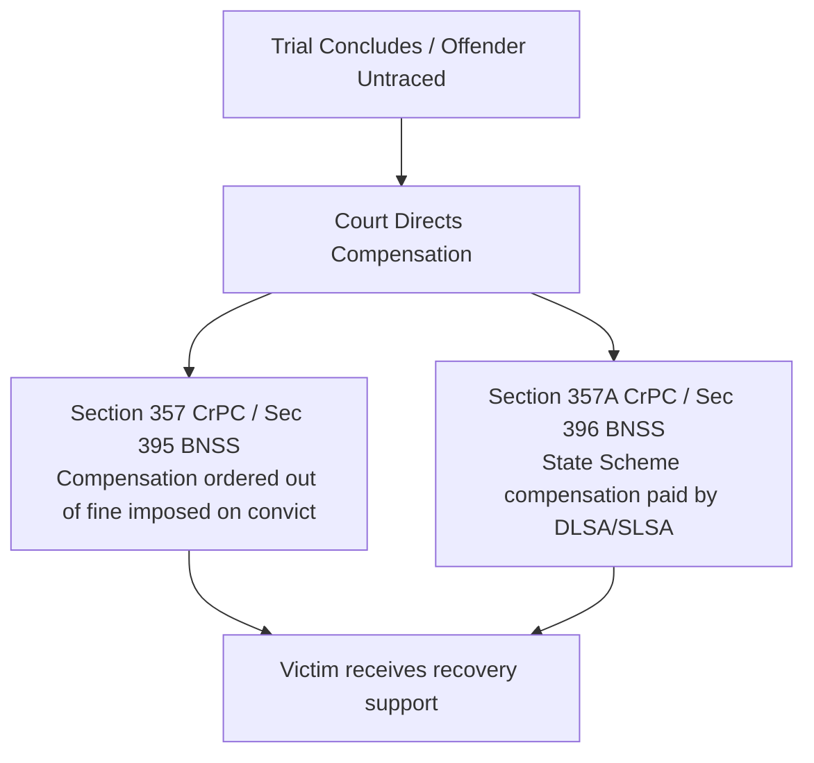

# 📘 Module 08: Legal Perspectives of Victim Assistance

🎚️ Difficulty: 🔴 Hard (High exam weightage, complex statutory provisions)  
⏳ Study Time: ~3 Hours  

---

### 🧠 Introduction

**Victim Assistance** represents the practical application of victimology within the criminal justice framework. It encompasses the legal, financial, and institutional structures designed to support victims, secure their rights during trials, and provide compensation to help them rebuild their lives.

In India, victim assistance has evolved from a purely welfare-based concept to a legally enforceable right. Supported by the Indian Constitution and key statutory reforms (such as Section 357 of the CrPC / BNSS), the legal framework ensures that victims are no longer passive bystanders in the justice process, but active participants with protected rights.

---

### 📖 Main Syllabus Content

#### 1. The UN Declaration on Victims' Rights (1985)

Passed by the UN General Assembly on November 29, 1985, the **Declaration of Basic Principles of Justice for Victims of Crime and Abuse of Power** is the global charter for victim advocacy. It outlines four core pillars of victim support:

1.  **Access to Justice & Fair Treatment**: Victims must be treated with compassion and respect, receive timely access to judicial mechanisms, and be informed of their rights and trial status.
2.  **Restitution**: Offenders should pay fair restitution to victims, covering physical harm, property damage, and legal expenses.
3.  **Compensation**: States must establish national funds to compensate victims when the offender is unable to pay or cannot be identified.
4.  **Assistance Programs**: Providing comprehensive medical, psychological, and social support through governmental and community agencies.

---

#### 2. Constitutional Rights of Victims in India

While the Indian Constitution does not explicitly contain the word "victim," the judiciary has read extensive victim protections into several key provisions:
*   **Article 21 (Right to Life and Personal Dignity)**: The right to a fair and speedy trial, legal assistance, and protection from harassment applies to victims just as it does to the accused.
*   **Article 14 (Right to Equality)**: Guarantees equal protection under the law, preventing arbitrary denial of justice or discriminatory treatment of victims during trials.
*   **Article 39A (Equal Justice & Free Legal Aid)**: Mandates that the state provide free legal representation to indigent victims to ensure that economic barriers do not prevent access to justice.
*   **Article 38 (Directive Principles of State Policy)**: Obligates the state to secure a social order that promotes justice and welfare for all citizens, including victims of crime.

---

#### 3. Statutory Provisions in India

India's legislative framework for victim assistance is primarily established under the Code of Criminal Procedure (CrPC) / Bharatiya Nagarik Suraksha Sanhita (BNSS) and the Probation of Offenders Act, 1958.

##### A. Victim Compensation Scheme (Section 357 & 357A CrPC / Sec 395 & 396 BNSS)

*   **Section 357 CrPC (Compensation from Fines)**: Empowers courts to direct the offender to pay compensation to the victim out of any fine imposed as part of their sentence.
*   **Section 357A CrPC (State Victim Compensation Scheme - Introduced in 2009)**: Mandates that every state government, in coordination with the central government, establish a victim compensation fund. This ensures that compensation is paid by the **District or State Legal Services Authority (DLSA/SLSA)** in cases where:
    *   The fine imposed under Section 357 is insufficient for rehabilitation.
    *   The accused is acquitted or discharged, but the victim still requires rehabilitation.
    *   The offender cannot be identified or traced (e.g., hit-and-run cases).

##### B. Section 5 of the Probation of Offenders Act, 1958
Empowers courts releasing an offender on probation or admonition to direct them to pay reasonable compensation and legal costs directly to the victim.

---

#### 4. Access to Justice & Rights During Trials

To prevent secondary victimization and ensure a balanced process, the law guarantees five key rights to victims during trials:

##### A. Right to Legal Assistance
Victims have the right to engage a private advocate to assist the Public Prosecutor. In cases of serious offenses against women or children, courts must provide free legal representation through the DLSA.

##### B. Right to Appeal (Section 372 CrPC Proviso - Introduced in 2009)
A landmark reform that grants victims a direct right to prefer an appeal against any order passed by a court:
1. Acquitting the accused.
2. Convicting the accused for a lesser offense.
3. Imposing inadequate compensation.

##### C. Role during Bail Hearings
Victims of serious or heinous offenses (such as sexual assault or gang rape) must be notified of bail hearings and have a right to be heard before courts decide on the accused's bail application.

##### D. Protection of Identity & In-Camera Trials (Section 327 CrPC / Sec 366 BNSS)
In-camera trials (closed to the public) are mandatory for sexual offenses. Publishing or disclosing the name or identity of a rape victim is a criminal offense under Section 228A of the IPC / BNS to protect privacy and prevent social stigma.

> 🧠 **Mnemonic — C-O-M-P-E-N-S-A-T-E:** "Courts Order Money, Protecting Every Needy Soul Against Trial Exploitation"
> *   **C** = Compensation schemes under Section 357 & 357A CrPC / BNSS
> *   **O** = UN Declaration principles of restitution and state compensation
> *   **M** = Mandatory in-camera trials for sexual offenses to protect privacy
> *   **P** = Proviso to Section 372 CrPC (Victim's direct right to appeal)
> *   **E** = Equal protection and right to legal dignity under Article 21
> *   **N** = Notification and representation rights during bail hearings
> *   **S** = Statutory legal aid through District Legal Services Authorities (DLSA)
> *   **A** = Assistance programs covering physical and psychological care
> *   **T** = Trial rights, including the ability to engage private counsel
> *   **E** = Easing the financial burden of legal costs (Sec 5 Probation Act)

---

### ⚖️ Landmark Case Laws

*   **Rudal Shah v. State of Bihar (1983)**: A historic judgment in which the Supreme Court introduced **compensatory jurisprudence for the violation of fundamental rights**. Rudal Shah was kept in illegal confinement for 14 years after his acquittal. The Court directed the state to pay him Rs. 35,000 in interim compensation, holding that Article 21 empowers courts to award financial relief for state excesses.
*   **Mallikarjun Kodagali v. State of Karnataka (2018)**: The Supreme Court emphasized that the right of a victim to prefer an appeal under Section 372 of the CrPC is a **real, substantive, and unrestricted right** that does not require prior permission (leave) from the High Court, ensuring direct access to justice.
*   **Ankush Shivaji Gaikwad v. State of Maharashtra (2013)**: The Supreme Court held that the power of courts to award compensation under Section 357 of the CrPC is **mandatory**, not discretionary. Courts must record reasons in every criminal case explaining why they did or did not award compensation to the victim, establishing a structured approach to sentencing.

---

### 🧾 Conclusion

Module 08 demonstrates that victim assistance is a cornerstone of modern criminal justice. Supported by global frameworks like the 1985 UN Declaration and key domestic reforms (such as Section 357A and the Section 372 appeal rights), the Indian legal system has established robust protections for victims. To ensure these measures are effective, courts must consistently apply compensatory rules, and states must ensure that victim compensation funds are easily accessible to all who need them.

---

### 🧠 Memorisation Toolkit

#### 🧩 Mnemonics
*   **C-O-M-P-E-N-S-A-T-E**: Compensation schemes, UN principles, Mandatory in-camera trials, Proviso to Section 372, Equal protection, Notification of bail, Statutory legal aid, Assistance programs, Trial rights, Easing financial burdens.
*   **U-N-C-A**: Access to justice, Restitution, Compensation, Assistance (The four pillars of the 1985 UN Declaration).

#### ⚡ Quick Revision Points
*   **1985 UN Declaration**: The global standard for victims' rights and state compensation.
*   **Section 357 CrPC**: Compensation paid directly out of the offender's fines.
*   **Section 357A CrPC**: State-funded Victim Compensation Schemes administered by the DLSA.
*   **Section 372 Proviso**: Grants the victim a direct right to appeal acquittals or inadequate sentences.
*   **Rudal Shah (1983)**: Landmark case establishing the state's liability to pay compensation for violating Article 21.
*   **Ankush Gaikwad (2013)**: Made it mandatory for courts to evaluate and record reasons regarding victim compensation in every criminal judgment.
