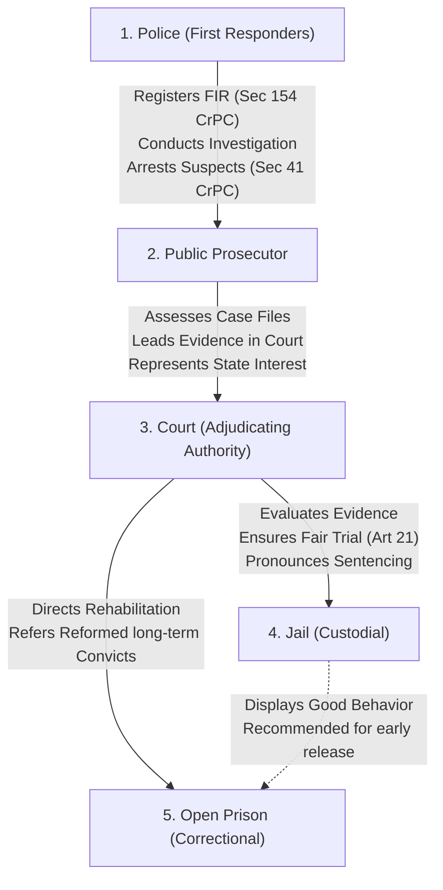

# 📐 Flowchart: Crime Control Mechanism Process

This flowchart maps the process and relationships between the five key organs of the Crime Control Mechanism in the Indian criminal justice system.

---

### 🗺️ Process Flowchart

---

### 📝 Key Procedural Steps

1.  **Police (Investigation & Arrest)**: The process begins when the police register an FIR under Section 154 of the CrPC. The police conduct the investigation, gather physical and forensic evidence, arrest the accused (under Section 41), and file a charge-sheet in court (Section 173).
2.  **Public Prosecutor (Prosecution)**: The prosecutor acts as an officer of the court, representing the interests of society to present the case against the accused in sessions or magistrate trials.
3.  **Court (Adjudication & Sentencing)**: The court evaluates the evidence presented by the prosecution and defense, ensuring a fair trial under Article 21 of the Indian Constitution, and pronounces the final sentence.
4.  **Jail Administration (Custodial Security)**: Jails hold under-trial prisoners during trials and secure convicted offenders serving sentences under the Prisons Act of 1894.
5.  **Open Prison (Rehabilitation)**: Reformed, well-behaved long-term prisoners can be transferred to open prisons, which operate on minimum security and high trust, to help them transition back into society.

---

> [!TIP]
> **Exam Writing Tip:**
> Cite the Supreme Court judgment in **State of Punjab v. Baldev Singh (1999)**. Explain that while crime control is a primary obligation of the state, it must be achieved while strictly protecting individual fundamental rights and due process.
