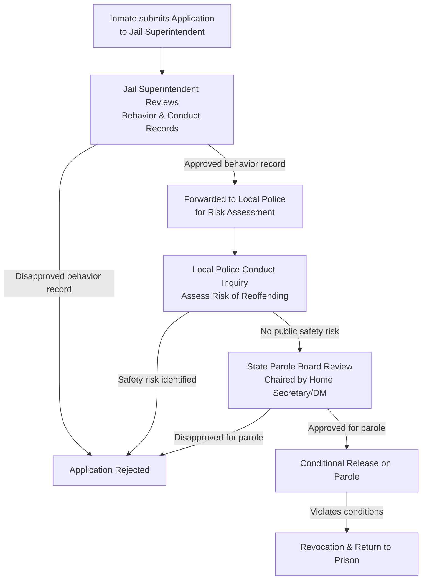

# 📐 Flowchart: Parole Release Procedure in India

This flowchart maps the administrative process of applying for and being released on parole in the Indian prison system.

---

### 🗺️ Process Flowchart

---

### 📝 Key Procedural Steps

1.  **Application Submission**: The eligible inmate submits a formal application for parole to the Jail Superintendent, specifying the reasons (e.g., family emergency).
2.  **Jail Conduct Review**: The Jail Superintendent reviews the inmate's behavior, work records, and overall discipline during confinement.
3.  **Local Police Inquiry**: The application is forwarded to the local police in the inmate's home district to assess public safety risks and the likelihood of reoffending.
4.  **Parole Board Review**: The State Parole Board (comprising state administrative, judicial, and police officials) reviews the reports and makes a final decision.
5.  **Conditional Release**: If approved, the inmate is released on parole under strict conditions (e.g., regular reporting and travel limits). Any violation leads to immediate revocation and return to prison.

---

> [!TIP]
> **Exam Writing Tip:**
> Cite the Supreme Court judgment in **Asfaq v. State of Haryana (2017)**. Explain that while parole is a discretionary privilege, applications must be processed fairly and without arbitrary administrative delays.
