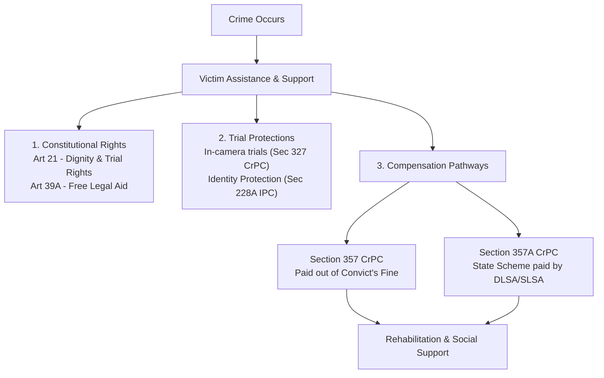

# 📐 Flowchart: Victim Assistance Framework in India

This flowchart maps the legal rights, assistance channels, and compensation pathways available to crime victims in the Indian criminal justice system.

---

### 🗺️ Process Flowchart

---

### 📝 Key Procedural Steps

1.  **Constitutional Protections**: The Supreme Court has read victim rights directly into Article 21 (right to dignity and a fair trial) and Article 39A (free legal aid), ensuring that victims receive necessary legal and social support.
2.  **Trial Protections**: To prevent secondary victimization, the law guarantees protections such as mandatory in-camera trials for sexual offenses (under Section 327 of the CrPC) and identity protection (under Section 228A of the IPC/BNS).
3.  **Compensation from Fines (Sec 357)**: Courts can direct the offender to pay compensation to the victim out of any fine imposed as part of their sentence.
4.  **State-Funded Schemes (Sec 357A)**: Administered by the State or District Legal Services Authorities (SLSA/DLSA), these schemes ensure that victims receive financial compensation even if the accused is acquitted, untraced, or unable to pay.

---

> [!TIP]
> **Exam Writing Tip:**
> Cite the Supreme Court judgment in **Ankush Shivaji Gaikwad v. State of Maharashtra (2013)**. Explain how the Court made it mandatory for criminal courts to evaluate and record reasons regarding victim compensation in every judgment.
