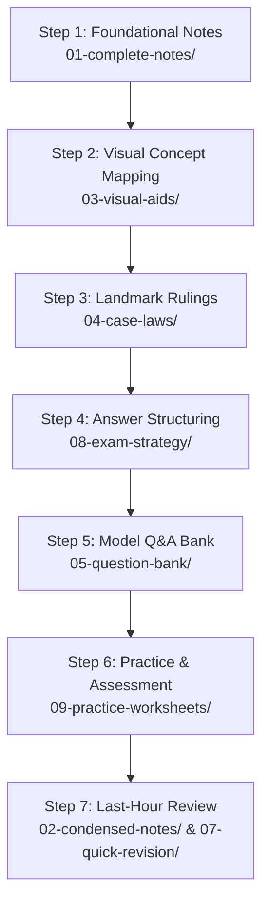

# 📖 Start Here: Guided Learning Path

Welcome! To master **Penology and Victimology** and secure a top grade in your SPPU examinations, follow this multi-layered, step-by-step study pipeline. It is structured to build a strong theoretical foundation before transitioning to exam strategy and practice.

---

## 🗺️ Recommended Study Path

---

## 🎯 Detailed Step-by-Step Breakdown

### 📚 Step 1: Grasp Foundational Concepts (Layer 1)
Begin with the **[Complete Notes](./01-complete-notes/)**. Each module file covers its topics thoroughly, incorporating statutory provisions (BNSS/CrPC/IPC), case histories, inline mnemonics, and custom flowcharts.
- *Recommended pace*: 1 Module every 2 days.

### 📐 Step 2: Reinforce with Visuals (Layer 3)
Read the **[Visual Aids](./03-visual-aids/)** alongside complete notes to cement your understanding:
- **Comparison Tables**: Study distinction sheets (e.g., *Parole vs. Furlough*) to prevent exam confusion.
- **Process Flowcharts**: Trace operational flows (e.g., *Parole Release*, *Crime Control Mechanisms*).

### ⚖️ Step 3: Memorize Landmark Jurisprudence (Layer 4)
Go through the **[Important Cases Digest](./04-case-laws/Module_Wise_Cases/Important_Cases_Penology_and_Victimology.md)**.
- Read each case's **Facts**, **Issue**, **Hold / Principle**, and specifically note the **Exam Relevance** to know exactly *when* and *where* to cite it for maximum impact.

### ✍️ Step 4: Learn Topper Answer Structuring (Layer 7)
Before attempting to write answers, read the **[Answer Writing Template](./08-exam-strategy/Answer_Writing_Template.md)**.
- Learn how to structure answers based on mark values (5, 10, or 15 marks).
- Note key tips: underlining statutory sections, listing explicit counts, and formatting citations.

### 📝 Step 5: Master the Model Q&A Bank (Layer 5)
Review the 20 files in the **[Question Bank](./05-question-bank/)**.
- Check the **[Most Probable Questions](./05-question-bank/Most_Probable_Questions_Oct_Nov_2026.md)** matrix first to identify high-priority modules.
- Read through the model answers for 5, 10, and 15 marks to understand how to apply the answer structuring rules.

### ⏱️ Step 6: Test Yourself Under Exam Conditions (Layer 8)
Print the **[Self Assessment Test](./09-practice-worksheets/Self_Assessment_Test.md)**.
- Allocate a continuous 3-hour slot.
- Attempt the mock exam without notes, mimicking exam-hall pressure to assess your recall.

### ⚡ Step 7: Last-Minute Rapid Revision (Layer 2 & 6)
On the day of the exam:
- Read the **[Condensed Notes](./02-condensed-notes/)** to jog your memory on core headings.
- Scan the **[Doctrines and Maxims Cheat Sheet](./07-quick-revision/Doctrines_and_Maxims.md)** for Latin phrases, section numbers, and the consolidated **mnemonics cheat sheet**.

---
*Good luck with your studies! Work hard and write structured answers.*
