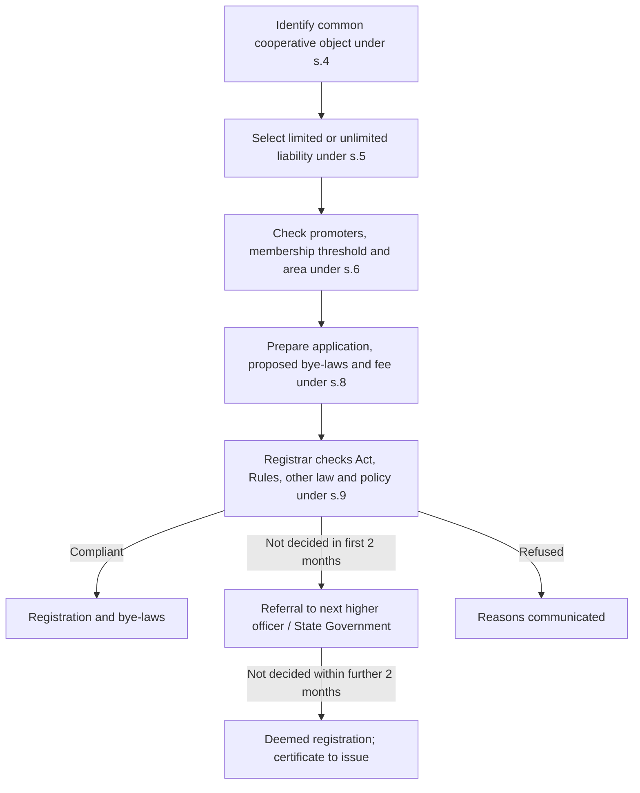
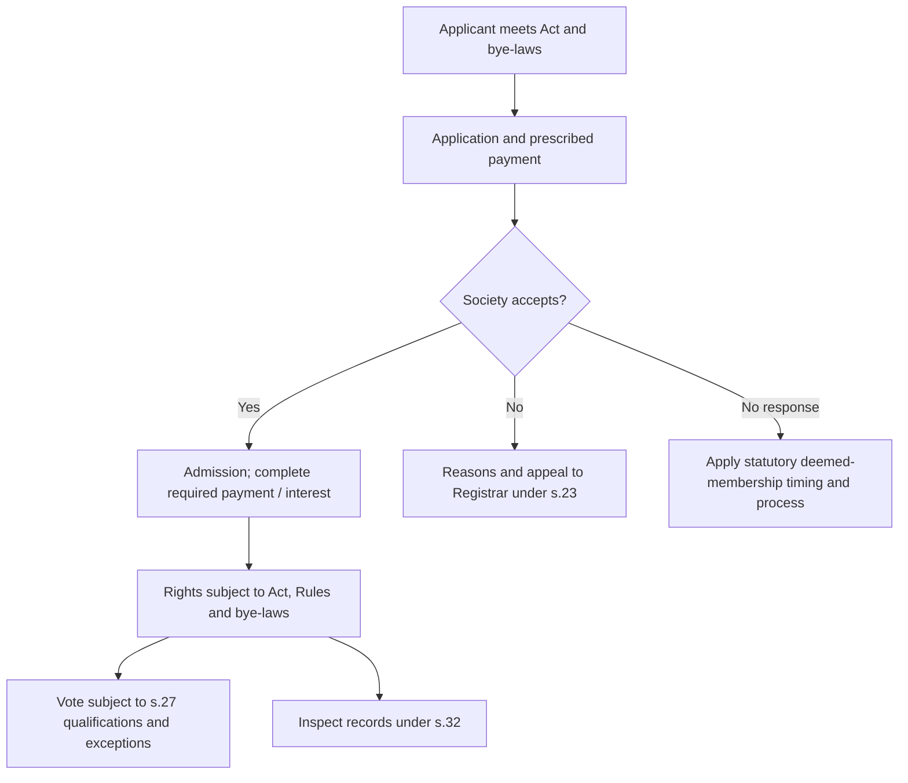
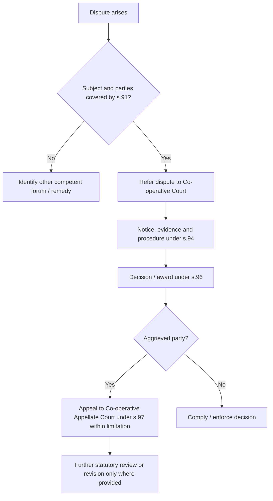
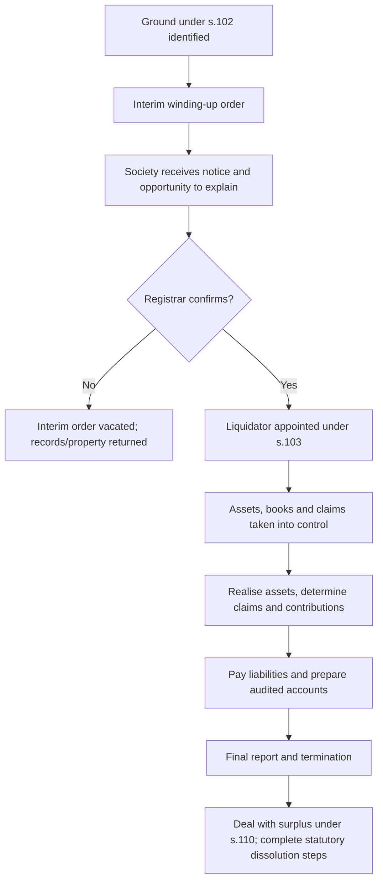

# Cooperative Law — Process Flowcharts

## Registration (MCS Act ss.4–10)

```mermaid
flowchart TD
 A[Identify common cooperative object under s.4] --> B[Select limited or unlimited liability under s.5]
 B --> C[Check promoters, membership threshold and area under s.6]
 C --> D[Prepare application, proposed bye-laws and fee under s.8]
 D --> E[Registrar checks Act, Rules, other law and policy under s.9]
 E -->|Compliant| F[Registration and bye-laws]
 E -->|Not decided in first 2 months| G[Referral to next higher officer / State Government]
 G -->|Not decided within further 2 months| H[Deemed registration; certificate to issue]
 E -->|Refused| I[Reasons communicated]
```

## Admission and membership rights

```mermaid
flowchart TD
 A[Applicant meets Act and bye-laws] --> B[Application and prescribed payment]
 B --> C{Society accepts?}
 C -->|Yes| D[Admission; complete required payment / interest]
 C -->|No| E[Reasons and appeal to Registrar under s.23]
 C -->|No response| F[Apply statutory deemed-membership timing and process]
 D --> G[Rights subject to Act, Rules and bye-laws]
 G --> H[Vote subject to s.27 qualifications and exceptions]
 G --> I[Inspect records under s.32]
```

## Dispute to appeal

```mermaid
flowchart TD
 A[Dispute arises] --> B{Subject and parties covered by s.91?}
 B -->|No| C[Identify other competent forum / remedy]
 B -->|Yes| D[Refer dispute to Co-operative Court]
 D --> E[Notice, evidence and procedure under s.94]
 E --> F[Decision / award under s.96]
 F --> G{Aggrieved party?}
 G -->|Yes| H[Appeal to Co-operative Appellate Court under s.97 within limitation]
 G -->|No| I[Comply / enforce decision]
 H --> J[Further statutory review or revision only where provided]
```

## Liquidation

```mermaid
flowchart TD
 A[Ground under s.102 identified] --> B[Interim winding-up order]
 B --> C[Society receives notice and opportunity to explain]
 C --> D{Registrar confirms?}
 D -->|No| E[Interim order vacated; records/property returned]
 D -->|Yes| F[Liquidator appointed under s.103]
 F --> G[Assets, books and claims taken into control]
 G --> H[Realise assets, determine claims and contributions]
 H --> I[Pay liabilities and prepare audited accounts]
 I --> J[Final report and termination]
 J --> K[Deal with surplus under s.110; complete statutory dissolution steps]
```
