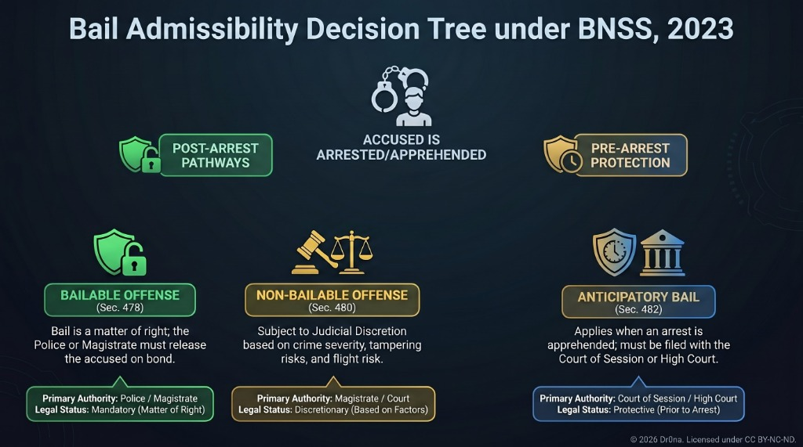
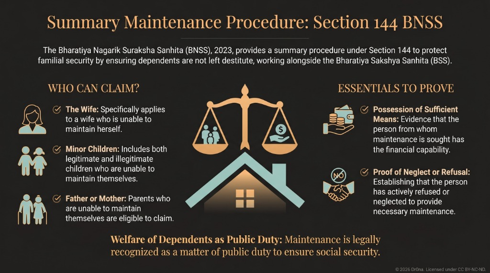

# Module 4: Bail and Bond, Security and Maintenance Proceedings

## Introduction

This module covers some of the most important provisions of the Bhartiya Nagarik Suraksha Sanhita (BNSS), 2023, dealing with the liberty of the accused and preventive aspects of criminal justice. Bail and bond provisions directly affect the fundamental right to personal liberty under Article 21. The module also covers security for keeping peace and good behaviour, maintenance of public order, disputes as to immovable property, and the maintenance obligations towards wives, children, and parents. These provisions demonstrate the dual function of criminal procedure — adjudicatory and preventive.

---

## 1. Bail Provisions (Secs. 478-496)

### Conceptual Framework

**Bail** is the release of an accused from custody upon execution of a bond (with or without sureties) guaranteeing the person's appearance at trial. It reflects the balance between the presumption of innocence and the need to ensure the accused's presence at trial.

> **Key Principle**: "Bail is the rule, jail is the exception" — *State of Rajasthan v. Balchand* (1977).

### Types of Bail

| Type | Description | BNSS Section |
|------|-------------|-------------|
| **Regular Bail** | Granted to a person who is already in custody | Secs. 478, 480 |
| **Anticipatory Bail** | Granted to a person apprehending arrest | Sec. 482 |
| **Default Bail / Statutory Bail** | When charge sheet not filed within prescribed period | Sec. 187 (read with Sec. 479) |
| **Interim Bail** | Temporary bail pending hearing of the bail application | Judicial practice |

---

### A. Bail in Bailable Offences (Sec. 478)

**Sec. 478(1)** — When any person **other than a person accused of a non-bailable offence** is arrested or detained without warrant, or appears or is brought before a Court, and is prepared to give bail, **such person shall be released on bail**.

> **Key Point**: In bailable offences, bail is a **matter of right**. The police officer or court has **no discretion** to refuse bail.

**Proviso to Sec. 478(1)** — If the person is **indigent** and unable to furnish surety:
- The officer or court **shall** discharge him on his executing a **personal bond** (without sureties)

**Explanation** — If a person is unable to give bail bond **within one week** of arrest, it shall be **presumed** that he is an indigent person.

> **New in BNSS**: The one-week presumption of indigence is a new provision aimed at preventing undue incarceration of poor accused persons.

**Sec. 478(2)** — If a person has **failed to comply** with conditions of bond regarding time and place of attendance:
- The court may **refuse** to release him on bail on a subsequent occasion in the same case
- This refusal is without prejudice to the court's power to call upon sureties to pay penalty under Sec. 491

---

### B. Maximum Period of Detention — Undertrial Prisoners (Sec. 479)

This section addresses the chronic problem of undertrial prisoners languishing in jail for periods longer than the sentence they would receive if convicted.

**Sec. 479(1)** — Where a person has undergone detention for **one-half** of the maximum period of imprisonment specified for the offence → **shall be released on bail by the Court**.

**First Proviso** — For **first-time offenders** (never previously convicted):
- Release on bond if detained for **one-third** of the maximum period

> **New in BNSS**: The one-third provision for first-time offenders is a new beneficial provision.

**Second Proviso** — The court may, after hearing the Public Prosecutor and for **reasons recorded in writing**, order continued detention beyond one-half of the period.

**Third Proviso** — In **no case** shall a person be detained for **more than the maximum period** of imprisonment for that offence.

> **Important**: This section does **not apply** to offences punishable with **death or life imprisonment**.

**Explanation** — Period of detention caused by **delay by the accused** shall be **excluded** from computation.

**Sec. 479(2)** — Exception: Where investigation, inquiry, or trial in **more than one offence or multiple cases** is pending, the person shall **not** be released on bail under this section.

**Sec. 479(3)** — The **Superintendent of Jail** shall make an application to the court for release on completion of one-half or one-third period.

> **New in BNSS**: The mandatory obligation on the jail superintendent to apply for bail is a new safeguard to prevent overcrowding and ensure timely release.

---

### C. Bail in Non-Bailable Offences (Sec. 480)

In non-bailable offences, bail is **not a matter of right** but of **judicial discretion**.

**Sec. 480(1)** — When any person accused of a non-bailable offence is arrested or appears before a court other than the High Court or Court of Session, **he may be released on bail**, but:

- **Clause (i)**: Shall **not** be released if there are reasonable grounds for believing guilt of an offence punishable with **death or life imprisonment**
- **Clause (ii)**: Shall **not** be released if the offence is **cognizable** and the person has been **previously convicted** of:
  - An offence punishable with death, life imprisonment, or 7+ years imprisonment, OR
  - On **two or more occasions** of a cognizable offence punishable with 3-7 years imprisonment

**Exceptions (Provisos to Sec. 480(1))**:

| Proviso | Exception |
|---------|-----------|
| **First Proviso** | Court may release a **child, woman, sick, or infirm person** even under clause (i) or (ii) |
| **Second Proviso** | Court may release person under clause (ii) for "any other **special reason**" |
| **Third Proviso** | Mere requirement for identification by witnesses or police custody beyond 15 days is **not sufficient ground** for refusing bail |
| **Fourth Proviso** | For offences punishable with death, life, or 7+ years — bail shall not be granted **without hearing the Public Prosecutor** |

**Sec. 480(2)** — If at any stage it appears that there are **not reasonable grounds** for believing the accused committed the non-bailable offence, but there are sufficient grounds for further inquiry → accused shall be released on bail.

**Sec. 480(3)** — Conditions for bail in offences punishable with 7+ years or under specified BNS chapters:
- **(a)** Attend as per bond conditions
- **(b)** Not commit similar offence
- **(c)** Not induce, threaten, or promise any witness so as to dissuade disclosure of facts or tamper with evidence

**Sec. 480(4)** — Court **must record reasons** in writing for granting bail.

**Sec. 480(5)** — Court may **re-arrest** and commit to custody a person released on bail.

**Sec. 480(6)** — In cases triable by Magistrate, if trial of a non-bailable offence is **not concluded within 60 days** from the first date of evidence → accused shall be released on bail (unless Magistrate records reasons for continued detention).

**Sec. 480(7)** — After conclusion of trial and before judgment, if court believes there are reasonable grounds that the accused is **not guilty** → shall release the accused on bond.

### Visual Guide: Bail Admissibility Decision Tree (BNSS 2023)

---

### D. Bail to Appear Before Appellate Court (Sec. 481)

**New Provision in BNSS**

**Sec. 481(1)** — Before conclusion of trial and before disposal of appeal:
- The trial court or appellate court shall require the accused to execute a **bond or bail bond** to appear before the **higher court** when notice is issued
- Such bond shall be **in force for six months**

**Sec. 481(2)** — If accused fails to appear → bond stands forfeited → procedure under Sec. 491 applies.

> **Significance**: This ensures continuity of the accused's obligation to appear through the appellate process.

---

### E. Anticipatory Bail (Sec. 482)

**Sec. 482(1)** — When any person has reason to believe that he **may be arrested** on accusation of a non-bailable offence:
- He may apply to the **High Court** or **Court of Session**
- The court may direct that **in the event of arrest**, he shall be released on bail

**Sec. 482(2)** — Conditions that may be imposed:
- **(i)** Make himself available for **interrogation** by police officer as and when required
- **(ii)** Not make any **inducement, threat, or promise** to any witness
- **(iii)** Not **leave India** without court permission
- **(iv)** Any other condition as may be imposed under Sec. 480(3)

**Sec. 482(3)** — If such person is subsequently arrested without warrant:
- He shall be released on bail
- If Magistrate decides to issue a warrant, it shall be a **bailable warrant** in conformity with the court's direction

**Sec. 482(4)** — **Exclusion**: Anticipatory bail does **not apply** to offences under:
- **Sec. 65 BNS** (Rape)
- **Sec. 70(2) BNS** (Gang rape)

> **Landmark Case**: *Gurbaksh Singh Sibbia v. State of Punjab* (1980) — Supreme Court held that anticipatory bail is a device to secure the individual's liberty. It is a constitutional imperative that no person should be deprived of liberty except in accordance with procedure established by law.

> **Landmark Case**: *Sushila Aggarwal v. State (NCT of Delhi)* (2020) — Supreme Court held that anticipatory bail can be **without time limit** and need not be limited to a specific period.

---

### F. Special Powers of High Court and Court of Session (Sec. 483)

**Sec. 483(1)** — The High Court or Court of Session may:
- **(a)** Direct release of any accused on bail with conditions
- **(b)** Set aside or modify bail conditions imposed by Magistrate

**Provisos**:
- Before granting bail for offences **triable exclusively by Sessions Court** or punishable with **life imprisonment** → must give **notice to Public Prosecutor**
- Before granting bail for offences under **Sec. 65 or 70(2) BNS** (rape/gang rape) → must give notice to PP within **15 days** from receipt of application

**Sec. 483(2)** — **Informant's presence** is obligatory at hearing of bail for rape/gang rape cases.

**Sec. 483(3)** — High Court or Sessions Court may **re-arrest** a person released on bail.

---

### G. Amount of Bond and Sureties (Secs. 484-486)

| Section | Provision |
|---------|-----------|
| **Sec. 484(1)** | Amount of bond shall be fixed with **due regard to circumstances** and shall **not be excessive** |
| **Sec. 484(2)** | High Court or Sessions Court may direct **reduction** of bail amount |
| **Sec. 485** | Bond/bail bond executed by accused and sureties — conditions regarding appearance |
| **Sec. 485(4)** | Court may accept **affidavits** to determine fitness of sureties |
| **Sec. 486** | Surety shall make a **declaration** as to number of persons to whom he has stood surety |

---

### H. Other Bail Provisions (Secs. 487-496)

| Section | Provision |
|---------|-----------|
| **Sec. 487** | **Discharge from custody** — release on execution of bond/bail bond |
| **Sec. 488** | Power to order **sufficient bail** when first taken is insufficient |
| **Sec. 489** | **Discharge of sureties** — surety may apply for discharge |
| **Sec. 490** | **Deposit instead of recognizance** — money or Government promissory notes in lieu of bond |
| **Sec. 491** | **Forfeiture of bond** — procedure when bond is forfeited; surety liable for imprisonment up to **6 months** in civil jail |
| **Sec. 492** | **Cancellation of bond** — bond and bail bond stand cancelled on forfeiture for breach |
| **Sec. 493** | **Death/insolvency of surety** — court may order fresh security |
| **Sec. 494** | **Bond from child** — surety only; child need not execute personal bond |
| **Sec. 495** | **Appeal** from orders under Sec. 491 — to Sessions Judge (from Magistrate) or to appellate court (from Sessions) |
| **Sec. 496** | **Power to direct levy** — High Court/Sessions may direct Magistrate to levy amount due on bond |

---

## 2. Security for Keeping Peace and for Good Behaviour (Secs. 125-143)

These are **preventive provisions** designed to maintain public order. They empower courts and magistrates to require security from persons who may breach the peace.

### A. Security on Conviction (Sec. 125)

**Sec. 125(1)** — When a Court of Session or Magistrate of the First Class **convicts** a person of specified offences and considers it necessary to take security → may order execution of bond or bail bond for keeping peace, **not exceeding 3 years**.

**Sec. 125(2)** — Specified offences:
- **(a)** Offences under **Chapter XI of BNS** (except certain sections)
- **(b)** Offences involving **assault, criminal force, or mischief**
- **(c)** **Criminal intimidation**
- **(d)** Offences causing or likely to cause **breach of peace**

**Sec. 125(3)** — If conviction is set aside on appeal → bond becomes **void**.
**Sec. 125(4)** — Order may also be made by **Appellate Court** or court exercising **revision**.

---

### B. Security for Keeping Peace in Other Cases (Sec. 126)

**Sec. 126(1)** — When an **Executive Magistrate** receives information that any person is likely to commit a **breach of the peace or disturb public tranquillity**:
- May require such person to **show cause** why he should not be ordered to execute a bond for keeping peace
- Period: **not exceeding one year**

**Sec. 126(2)** — Proceedings may be taken when the place of apprehended breach **or** the person is within local jurisdiction.

---

### C. Security for Good Behaviour (Secs. 127-129)

| Section | Category | Period |
|---------|----------|--------|
| **Sec. 127** | Persons **disseminating certain matters** (seditious/defamatory/obscene) | Up to **1 year** |
| **Sec. 128** | **Suspected persons** concealing presence with view to committing cognizable offence | Up to **1 year** |
| **Sec. 129** | **Habitual offenders** — robbers, house-breakers, thieves, forgers, receivers of stolen property, kidnappers, and persons "desperate and dangerous" | Up to **3 years** |

**Sec. 129** — Categories of habitual offenders include:
- Habitual robbers, house-breakers, thieves, forgers
- Habitual receivers of stolen property
- Habitual kidnappers, abductors, extortionists
- Habitual offenders under specified Acts (Drugs Act, FEMA, Essential Commodities Act, etc.)
- Persons "so desperate and dangerous as to render being at large hazardous to the community"

---

### D. Procedure for Security Proceedings (Secs. 130-143)

#### Order and Inquiry (Secs. 130-135)

| Section | Provision |
|---------|-----------|
| **Sec. 130** | Magistrate shall make **written order** setting forth substance of information, amount of bond, term, and number of sureties |
| **Sec. 131** | If person is **present** in court — order shall be read over or explained |
| **Sec. 132** | If person is **absent** — summons or warrant shall be issued |
| **Sec. 133** | Copy of order to accompany summons or warrant |
| **Sec. 134** | Magistrate may **dispense with personal attendance** and permit appearance by advocate |
| **Sec. 135** | **Inquiry** — conducted as a summons case trial |

**Sec. 135(3)** — During pending inquiry, Magistrate may direct person to execute bond **if immediate measures are necessary** for prevention of breach of peace.

**Sec. 135(6)** — Inquiry must be completed within **6 months**; if not completed, proceedings **stand terminated** (unless Magistrate records special reasons).

#### Order, Discharge, and Imprisonment (Secs. 136-143)

| Section | Provision |
|---------|-----------|
| **Sec. 136** | If inquiry proves security is necessary → Magistrate shall order execution of bond |
| **Sec. 137** | If not proved → person shall be **discharged** |
| **Sec. 138** | Commencement of security period — from expiration of sentence or date of order |
| **Sec. 139** | Contents of bond — breach includes commission of any offence punishable with imprisonment |
| **Sec. 140** | Power to **reject sureties** after inquiry on oath |
| **Sec. 141** | **Imprisonment in default** of security — maximum **3 years** |
| **Sec. 142** | Power to **release** persons imprisoned for failing to give security |
| **Sec. 143** | Security for **unexpired period** of bond — fresh security for remaining term |

**Sec. 141(7)** — Imprisonment for failure to give security for keeping peace shall be **simple**.
**Sec. 141(8)** — Imprisonment for failure to give security for good behaviour:
- Under Sec. 127 → **simple**
- Under Secs. 128 or 129 → **rigorous or simple** as directed

---

## 3. Maintenance of Public Order and Tranquillity (Secs. 148-163)

### A. Unlawful Assemblies (Secs. 148-151)

**Sec. 148** — Dispersal of assembly by civil force:
- **Executive Magistrate, officer-in-charge of police station, or sub-inspector** may command any unlawful assembly or assembly of **5+ persons** likely to cause disturbance to disperse
- If assembly does not disperse → may use **force** to disperse
- May require assistance of **any person** (not armed forces) for dispersal

**Sec. 149** — Use of armed forces to disperse assembly:
- Only by **District Magistrate** or authorised Executive Magistrate
- Armed forces shall use **as little force** and do **as little injury** as consistent with dispersal

**Sec. 150** — Power of armed forces officers:
- When no Executive Magistrate can be communicated with → commissioned/gazetted officer may disperse assembly
- Must communicate with Executive Magistrate as soon as practicable

**Sec. 151** — Protection against prosecution:
- No prosecution without sanction of **Central Government** (for armed forces) or **State Government** (others)
- No person acting in **good faith** shall be deemed to have committed an offence

---

### B. Public Nuisances (Secs. 152-163)

#### Conditional Order for Removal of Nuisance (Sec. 152)

An **Executive Magistrate** (District Magistrate, Sub-divisional Magistrate, or specially empowered Magistrate) may make a conditional order when:
- **(a)** Unlawful obstruction or nuisance in a **public place, way, river, or channel**
- **(b)** Trade/occupation **injurious to health** or physical comfort of community
- **(c)** Construction likely to cause **conflagration or explosion**
- **(d)** Building/structure/tree **likely to fall** and cause injury
- **(e)** Tank/well/excavation needing **fencing** to prevent danger
- **(f)** **Dangerous animal** to be destroyed, confined, or disposed of

The order requires the person to remove the nuisance within a fixed time, or **show cause** why the order should not be made absolute.

**Sec. 152(2)** — No order under this section shall be questioned in any **Civil Court**.

#### Procedure (Secs. 153-161)

| Section | Provision |
|---------|-----------|
| **Sec. 153** | Service or notification of order — by summons or proclamation |
| **Sec. 154** | Person to obey or show cause; hearing may be through **audio-video conferencing** (New) |
| **Sec. 155** | Penalty for non-compliance — under Sec. 223 BNS; order made absolute |
| **Sec. 156** | Procedure where existence of **public right** is denied — Magistrate to inquire |
| **Sec. 157** | Procedure where person shows cause — evidence as in summons case; proceedings to be completed within **90 days** (extendable to **120 days**) |
| **Sec. 158** | Power of Magistrate to direct **local investigation** or examine **expert** |
| **Sec. 159** | Power to furnish written instructions; report receivable as evidence |
| **Sec. 160** | Consequences of disobedience — Magistrate may cause act to be performed and recover costs |
| **Sec. 161** | **Injunction pending inquiry** — for imminent danger or serious injury |

**Sec. 160(3)** — No suit shall lie for acts done in **good faith**.

#### Urgent Cases — Sec. 163 (Corresponding to CrPC Sec. 144)

**Sec. 163(1)** — Executive Magistrate may pass order directing any person to **abstain from a certain act** or take certain order with respect to property, if such direction is likely to prevent:
- Obstruction, annoyance, or injury
- Danger to human life, health, or safety
- Disturbance of public tranquillity
- Riot or affray

**Sec. 163(2)** — Order may be passed **ex parte** in cases of emergency.

**Sec. 163(3)** — Order may be directed to a **particular individual** or to **persons in an area** or to the **public generally**.

**Sec. 163(4)** — Duration: Not more than **2 months** from making.
- **Proviso**: State Government may extend for a further period **not exceeding 6 months** for preventing danger to life, health, safety, riot, or affray.

**Sec. 163(5)-(6)** — Magistrate or State Government may **rescind or alter** the order on own motion or on application.

**Sec. 163(7)** — If application is rejected → reasons must be **recorded in writing**.

> **Landmark Case**: *Madhu Limaye v. Sub-Divisional Magistrate* (1970) — Supreme Court held that orders under Sec. 144 CrPC (now Sec. 163 BNSS) must be passed on material facts; power cannot be used as a tool to prevent exercise of fundamental rights of assembly and free speech.

> **Landmark Case**: *Anuradha Bhasin v. Union of India* (2020) — Supreme Court held that orders under Sec. 144 CrPC must satisfy the test of proportionality and must be published for judicial review.

---

### C. Magistrate May Prohibit Repetition of Public Nuisance (Sec. 162)

District/Sub-divisional Magistrate or any empowered Executive Magistrate or DCP may order any person **not to repeat or continue** a public nuisance as defined in BNS or any special/local law.

---

## 4. Disputes as to Immovable Property (Secs. 164-167)

### Sec. 164 — Procedure When Dispute Concerning Land or Water Is Likely to Cause Breach of Peace

**Sec. 164(1)** — When an **Executive Magistrate** is satisfied from a police report or other information that a **dispute likely to cause breach of peace** exists concerning **land or water** within his jurisdiction:
- Make a **written order** requiring parties to attend court
- Parties to submit **written statements** of their claims regarding **actual possession**

**Sec. 164(2)** — "Land or water" includes: buildings, markets, fisheries, crops, produce of land, rents, and profits.

**Sec. 164(4)** — Magistrate shall:
- **Not refer to merits** of claims to right
- Decide **who was in actual possession** at the date of the order

**Proviso to Sec. 164(4)** — If any party was **forcibly and wrongfully dispossessed within 2 months** before the police report → Magistrate may treat such party as if in possession.

**Sec. 164(5)** — Any party may show that **no dispute exists** → Magistrate shall cancel order. Subject to this, Magistrate's order under sub-section (1) is **final**.

**Sec. 164(6)** — If Magistrate decides one party was in possession → shall declare that party entitled to possession **until evicted in due course of law**; may **restore possession** in case of forcible dispossession.

### Sec. 165 — Attachment and Receiver

**Sec. 165(1)** — Magistrate may **attach** the subject of dispute if:
- Case is one of **emergency**, or
- **None** of the parties was in possession, or
- Magistrate is **unable to determine** possession

Attachment continues until a competent court determines rights.

**Sec. 165(2)** — Magistrate may appoint a **receiver** with powers of a receiver under CPC, 1908.

### Sec. 166 — Disputes Concerning Right of User of Land or Water

Disputes regarding **easements or rights of user** → same procedure as Sec. 164 applies.

### Sec. 167 — Local Inquiry

Magistrate may depute a subordinate Magistrate for **local inquiry**; may direct who shall bear costs.

---

## 5. Maintenance of Wives, Children and Parents (Secs. 144-147)

### Sec. 144 — Order for Maintenance

**Sec. 144(1)** — If any person having sufficient means **neglects or refuses** to maintain:
- **(a)** His **wife**, unable to maintain herself
- **(b)** His **legitimate or illegitimate child** (married or not), unable to maintain itself
- **(c)** His legitimate/illegitimate child (not being a **married daughter**) who has attained majority, where such child is, by reason of **physical or mental abnormality or injury**, unable to maintain itself
- **(d)** His **father or mother**, unable to maintain himself or herself

→ A **Magistrate of the First Class** may order the person to make a **monthly allowance** for maintenance.

**First Proviso** — Father of a minor married daughter may be ordered to pay maintenance if husband lacks sufficient means.

**Second Proviso** — During **pendency** of proceedings, Magistrate may order **interim maintenance** and expenses of proceedings.

**Third Proviso** — Application for interim maintenance shall be disposed of within **60 days** from service of notice.

**Explanation** — "**Wife**" includes a woman who has been **divorced** by, or has obtained a divorce from, her husband and has **not remarried**.

> **Important**: The definition of "wife" includes a divorced woman who has not remarried, thereby extending the benefit of maintenance even after divorce.

**Sec. 144(2)** — Allowance payable from **date of order** or, if so ordered, from **date of application**.

**Sec. 144(3)** — On failure to pay → Magistrate may:
- Issue **warrant for levying** the amount as a fine
- Sentence to imprisonment for **up to 1 month** (or until payment)
- Application for levy must be made **within 1 year** from due date

**Sec. 144(4)** — No wife shall receive maintenance if:
- She is living in **adultery**, or
- Without sufficient reason, **refuses to live with husband**, or
- They are living separately by **mutual consent**

**Explanation** — Husband's marriage with another woman or keeping a mistress is **just ground** for wife's refusal to live with him.

### Visual Guide: Section 144 Maintenance Admissibility Checklist

### Sec. 145 — Procedure

**Sec. 145(1)** — Proceedings may be taken in any district where:
- **(a)** The respondent **is**, or
- **(b)** The respondent or his wife **resides**, or
- **(c)** The respondent **last resided** with wife/mother, or
- **(d)** His **father or mother** resides

**Sec. 145(2)** — Evidence to be taken in presence of the respondent or his advocate; may proceed **ex parte** if respondent wilfully avoids service; ex parte order may be set aside within **3 months**.

### Sec. 146 — Alteration in Allowance

**Sec. 146(1)** — On proof of **change in circumstances** → Magistrate may alter the allowance.

**Sec. 146(2)** — If a Civil Court decision affects the maintenance order → Magistrate shall **cancel or vary** accordingly.

**Sec. 146(3)** — Cancellation where divorced wife:
- **(a)** Has **remarried** → cancel from date of remarriage
- **(b)** Has received full sum payable under personal law on divorce → cancel
- **(c)** Has voluntarily **surrendered** maintenance rights → cancel

### Sec. 147 — Enforcement of Order

Copy of order to be given **free of cost** to the beneficiary. Order may be enforced by **any Magistrate** anywhere the respondent may be found.

---

## 6. Maintenance Under the Muslim Women (Protection of Rights on Divorce) Act, 1986

### Background

This Act was enacted following the Supreme Court decision in *Mohd. Ahmed Khan v. Shah Bano Begum* (1985), where the court held that a Muslim woman is entitled to maintenance under Sec. 125 CrPC (now Sec. 144 BNSS) even after iddat period.

### Key Provisions

1. **Reasonable and fair provision** during **iddat period** (approx. 3 months after divorce)
2. **Mahr** (dower) amount to be paid
3. Return of properties given at the time of marriage
4. Maintenance for **children** born before or after divorce for a period of **2 years**
5. If the divorced woman is unable to maintain herself after iddat → **Magistrate may order relatives** (who would inherit her property) to maintain her
6. If no relatives → **State Waqf Board** is liable

### Important Judicial Development

**Mohd. Abdul Samad v. State of Telangana** (2024) — Supreme Court upheld that Muslim women can seek maintenance under both the 1986 Act and Sec. 125 CrPC (now Sec. 144 BNSS).

> **Landmark Case**: *Danial Latifi v. Union of India* (2001) — Supreme Court read down the 1986 Act to hold that a Muslim husband is liable to make reasonable and fair provision for the future of the divorced wife, extending beyond the iddat period.

---

## Landmark Judgments

### 1. State of Rajasthan v. Balchand (1977)
- **Held**: "Bail is the rule, jail is the exception." Basic rule of criminal justice is bail, not jail.
- **Significance**: Established the foundational principle for bail jurisprudence.

### 2. Gurbaksh Singh Sibbia v. State of Punjab (1980)
- **Held**: Anticipatory bail is a constitutional imperative; no blanket restrictions can be imposed on the power of courts to grant anticipatory bail.
- **BNSS Relevance**: Sec. 482

### 3. Sushila Aggarwal v. State (NCT of Delhi) (2020)
- **Held**: Anticipatory bail can be without time limit; need not be limited to a specific period. The protection can continue until the trial concludes.
- **BNSS Relevance**: Sec. 482

### 4. Arnesh Kumar v. State of Bihar (2014)
- **Held**: Police must satisfy themselves about necessity of arrest in cases with imprisonment up to 7 years. Magistrate must be satisfied that conditions for arrest were met before authorizing detention.
- **BNSS Relevance**: Sec. 35 (arrest restrictions), Sec. 480 (bail in non-bailable)

### 5. Dataram Singh v. State of UP (2018)
- **Held**: Supreme Court deprecated the practice of attaching conditions that are impossible to comply with while granting bail. Conditions must be reasonable.
- **BNSS Relevance**: Sec. 484 (amount of bond not to be excessive)

### 6. Mohd. Ahmed Khan v. Shah Bano Begum (1985)
- **Held**: Muslim divorced woman is entitled to maintenance under Sec. 125 CrPC even after iddat period.
- **BNSS Relevance**: Sec. 144

### 7. Madhu Limaye v. Sub-Divisional Magistrate (1970)
- **Held**: Orders under Sec. 144 CrPC (now Sec. 163 BNSS) must be based on material facts; cannot be used to prevent exercise of fundamental rights.
- **BNSS Relevance**: Sec. 163

### 8. Anuradha Bhasin v. Union of India (2020)
- **Held**: Orders under Sec. 144 CrPC must satisfy proportionality test and be published for judicial review.
- **BNSS Relevance**: Sec. 163

---

## Examination Notes

### Most Important Sections

- **Sec. 478**: Bail in bailable offences (right of bail)
- **Sec. 479**: Maximum period of detention — one-half/one-third rule (New)
- **Sec. 480**: Bail in non-bailable offences (judicial discretion)
- **Sec. 482**: Anticipatory bail (exclusion for rape/gang rape)
- **Sec. 483**: Special powers of High Court/Sessions Court
- **Sec. 144**: Maintenance of wives, children, and parents
- **Sec. 163**: Urgent cases (corresponding to CrPC Sec. 144)
- **Sec. 164**: Disputes as to immovable property

### Key Comparisons for Exam

| Aspect | CrPC 1973 | BNSS 2023 |
|--------|-----------|-----------|
| Bail (bailable offences) | Sec. 436 | Sec. 478 |
| Bail (non-bailable) | Sec. 437 | Sec. 480 |
| Anticipatory bail | Sec. 438 | Sec. 482 |
| Max undertrial detention | Sec. 436A | Sec. 479 (improved: 1/3 for first-timers) |
| Maintenance | Sec. 125 | Sec. 144 (interim maintenance within 60 days) |
| Sec. 144 orders | Sec. 144 | Sec. 163 |
| Bail to appear before appellate court | No equivalent | Sec. 481 (New) |
| Indigent presumption | No provision | Sec. 478 Explanation (1 week) |
| Jail superintendent obligation | No provision | Sec. 479(3) (New) |
| Exclusion of anticipatory bail for rape | No exclusion | Sec. 482(4) (New) |

### Frequently Asked Questions

1. **Distinguish between bail in bailable and non-bailable offences** (10 marks)
2. **Explain the concept of anticipatory bail under BNSS** (10 marks)
3. **Write a note on the maximum period of detention of undertrials (Sec. 479)** (5 marks)
4. **Discuss the maintenance provisions under Sec. 144 BNSS** (15 marks)
5. **Explain the procedure under Sec. 163 BNSS (urgent cases)** (10 marks)
6. **Distinguish between security for keeping peace and security for good behaviour** (10 marks)
7. **Discuss the procedure for disputes as to immovable property under Sec. 164** (10 marks)

---

## Quick Revision Points

✅ **Sec. 478**: Bail in bailable offences is a **matter of right**; indigent presumed if unable to give bail within **1 week** (New)

✅ **Sec. 479**: Maximum detention — **1/2** of maximum punishment; **1/3** for **first-time offenders** (New); jail superintendent **must apply** for bail (New)

✅ **Sec. 480**: Bail in non-bailable — **discretionary**; must hear PP for 7+ year offences; child/woman/sick may be released

✅ **Sec. 481**: Bond to appear before appellate court — **6 months** (Entirely New)

✅ **Sec. 482**: Anticipatory bail — High Court or Sessions Court; **not available for rape/gang rape** (New exclusion)

✅ **Sec. 483**: Special powers — PP notice mandatory for sessions-triable/life imprisonment offences; **15 days** for rape cases

✅ **Secs. 125-129**: Security — on conviction (3 years), breach of peace (1 year), habitual offenders (3 years)

✅ **Sec. 135(6)**: Security inquiry must be completed within **6 months** or proceedings terminated

✅ **Sec. 141**: Imprisonment in default of security — max **3 years**; keeping peace = simple; good behaviour = rigorous or simple

✅ **Sec. 144**: Maintenance — wife (including **divorced wife who has not remarried**), children, parents; interim maintenance within **60 days** (New timeline)

✅ **Sec. 148**: Dispersal of unlawful assembly — 5+ persons; escalation: civil force → armed forces

✅ **Sec. 163**: Urgent orders — max **2 months**; State Government may extend to **6 months**; can be ex parte; must satisfy **proportionality test**

✅ **Sec. 164**: Land/water disputes — only **actual possession** examined, not merits; forcible dispossession within **2 months** — deemed in possession

✅ *Bail is the rule, jail is the exception* — **Balchand** (1977)

✅ Anticipatory bail without time limit — **Sushila Aggarwal** (2020)

✅ Shah Bano case → Muslim Women Act, 1986 → **Danial Latifi** read-down

---

**Next Module**: Charge, Trial and Investigation Procedures
