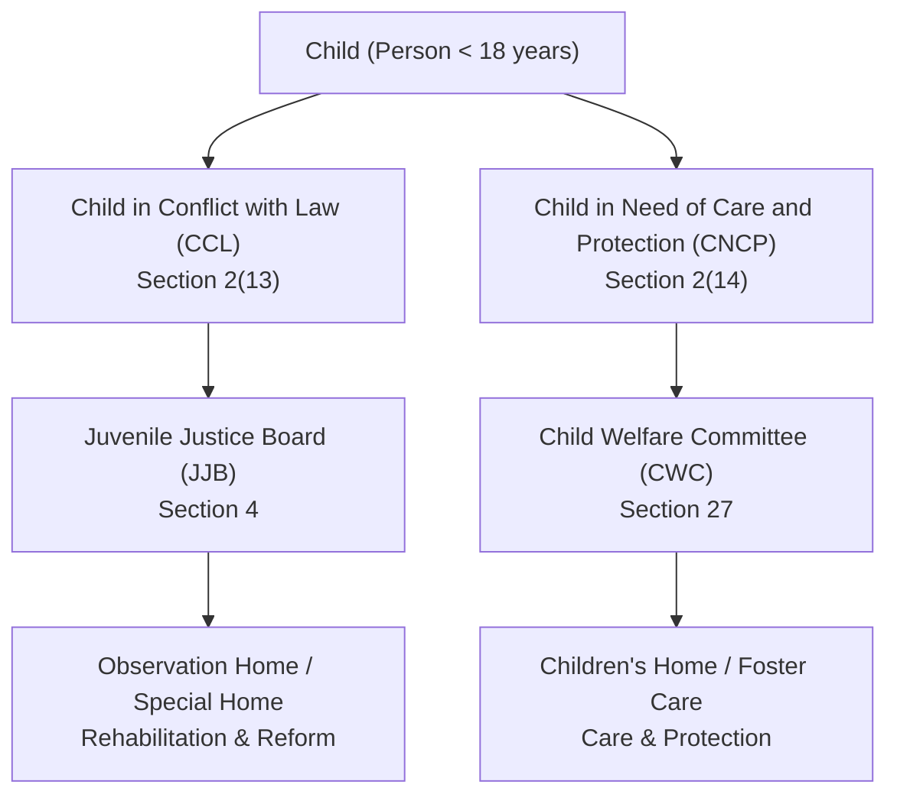
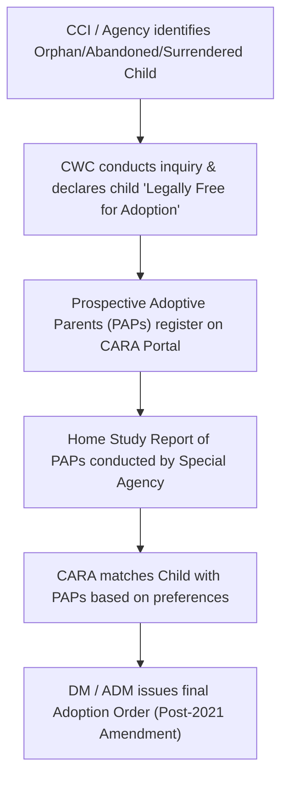

# Module 7: Juvenile Justice System and Child Protection Laws

## Introduction

The juvenile justice system is a specialized branch of the criminal justice delivery mechanism that deals with children. Unlike the adult criminal justice system, which focuses heavily on deterrence and retribution, the juvenile justice system is built on the foundation of **care, protection, treatment, development, and rehabilitation**. The objective is to reform youthful offenders and reintegrate them into society rather than punishing them through traditional correctional methods.

In India, the legal framework has evolved from the historical Juvenile Justice Act, 1986 to the landmark **Juvenile Justice (Care and Protection of Children) Act, 2015**. This module provides a comprehensive analysis of the concepts, statutory frameworks, institutional mechanisms, and procedures governing juvenile justice in India, with particular emphasis on the distinction between children in conflict with law and children in need of care and protection, the roles of the Juvenile Justice Board (JJB) and Child Welfare Committee (CWC), institutional rehabilitation, and adoption procedures.

---

## 1. Concept and Historical Perspective of Juvenile Justice

### A. Conceptual Foundations of Juvenile Justice
The concept of juvenile justice is based on the legal maxim ***Doli Incapax*** (incapable of doing wrong). It recognizes that children lack the cognitive maturity and mental capacity (*mens rea*) to fully comprehend the consequences of their actions.

The system is guided by four core sociological and legal philosophies:
1. **The Welfare Model**: Focuses on the needs of the child, viewing delinquency as a symptom of social, economic, or psychological deprivation.
2. **The Justice Model**: Emphasizes due process, legal representation, and fair hearings for juveniles accused of offences.
3. **The Rehabilitative/Reconstructive Model**: Aims at reforming the child through vocational training, counseling, and education.
4. **The Restorative Model**: Seeks to heal the relationship between the youthful offender, the victim, and the community.

### B. Historical Evolution in India (4 Key Eras)
1. **Pre-Independence Era**: Governed by piecemeal legislations like the **Apprentices Act, 1850** (which allowed courts to bind children as apprentices) and the **Reformatory Schools Act, 1897** (which established separate reform schools).
2. **Post-Independence and State Acts Era**: Individual states enacted their own Children Acts (e.g., Bombay Children Act, 1948). This created significant geographical disparity in juvenile administration.
3. **Juvenile Justice Act, 1986**: The first unified federal legislation enacted to implement the **UN Standard Minimum Rules for the Administration of Juvenile Justice, 1985 (Beijing Rules)**. It defined a juvenile boy as under 16 years and a juvenile girl as under 18 years.
4. **Juvenile Justice Act, 2000**: Enacted to align with the **UN Convention on the Rights of the Child (UNCRC), 1989** (ratified by India in 1992). It brought uniformity by defining a "juvenile" or "child" as any person who has not completed **18 years of age** (unifying gender age limits).
5. **Juvenile Justice (Care and Protection of Children) Act, 2015**: Enacted following the public outcry over the Delhi Gang Rape case (2012), where one of the accused was a 17-and-a-half-year-old juvenile. The 2015 Act replaced the 2000 Act to address heinous offences committed by juveniles in the **16 to 18 age group**.

### C. Provisions under Bharatiya Nyaya Sanhita, 2023 (BNS)
The BNS, 2023 codifies the general exceptions regarding the criminal responsibility of children:

#### Section 20 BNS — Act of a child under seven years of age
- **Provision**: Nothing is an offence which is done by a child under seven years of age.
- **Legal Character**: **Absolute Immunity** (*Doli Incapax*). It is an irrebuttable presumption of law that a child below 7 cannot possess criminal intent.

#### Section 21 BNS — Act of a child above seven and under twelve of immature understanding
- **Provision**: Nothing is an offence which is done by a child above seven years of age and under twelve, who has not attained sufficient maturity of understanding to judge of the nature and consequences of his conduct on that occasion.
- **Legal Character**: **Qualified Immunity** (*Doli Capax* status must be proven). The prosecution must prove that the child had sufficient maturity to understand the wrongfulness of the act.

---

## 2. The Juvenile Justice (Care and Protection of Children) Act, 2015

The Juvenile Justice (Care and Protection of Children) Act, 2015 (referred to as the "JJ Act, 2015") came into force on **15th January 2016**. It establishes a dual framework to address two distinct categories of children:

### A. Child in Conflict with Law (CCL) — Section 2(13)
- **Definition**: A child who is alleged or found to have committed an offence and who has not completed eighteen years of age on the date of commission of such offence.
- **Adjudicatory Body**: **Juvenile Justice Board (JJB)**.
- **Core Principle**: Non-penal approach. The terminology used is "apprehended" (not arrested), "inquiry" (not trial), and "order" (not judgment/sentence).

### B. Child in Need of Care and Protection (CNCP) — Section 2(14) (12 Categories)
The Act defines a CNCP as a child who falls under any of the following twelve categories:
1. Who is found without any settled place of abode and without any ostensible means of subsistence (homeless/destitute).
2. Who is found working in contravention of labour laws, or begging, or living on the street.
3. Who resides with a person who has threatened to kill, abuse, or neglect the child.
4. Who is mentally or physically challenged, with no parent or guardian able to care for them.
5. Who has no parent or guardian, or whose parents have abandoned or surrendered them.
6. Who is missing or run-away, and whose parents cannot be found after reasonable inquiry.
7. Who is vulnerable and likely to be inducted into drug abuse, trafficking, or criminal activity.
8. Who is a victim of armed conflict, civil commotion, or natural calamity.
9. Who is imminent danger of child marriage.
10. Who has been exploited, abused, or subjected to custodial violence.
11. Who is found integrated with illegal armed groups or gang activity.
12. Who has run away from a child care institution.

- **Adjudicatory Body**: **Child Welfare Committee (CWC)**.

---

## 3. Institutional Frameworks: CWC and JJB

The JJ Act, 2015 mandates the constitution of two distinct statutory bodies in every district.

### A. Juvenile Justice Board (JJB) — Sections 4 to 9

#### 1. Composition of the Board (Sec. 4)
The JJB consists of:
- **Principal Magistrate**: A Judicial Magistrate First Class (JMFC) or Metropolitan Magistrate (MM) with at least 3 years of experience.
- **Two Social Workers**: Including at least one woman, having at least 7 years of active involvement in health, education, or welfare activities pertaining to children.

#### 2. Powers, Functions, and Responsibilities (Sec. 8)
- Sole authority to conduct inquiries for children in conflict with law.
- Power to grant bail to juveniles (Sec. 12 mandates that a child apprehended shall be released on bail unless it brings the child into association with known criminals).
- Conduct **Preliminary Assessments** under Section 15 for heinous offences.
- Conduct regular visits to residential facilities/Observation Homes.

#### 3. Classification of Offences for Inquiries (3 Categories)
1. **Petty Offences (Sec. 2(45))**: Offences where the maximum punishment under adult law is imprisonment up to 3 years. (JJB must conclude inquiry within 4 months).
2. **Serious Offences (Sec. 2(54))**: Offences where the punishment is between 3 to 7 years.
3. **Heinous Offences (Sec. 2(33))**: Offences where the minimum punishment is 7 years or more.

#### 4. Preliminary Assessment in Heinous Offences (Sec. 15)
- **Applicability**: Heinous offences committed by children in the **16 to 18 age group**.
- **Scope**: The JJB must assess:
  - The mental and physical capacity of the child to commit such an offence.
  - The child's ability to understand the consequences of the offence.
  - The circumstances under which the offence was committed.
- **JJB Decision**: If the JJB finds that the child possessed the maturity of an adult, it may transfer the case to the **Children's Court** (Sessions Court) for trial as an adult.

---

### B. Child Welfare Committee (CWC) — Sections 27 to 30

#### 1. Composition of the Committee (Sec. 27)
The CWC is a bench of Magistrates constituted by the State Government in every district, consisting of:
- **Chairperson**: An eminent person with experience in child welfare.
- **Four Other Members**: At least one of whom must be a woman, and another must be an expert on matters relating to children.

#### 2. Powers and Functions (Sec. 29 & 30)
- Cognizance of children in need of care and protection (produced by police, social workers, or Childline).
- Conduct inquiries to determine if a child is a CNCP.
- Order the placement of the child in Children’s Homes, Foster Care, or declare them legally free for adoption.
- Monitor the functioning of Child Care Institutions (CCIs).

#### 3. Special Juvenile Police Units (SJPUs) and Childline Services (Sec. 107)
- **SJPU**: Every police station must designate at least one officer as the **Child Welfare Police Officer (CWPO)**. At the district level, a Special Juvenile Police Unit headed by a DSP-rank officer coordinates child protection.
- **Childline Services**: A 24-hour toll-free emergency outreach service (**1098**) for children in distress, linking them to the CWC.

---

## 4. Institutional Mechanisms and Rehabilitation

The rehabilitation of children under the JJ Act, 2015 is carried out through registered **Child Care Institutions (CCIs)** and community-based alternatives.

### A. Types of Child Care Institutions (5 Key Homes)

| CCI Type | Section | Target Group | Primary Purpose |
|:---|:---:|:---|:---|
| **Observation Home** | Sec. 47 | Children in Conflict with Law (CCL) during pendency of inquiry. | Temporary reception, care, and security. Provides basic amenities and crisis counseling. |
| **Special Home** | Sec. 48 | Children in Conflict with Law (CCL) convicted by the JJB. | Long-term rehabilitation, education, vocational training, and reform (maximum stay of 3 years). |
| **Children's Home** | Sec. 50 | Children in Need of Care and Protection (CNCP). | Long-term institutional care, housing, education, and social integration. |
| **Place of Safety** | Sec. 49 | CCLs aged 16-18 accused/convicted of heinous offences, or those transitioning to adulthood. | High-security containment with therapeutic rehabilitation, preventing mixture with younger children. |
| **Fit Facility / Fit Person** | Sec. 51 & 52 | CCL or CNCP temporarily placed by JJB or CWC. | Managed by NGOs or individuals recognized as fit to provide specialized care. |

> 🧠 **Mnemonic — O-S-C-F-P**: *"Officially Safe Children Find Protection"*
> - **O** = **O**bservation Homes (temporary custody during inquiry)
> - **S** = **S**pecial Homes (post-inquiry reform for CCLs)
> - **C** = **C**hildren's Homes (long-term care for CNCPs)
> - **F** = **F**it Facilities (recognized NGO/private care)
> - **P** = **P**lace of Safety (high-security reform for 16-18 heinous CCLs)

### B. Rehabilitation and Reintegration Measures (Sec. 56 - 100)
1. **Sponsorship**: Financial assistance to families to keep the child in school and prevent child labour.
2. **Foster Care**: Placing the child with a family that is temporarily vetted to care for them.
3. **After-Care (Sec. 46)**: Financial and vocational support for young persons leaving CCIs at the age of 18, helping them transition into independent adulthood up to the age of 21.

---

## 5. Special Procedures for Adoption

Adoption under the JJ Act, 2015 is secular, allowing persons of any religion to adopt, unlike the personal laws (e.g., Hindu Adoptions and Maintenance Act, 1956).

### A. Legal Framework for Adoption
- **Central Authority**: **Central Adoption Resource Authority (CARA)**, a statutory body under the Ministry of Women and Child Development. CARA regulates all domestic and inter-country adoptions.
- **Vesting Powers**: Under the **Juvenile Justice Amendment Act, 2021**, the power to issue adoption orders was shifted from Civil Courts to the **District Magistrate (DM)** and **Additional District Magistrate (ADM)** to expedite the process.

### B. Categories of Adoptable Children
1. **Orphan**: A child who has no parents or legal guardians, or whose parents have died.
2. **Abandoned**: A child deserted by parents/guardians, declared abandoned by the CWC after a public notice period.
3. **Surrendered**: A child relinquished by parents/guardians due to physical, emotional, or social factors, after counseling by the CWC.

### C. Domestic and Inter-Country Adoption Procedure (6 Steps)

#### 1. Declaration of Adoptability
The CWC must declare the child "legally free for adoption" after ensuring all efforts to trace the parents have failed.

#### 2. Registration on CARINGS
Prospective Adoptive Parents (PAPs) must register online on the Child Adoption Resource Information and Guidance System (CARINGS) portal.

#### 3. Home Study Report
A registered adoption agency conducts a Home Study Report of the PAPs to evaluate their financial, emotional, and social capability.

#### 4. Referral and Matching
CARA matches the child with eligible PAPs. The PAPs visit the child and accept the placement.

#### 5. Court/DM Order
The adoption agency files an application before the District Magistrate (DM) under Section 61. The DM passes the final adoption order.

#### 6. Inter-Country Adoption Safeguards (Sec. 59)
- Allowed only as a **last resort** (subsidiarity principle) if the child cannot be placed in a domestic family within 60 days of being declared free for adoption.
- Requires a **No Objection Certificate (NOC)** from CARA.
- The receiving country’s government agency must guarantee the child's legal status and citizenship.

---

## Landmark Judgments

### 1. Subramanian Swamy v. Raju (2014) SC
- **Facts**: Following the 2012 Delhi gang rape case, Dr. Subramanian Swamy challenged the constitutionality of the JJ Act, 2000, arguing that the 17-and-a-half-year-old accused should be tried as an adult due to the heinous nature of the crime.
- **Issue**: Can the court create an exception to the strict age bar of 18 years for heinous crimes under the 2000 Act?
- **Held**: The Supreme Court dismissed the petition, ruling that the age limit of 18 was constitutional and a bright-line rule. However, this judgment catalyzed the legislature to pass the **JJ Act, 2015**, which introduced adult trials for heinous offences in the 16-18 age group.
- **Exam Relevance**: Use when discussing the legislative history and rationale behind the JJ Act, 2015 and adult trials.

### 2. Sampurna Behrua v. Union of India (2018) SC
- **Facts**: A public interest litigation (PIL) highlighted the miserable conditions of Child Care Institutions across India, the non-constitution of JJBs and CWCs, and lack of trained personnel.
- **Issue**: Non-implementation of the provisions of the Juvenile Justice Act by State Governments.
- **Held**: The Supreme Court issued comprehensive guidelines to all State Governments, directing the mandatory setup of JJBs and CWCs, the registration of all CCIs under Section 41, and regular social audits of children's homes.
- **Exam Relevance**: Important for questions on institutional mechanisms, CWC/JJB constitution, and child rights enforcement.

### 3. Salil Bali v. Union of India (2013) SC
- **Facts**: Challenge to the juvenile age limit of 18, arguing it should be reduced to 16 due to rising juvenile delinquency.
- **Issue**: Constitutionality of the uniform age limit under Section 2(k) of the JJ Act, 2000.
- **Held**: The Court upheld the age of 18, stating that the international standard (UNCRC) must be respected, and juveniles require rehabilitation and psychological reform rather than incarceration.
- **Exam Relevance**: Essential for questions on the concept and historical perspective of juvenile justice and age determination.

### 4. Hari Ram v. State of Rajasthan (2009) SC
- **Facts**: The accused committed an offence when he was under 18 but was apprehended after attaining majority.
- **Issue**: Does the JJ Act apply to a person who was a juvenile at the time of the offence but has turned adult during trial?
- **Held**: The Supreme Court held that the **date of commission of the offence** is the sole criterion for determining juvenility. The benefits of the JJ Act apply even if the person is apprehended or tried as an adult.
- **Exam Relevance**: Crucial case for questions on jurisdiction and age determination under criminal procedure.

---

## Examination Notes

### Most Important Sections to Remember
- **Section 2(13)**: Child in Conflict with Law (CCL).
- **Section 2(14)**: Child in Need of Care and Protection (CNCP).
- **Section 4**: Constitution of Juvenile Justice Board.
- **Section 12**: Bail provisions for juveniles.
- **Section 15**: Preliminary assessment for heinous offences.
- **Section 27**: Constitution of Child Welfare Committee.
- **Section 47-50**: Institutional homes (Observation, Special, Children's, Place of Safety).
- **Section 56-59**: Adoption framework under CARA.
- **Section 107**: Special Juvenile Police Unit (SJPU).

### Common Student Mistakes
- Confusing the roles of JJB and CWC: Remember, **JJB** is for CCLs (quasi-criminal inquiries) and **CWC** is for CNCPs (care and welfare protection).
- Citing the old Juvenile Justice Act, 2000 or the Juvenile Justice Act, 1986 as the current primary legislation: Always focus on the **JJ Act, 2015** and the **2021 Amendment**.
- Stating that the power to issue adoption orders lies with the Family Court: Post the **2021 Amendment**, the power lies exclusively with the **District Magistrate (DM)**.
- Forgetting to cite BNS Sections 20 and 21 (formerly IPC Secs 82 & 83) when discussing the concept of juvenile responsibility.

---

## Model 5 Marks Answer

**Q: Distinguish between a 'Child in Conflict with Law' and a 'Child in Need of Care and Protection'.**

**📖 Statutory Provisions: Section 2(13) & Section 2(14) of the Juvenile Justice Act, 2015**

**1. Meaning**: 
- **Child in Conflict with Law (CCL) [Sec. 2(13)]**: A child who has committed or is alleged to have committed an offence and has not completed 18 years of age at the time of the offence.
- **Child in Need of Care and Protection (CNCP) [Sec. 2(14)]**: A child who requires care, protection, and rehabilitation due to homelessness, abandonment, abuse, exploitation, or lack of capable guardians.

**2. Adjudicatory Authority**:
- In the case of a CCL, the primary authority is the **Juvenile Justice Board (JJB)** under Section 4.
- In the case of a CNCP, the authority is the **Child Welfare Committee (CWC)** under Section 27.

**3. Primary Objectives and Rehabilitation**:
- For CCLs, the focus is on **reform, rehabilitation, and correction** in Observation Homes or Special Homes.
- For CNCPs, the focus is on **care, shelter, maintenance, and permanent rehabilitation** via Children's Homes, Foster Care, or Adoption.

**🎯 Conclusion**: The JJ Act, 2015 treats CCLs and CNCPs separately to prevent the intermixing of neglected children with children accused of crimes, ensuring tailored rehabilitative approaches.

---

## Model 10 Marks Answer

**Q: Discuss the constitution, powers, and functions of the Child Welfare Committee (CWC) under the Juvenile Justice Act, 2015.**

### 1. Introduction & Definition
The Child Welfare Committee (CWC) is a statutory, quasi-judicial body constituted under **Section 27** of the Juvenile Justice (Care and Protection of Children) Act, 2015. It functions as a bench of Magistrates and has final authority in matters concerning the care, protection, treatment, development, rehabilitation, and reintegration of **Children in Need of Care and Protection (CNCP)**.

### 2. Constitution of CWC (Sec. 27)
- **Establishment**: The State Government must establish one or more CWCs in every district by notification.
- **Composition (5 Members)**: 
  - One **Chairperson**: An eminent child welfare worker or expert.
  - Four **Members**: Vetted professionals, including at least one woman, with at least 7 years of experience in child health, education, or welfare.
- **Disqualification**: A member cannot be associated with any child-care institution or have any conflict of interest in the district.

### 3. Powers of the Committee (Sec. 29)
The CWC has the following key powers:
- Exclusive authority to deal with all proceedings relating to CNCPs.
- The powers of a **Metropolitan Magistrate** or a **Judicial Magistrate First Class** under the CrPC/BNSS when conducting inquiries.
- Power to direct the police, Special Juvenile Police Unit (SJPU), or Childline to produce a child before it.
- Power to order the placement of a child in a Children's Home, Fit Facility, or Foster Care.
- Power to declare a child legally free for adoption.

### 4. Functions and Responsibilities (Sec. 30)
The CWC is responsible for:
- **Receiving and Processing**: Taking cognizance of children produced before it (under Sec. 31).
- **Inquiry**: Conducting inquiries regarding the child's safety, family background, and welfare needs.
- **Placement**: Directing appropriate placement in Child Care Institutions (CCIs) for care and education.
- **Restoration**: Restoring the child to their parents or guardians after due verification.
- **Adoption Declaration**: Declaring orphaned, abandoned, or surrendered children legally free for adoption.
- **Monitoring**: Conducting visits to Children's Homes and inspecting the standard of care.

### 5. Conclusion
In *Sampurna Behrua v. Union of India* (2018), the Supreme Court emphasized the critical role of CWCs in protecting child rights, ordering state governments to ensure they are fully staffed and functional in every district to realize the child-centric goals of the JJ Act.

---

## Model 15 Marks Answer

**Q: Explain the judicial and administrative procedures for dealing with a Child in Conflict with Law (CCL) under the JJ Act, 2015, highlighting the 2015 changes for the 16-18 age group.**

### 1. Introduction
The Juvenile Justice (Care and Protection of Children) Act, 2015 introduces a comprehensive, welfare-oriented procedure for children who are alleged to have committed offences. The procedure replaces standard criminal trials with reformative inquiries, placing the child under the jurisdiction of the **Juvenile Justice Board (JJB)**.

### 2. Initial Apprehension and Rights of the Child
When a child alleged to be in conflict with the law is apprehended:
- **No Traditional Arrest**: The child is apprehended by the Child Welfare Police Officer (CWPO) or the Special Juvenile Police Unit (SJPU).
- **No Jail or Police Lock-up**: Under **Section 10**, the child must not be kept in a police lock-up or jail. The child must be kept in an **Observation Home** until production before the Board.
- **Production within 24 Hours**: The child must be produced before the JJB within 24 hours of apprehension.
- **Bail as a Right (Sec. 12)**: The child is entitled to bail regardless of the nature of the offence, unless releasing the child would expose them to moral danger or association with criminals.
- **No Handcuffs**: The police cannot handcuff the child or use force.

### 3. Inquiry by the Juvenile Justice Board (JJB)
The JJB conducts an inquiry rather than a trial:
- **Non-Adversarial Environment**: The JJB does not conduct proceedings like a criminal court. The Magistrate and social workers do not wear uniforms, and the child is not placed in a dock.
- **Time Limit**: Petty offences must be resolved within 4 months.
- **Orders that can be Passed (Sec. 18)**: If the child is found guilty, the JJB can:
  - Allow the child to go home after counseling.
  - Direct the child to perform community service.
  - Order the child's parents to pay a fine.
  - Place the child on probation.
  - Send the child to a **Special Home** for a maximum period of 3 years.

### 4. Special Provisions for the 16-18 Age Group: Preliminary Assessment (Sec. 15)
The most significant departure in the JJ Act, 2015 from previous legislations is the treatment of children aged between 16 and 18 years who commit **heinous offences** (offences carrying a minimum punishment of 7 years under adult law, e.g., murder or rape).

- **Preliminary Assessment**: Under Section 15, the JJB must conduct an assessment of the child’s mental and physical capacity to commit the crime, their maturity, and the circumstances. The assessment must be completed within 3 months with the aid of experienced psychologists.
- **Transfer to Children's Court**: If the JJB determines that the child possessed the cognitive maturity of an adult, it can transfer the case to the **Children's Court** (Sessions Court).
- **Trial as an Adult (Sec. 19)**: The Children's Court can try the child as an adult and pass any sentence under adult law, except:
  - No death penalty.
  - No life imprisonment without the possibility of release.

### 5. Case Laws
- ***Subramanian Swamy v. Raju* (2014)**: Upholding the legislative competency to make age-based classifications, paving the way for the Section 15 preliminary assessment.
- ***Hari Ram v. State of Rajasthan* (2009)**: Confirmed that juvenility is determined as of the date of the offence, protecting children from retrospective adult trials.

### 6. Conclusion
The JJ Act, 2015 balances the need for child reform with public safety by allowing a strict, psychological evaluation before trying older juveniles as adults for heinous crimes, ensuring that rehabilitation remains the primary goal while maintaining deterrence for grave offences.

---

## Quick Revision

### Key Sections to Memorize
- **Section 2(13)**: Child in Conflict with Law (CCL).
- **Section 2(14)**: Child in Need of Care and Protection (CNCP).
- **Section 4**: Constitution of the Juvenile Justice Board.
- **Section 15**: Preliminary assessment for heinous crimes (16-18 age group).
- **Section 27**: Child Welfare Committee.
- **Section 56**: secular adoption.
- **Section 61**: DM/ADM power to issue adoption orders.
- **Section 107**: Special Juvenile Police Unit (SJPU).

### Essential Distinctions
- **JJB**: Principal Magistrate (JMFC) + 2 Social Workers. Deals with CCLs.
- **CWC**: Chairperson + 4 Members. Deals with CNCPs.
- **Section 20 BNS**: Child < 7 years = Absolute immunity (*Doli incapax*).
- **Section 21 BNS**: Child 7-12 years = Qualified immunity.

---

<!-- VISUAL_DATA_START -->
Topic: Juvenile Justice System and Child Protection Laws
MindMapNodes:
- Concept of Juvenile Justice
- Historical Evolution
- BNS Provisions (Sec 20 & 21)
- Child in Conflict with Law (CCL)
- Child in Need of Care and Protection (CNCP)
- Juvenile Justice Board (JJB)
- Child Welfare Committee (CWC)
- Child Care Institutions (CCIs)
- CARA Adoption Procedures
- Landmark Judgments
FlowchartNodes:
- Juvenile Apprehension to Rehabilitation Workflow
- Preliminary Assessment Process (Sec 15)
- CARA Adoption Process
TimelineNodes:
- Apprentices Act 1850
- Reformatory Schools Act 1897
- Juvenile Justice Act 1986
- Juvenile Justice Act 2000
- JJ Act 2015 & 2021 Amendment
ComparisonNodes:
- CCL vs CNCP
- JJB vs CWC
- Section 20 BNS vs Section 21 BNS
- Observation Home vs Special Home
DoctrineNodes:
- Doli Incapax
- Doli Capax
- Principle of Subsidiarity
CaseLawNodes:
- Subramanian Swamy v. Raju (2014)
- Sampurna Behrua v. Union of India (2018)
- Salil Bali v. Union of India (2013)
- Hari Ram v. State of Rajasthan (2009)
StatutoryNodes:
- Juvenile Justice Act 2015
- BNS 2023 Section 20
- BNS 2023 Section 21
ArticleNodes:
- Constitution of India Article 21
- Constitution of India Article 22
- Constitution of India Article 39A
MnemonicNodes:
- O-S-C-F-P (Observation, Special, Children, Fit, Place of Safety)
<!-- VISUAL_DATA_END -->

---

**Next Folder**: [02-condensed-notes](../02-condensed-notes/)
