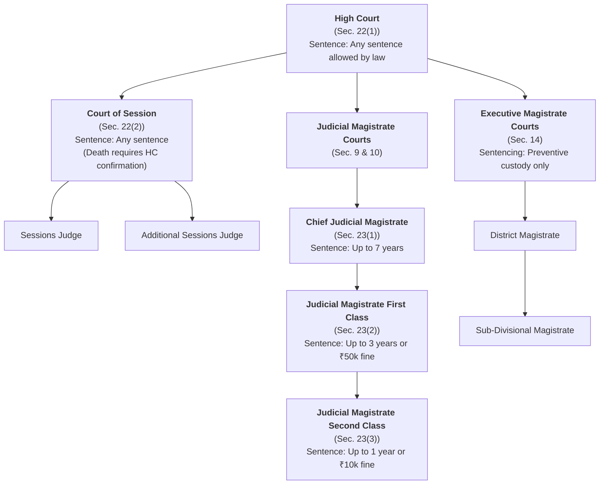
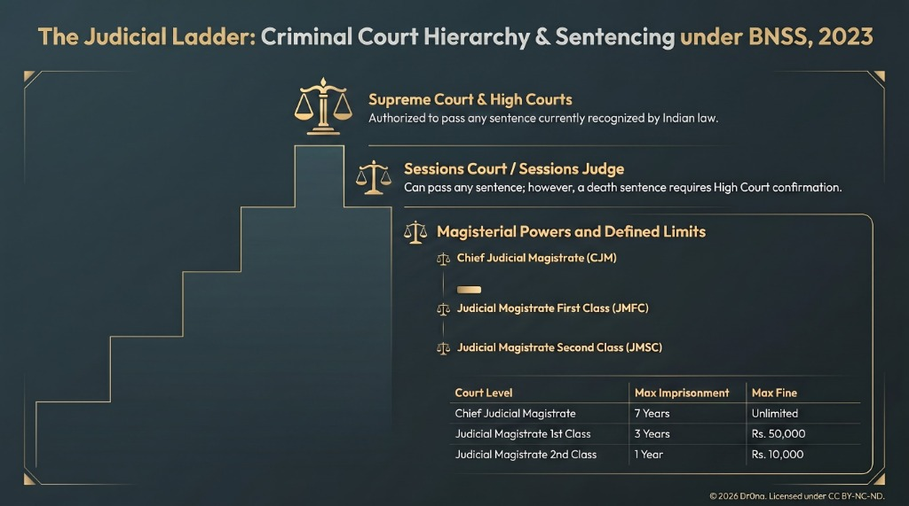
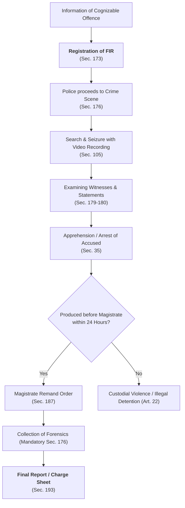
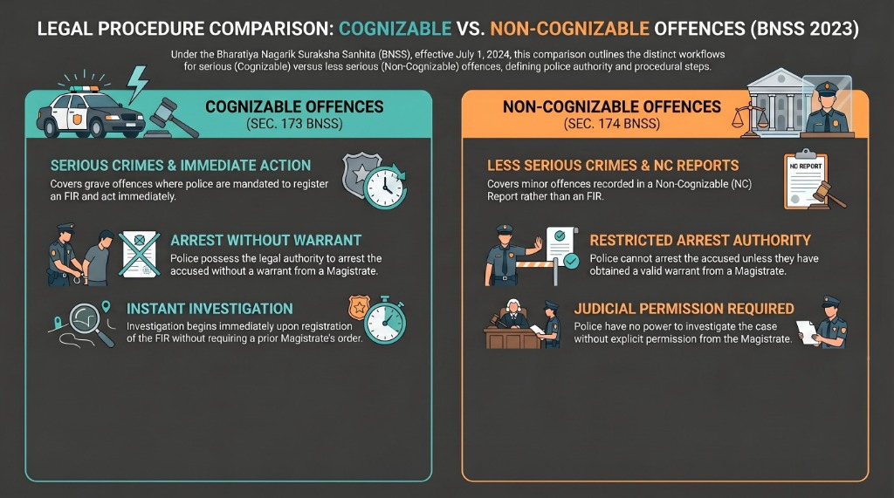
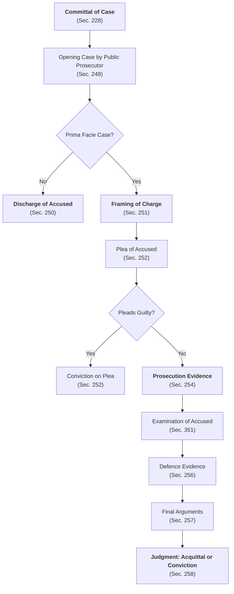
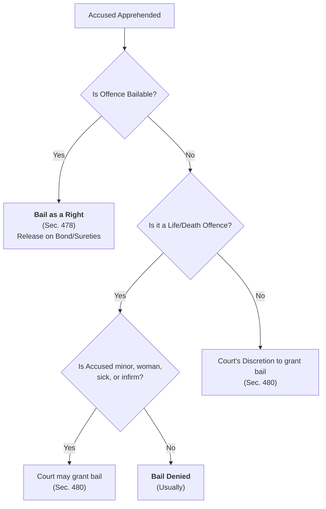
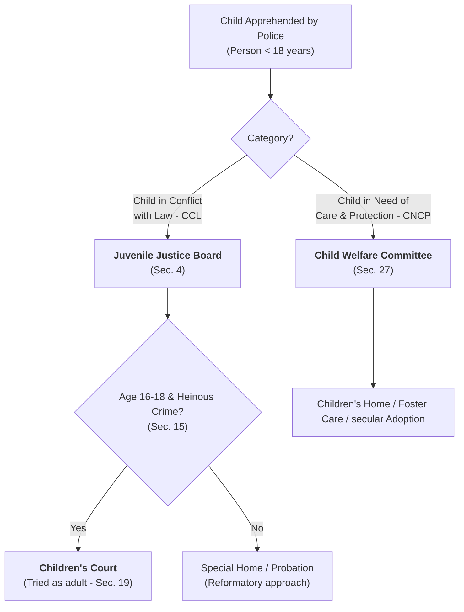

# 📐 Flowcharts and Diagrams - Law of Criminal Procedure (LCC 0701)

These diagrams illustrate the structural hierarchies, processes, and decision-making pathways within the criminal justice system under the BNSS, 2023.

---

## 1. Hierarchy and Sentencing Powers of Criminal Courts

This tree diagram shows the organization of criminal courts in India and their sentencing authorities under Sections 6, 22, and 23 of the BNSS.

### Visual Guide: The Judicial Ladder (Court Hierarchy & Sentencing)

💡 **Exam Tip**: Draw this flowchart when writing about "Hierarchy and Powers of Criminal Courts" in Module 01.

---

## 2. Step-by-Step Criminal Investigation Process

This flowchart maps the sequence of police actions from the registration of an FIR to the submission of the Charge Sheet.

### Visual Guide: Legal Procedure Comparison (Cognizable vs Non-Cognizable)

💡 **Exam Tip**: Draw this process map when explaining "FIR and Investigation Proceedings" under Module 03.

---

## 3. Stages in a Sessions Trial

This sequence diagram outlines the steps followed during a trial before a Court of Session under Sections 248 to 260 of the BNSS.

### Visual Guide: Comparison of Criminal Trial Types (BNSS 2023)

💡 **Exam Tip**: Essential flowchart for long answers on "Trial before Court of Session" in Module 05.

---

## 4. Bail Decision Logic

This decision tree shows how police and courts determine bail under Sections 478 and 480.

### Visual Guide: Bail Admissibility Decision Tree (BNSS 2023)

💡 **Exam Tip**: Draw this decision tree when answering questions on "Bail and Anticipatory Bail" in Module 04.

---

## 5. Juvenile Justice System Workflow

This diagram maps the path taken by children under the JJ Act, 2015 based on their classification under Section 2.

💡 **Exam Tip**: Draw this to illustrate the dual approach of the Juvenile Justice Act in Module 07 answers.
