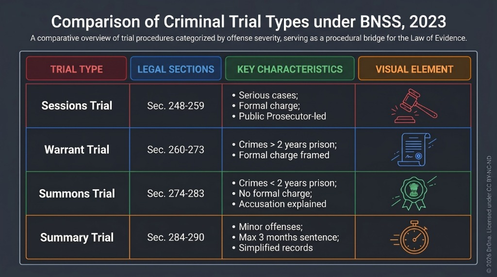

## 📝 Q3. Explain in detail the procedure for a trial before a Court of Session under the BNSS, 2023.

### 1. Introduction
The Court of Session is the highest subordinate criminal court in a district, competent to try the most serious offences (such as murder, rape, or dacoity). The procedure for a Sessions trial is designed to protect the rights of both the accused and the victim, ensuring a fair and transparent adjudication.

### 2. Definition (with Section number)
- The statutory procedure for a trial before a Court of Session is governed by **Sections 248 to 260 of the BNSS, 2023** (formerly Sections 225 to 237 of the CrPC, 1973).
- **Section 228 of the BNSS** (formerly Section 209 CrPC) provides for the **Committal of Case** by a Magistrate to the Court of Session when the offence is triable exclusively by it.

### 3. Step-by-Step Trial Procedure (8 Key Stages)

#### I. Opening the Case (Section 248)
- The trial is conducted by the **Public Prosecutor (PP)** representing the State.
- The PP opens the case by describing the charge against the accused and stating the evidence they propose to use to prove guilt.

#### II. Discharge of the Accused (Section 250)
- The court considers the record of the case and documents submitted. It hears both the accused and the prosecution.
- If the Sessions Judge finds that there is **no sufficient ground** for proceeding against the accused, they shall **discharge** the accused and record the reasons.

#### III. Framing of Charge (Section 251)
- If the court believes there is a prima facie case (ground for presuming the accused committed the offence):
  - It frames a written charge against the accused.
  - The charge must be read and explained to the accused.
  - The accused is asked whether they plead guilty or claim to be tried.

#### IV. Conviction on Plea of Guilty (Section 252)
- If the accused pleads guilty, the Judge records the plea and may, in their discretion, convict the accused. (Note: The Judge is not bound to convict on a guilty plea in serious cases like murder; they may choose to proceed with the trial).

#### V. Prosecution Evidence (Section 254)
- If the accused refuses to plead guilty or claims to be tried, the Judge fixes a date for the examination of witnesses.
- The prosecution presents its witnesses, who are examined-in-chief and then cross-examined by the defence counsel.
- The BNSS allows the deposition of witnesses to be recorded via **audio-video electronic means**.

#### VI. Examination of the Accused (Section 351)
- After the prosecution evidence is closed, the court examines the accused personally to enable them to explain any circumstances appearing in the evidence against them. This is a non-oath statement.

#### VII. Defence Evidence (Section 256)
- The accused is called upon to enter their defence and produce evidence.
- The defence counsel examines their witnesses, who are cross-examined by the Public Prosecutor.

#### VIII. Arguments and Judgment (Sections 257 & 258)
- After the evidence is completed, the Prosecutor sums up the case, and the defence counsel replies.
- The Judge delivers the **Judgment** of acquittal or conviction (Sec. 258).
- **Sentence Hearing**: If convicted, the Judge must hear the accused on the question of sentence (unless they release them on probation under Sec. 401) before passing the final sentence.

### Visual Guide: Sessions Trial & Comparison of Trial Procedures

---

### 4. Case Laws
- ***Kehar Singh v. State (Delhi Admn.)* (1988)**: Emphasized that the procedural rules under the Sessions trial must be strictly followed to ensure a fair trial under Article 21.
- ***State of Maharashtra v. Sukhdeo Singh* (1992) SC**: The Supreme Court held that framing of a charge is a critical stage. The Judge must apply their mind to check if a prima facie case exists; they cannot act as a mere post office.
- ***K. Anbazhagan v. Superintendent of Police* (2004) SC**: Transfer of case to another Sessions Court is justified if there is a reasonable apprehension that a fair trial is impossible.

### 5. Conclusion
The Sessions trial procedure under Sections 248 to 260 BNSS ensures that serious charges are subjected to a rigorous, multi-stage judicial inquiry. By separating the stages of discharge, charge framing, evidence, and sentence hearing, the law guarantees that the accused is given a complete opportunity to establish innocence, fulfilling the constitutional mandate of due process.
