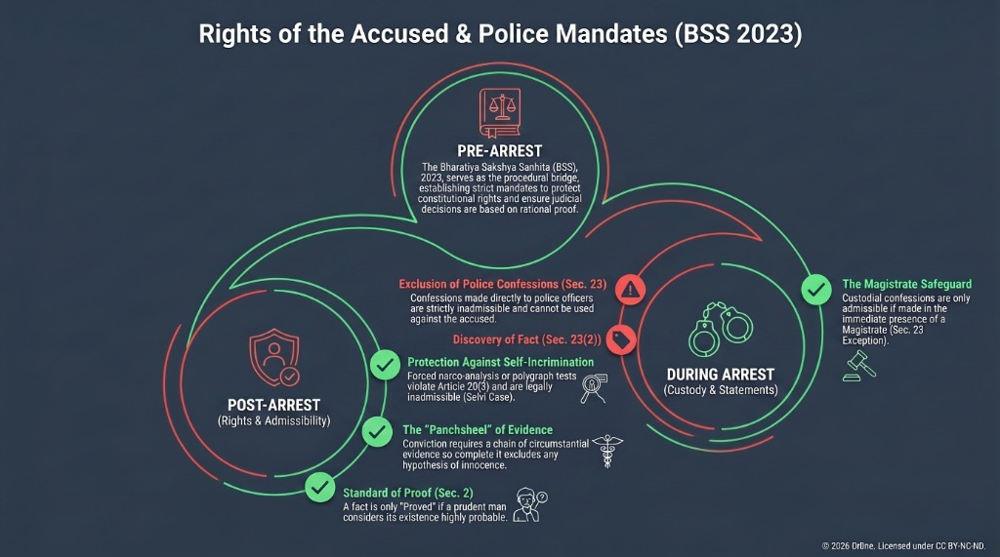
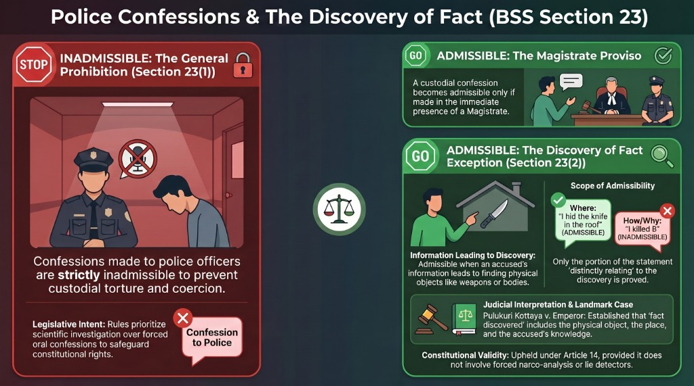
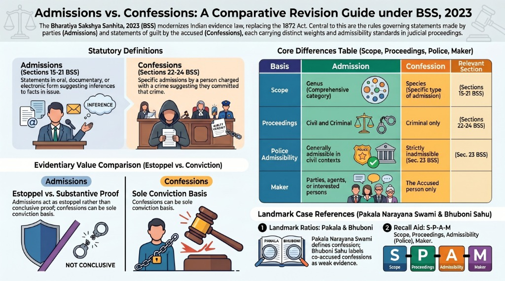

# Module 2: Relevance and Admissibility

## Introduction
Relevancy and Admissibility are the two foundational pillars of the Law of Evidence. Section 3 of the Bharatiya Sakshya Sanhita, 2023 (BSS) mandates that evidence may be given in any suit or proceeding of the existence or non-existence of every fact in issue, and of such other facts as are declared to be relevant under Sections 4 to 50 of the Sanhita, and of no others.

*   **Logical Relevancy**: When one fact is connected to another by logic, common sense, or human experience.
*   **Legal Relevancy**: When a fact is declared relevant by the provisions of the Evidence law (Sections 4 to 50 of BSS). Only legally relevant facts are admissible.
*   **Admissibility**: The process by which the court allows a relevant fact to be brought on record as evidence. Admissibility is a question of law determined by the judge.

---

## 1. Key Doctrines of Relevancy (BSS Sections 4 to 14)

### A. Doctrine of Res Gestae — Sec. 4 BSS
Facts which, though not in issue, are so connected with a fact in issue as to form part of the same transaction, are relevant, whether they occurred at the same time and place or at different times and places.
*   **Meaning**: Latin for "things done". It is an exception to the hearsay rule. It covers spontaneous declarations made during, immediately before, or immediately after the occurrence of the transaction.
*   **Illustration**: A is accused of the murder of B by beating him. Whatever was said or done by A or B or the by-standers at the beating, or so shortly before or after it as to form part of the transaction, is a relevant fact.
*   **Key Case**: *Sukhar v. State of UP (1999)*: Held that for a statement to be relevant under Res Gestae, it must be spontaneous and contemporaneous with the act, leaving no time for fabrication.

### B. Test Identification Parade (TIP) — Sec. 7 BSS
Facts necessary to explain or introduce a fact in issue or relevant fact, or which support or rebut an inference suggested by a fact in issue or relevant fact, or which establish the identity of any thing or person whose identity is relevant, are relevant.
*   **Meaning**: Conducted during investigation by a Magistrate to test the reliability of a witness’s memory. The witness identifies the suspect from a lineup of similar persons.
*   **Key Case**: *State of Maharashtra v. Sukhdev Singh (1992)*: Held that TIP is corroborative evidence, not substantive, but is of great value to test the veracity of the witness.

### C. Evidence of Common Intention — Sec. 8 BSS
Where there is reasonable ground to believe that two or more persons have conspired together to commit an offence, anything said, done, or written by any one of such persons in reference to their common intention, after the time when such intention was first entertained by any one of them, is a relevant fact against each of the conspirators.
*   **Key Case**: *Mirza Akbar v. Emperor (1940)*: Clarified that statements made after the conspiracy has ended or the objective is achieved are not relevant under this section.

### D. Plea of Alibi — Sec. 9 BSS (Facts showing inconsistency)
Facts not otherwise relevant are relevant:
1. If they are inconsistent with any fact in issue or relevant fact.
2. If by themselves or in connection with other facts they make the existence or non-existence of any fact in issue or relevant fact highly probable or improbable.
*   **Meaning**: "Alibi" means elsewhere. The accused pleads that they were at a different place at the time of the offence, making it impossible for them to commit the crime.
*   **Burden of Proof**: The burden to prove the plea of alibi is strictly on the accused.
*   **Key Case**: *Dudh Nath Pandey v. State of UP (1981)*: The plea of alibi must be proved with absolute certainty, showing physical impossibility of the accused's presence at the scene of the crime.

---

## 2. Admissions — Secs. 15 to 21, 25 BSS

An **Admission** is a statement, oral or documentary or contained in electronic form, which suggests any inference as to any fact in issue or relevant fact, made by any of the persons and under the circumstances mentioned in BSS.

### General Principles:
- Can be made by a party to the proceeding, their agent, or interested parties (Sec. 16, 17).
- Admission in civil cases (Sec. 25 BSS): No admission is relevant in civil cases if it is made upon an express condition that evidence of it is not to be given, or under circumstances from which the court can infer that the parties agreed together that evidence of it should not be given (without prejudice).

---

## 3. Confessions — Secs. 22 to 24 BSS

A **Confession** is an admission made at any time by a person charged with a crime, stating or suggesting the inference that he committed that crime.

### Key Provisions under BSS:
- **Confession before Police — Sec. 23 BSS**: A confession made to a police officer is inadmissible and cannot be proved against the accused.
- **Confession in Police Custody — Sec. 23 BSS Exception**: A confession made in police custody is inadmissible unless made in the immediate presence of a Magistrate.
- **Discovery of Fact — Sec. 23(2) BSS (formerly Sec. 27 IEA)**: When any fact is deposed to as discovered in consequence of information received from a person accused of any offence, in the custody of a police officer, so much of such information, whether it amounts to a confession or not, as relates distinctly to the fact thereby discovered, may be proved.
- **Confession by Co-Accused — Sec. 24 BSS**: When more persons than one are being tried jointly for the same offence, and a confession made by one of such persons affecting himself and some other of such persons is proved, the Court may take into consideration such confession as against such other person as well as against the person who makes such confession.

### Visual Guide: Rights of the Accused & Police Mandates

### Visual Guide: Police Confessions & Discovery of Fact (BSS Sec. 23)

---

## 4. Differences between Admission and Confession

| Basis | Admission | Confession |
| --- | --- | --- |
| Definition | General statement suggesting inference in civil or criminal cases | Specific statement admitting guilt in criminal cases |
| Proceedings | Applicable to both civil and criminal proceedings | Applicable only to criminal proceedings |
| Evidentiary Value | Not conclusive proof, but acts as estoppel | Substantive evidence if voluntary and truthful |
| Police Presence | Admission to police is generally admissible | Confession to police is strictly inadmissible |

### Visual Comparative Guide (BSS Secs. 15-24)

---

## 5. Landmark Judgments

1.  **Pulukuri Kottaya v. Emperor (AIR 1947 PC 67)**
    - *Ratio*: Interpreted Section 27 of the IEA (now Sec. 23(2) BSS). Held that "discovery of fact" means the discovery of the physical object in connection with the mental knowledge of the accused, and only the distinct info leading to discovery is admissible.
2.  **Pakala Narayana Swami v. Emperor (AIR 1939 PC 47)**
    - *Ratio*: Defined confession. Held that a confession must either admit in terms the offence, or at any rate substantially all the facts which constitute the offence. An admission of a gravely incriminating fact is not of itself a confession.
3.  **Bhuboni Sahu v. The King (1949)**
    - *Ratio*: Dealt with confession of co-accused. Held that it is a weak type of evidence and cannot be used as the foundation of a conviction; it can only be used to lend assurance to other evidence.

---

## 6. Model Answers (10 Marks & 15 Marks)

### A. Model 10 Marks Answer: Explain the Doctrine of Res Gestae with relevant case laws.
**Answer**:
1.  **Introduction**: Under Section 4 of BSS, facts forming part of the same transaction are relevant. Res Gestae is a Latin phrase meaning "things done". It is an exception to the hearsay rule.
2.  **Essentials**:
    - The statement or act must be contemporaneous with the transaction.
    - There must be no interval which would allow fabrication or concoction.
    - It must explain, illustrate, or be connected with the main transaction.
3.  **Hearsay Exception**: Hearsay is generally excluded because it lacks an oath and cross-examination. Res Gestae is admitted because the spontaneity of the statement under stress of the event guarantees its truthfulness.
4.  **Case Laws**:
    - *R v. Bedingfield (1879)*: The throat of a woman was cut, and she ran out of the room crying "Oh dear, Aunt, see what Bedingfield has done to me!" Held inadmissible as Res Gestae because the transaction was already over. This is a very strict English view.
    - *R v. Foster (1834)*: A witness saw a speeding carriage and later heard the victim groan. The victim's statement explaining the accident was held admissible.
    - *Sawaldas v. State of Bihar (1974)*: The cry of the deceased "save me, my husband is killing me" heard by neighbors was held admissible under Res Gestae.
5.  **Conclusion**: Res Gestae is a highly valuable exception, but the court must apply it cautiously to prevent hearsay from bypassing the rules of reliability.

### B. Model 15 Marks Answer: Critically analyze the admissibility of confessions made by an accused under police custody and the scope of "Discovery of Fact" under BSS, 2023.
**Answer**:
1.  **Introduction**: Under BSS, confessions made to a police officer or under custody are viewed with suspicion due to the fear of torture and coercion. Section 23 of BSS lays down the general rule of exclusion.
2.  **General Exclusionary Rule**:
    - Section 23(1) BSS: Confession to police is inadmissible.
    - Rationale: To protect individuals from custodial torture and ensure police rely on scientific investigation rather than forced confessions.
3.  **The Exception — Discovery of Fact (Sec. 23(2) BSS)**:
    - When an accused in police custody gives information that leads to the discovery of a distinct fact (e.g., weapon of offence, stolen money, dead body), that portion of the information which distinctly relates to the discovery is admissible.
4.  **Scope of Sec. 23(2) / Pulukuri Kottaya case**:
    - The Privy Council held that "fact discovered" is not just the physical object, but the place from where it is produced and the accused's knowledge of it.
    - *Example*: "I hid the knife used to kill B under the roof of my house" -> Only the fact that he hid the knife under the roof is admissible; the statement "used to kill B" is inadmissible confession.
5.  **Constitutional Validity**:
    - *State of UP v. Deoman Upadhyaya (1960)*: Upheld the validity of this provision under Article 14 of the Constitution.
    - *Selvi v. State of Karnataka (2010)*: Held that narco-analysis or lie detector tests conducted forcibly violate Article 20(3) (self-incrimination) and cannot be admitted under the guise of discovery of fact.
6.  **Conclusion**: Section 23(2) of BSS is a powerful tool for investigators, but must be strictly construed to safeguard the constitutional rights of the accused.

---

## Memory Aids
*   **Mnemonic for Hearsay Exceptions**: **RCA**
    - **R** -> Res Gestae (Sec. 4)
    - **C** -> Conspirators' common intention (Sec. 8)
    - **A** -> Admissions (Sec. 15)

<!-- VISUAL_DATA_START -->
Topic: Relevance and Admissibility
MindMapNodes:
- Res Gestae Sec. 4
- Test Identification Sec. 7
- Common Intention Sec. 8
- Plea of Alibi Sec. 9
- Admissions Sec. 15-21
- Confessions Sec. 22-24
- Discovery of Fact Sec. 23(2)
<!-- VISUAL_DATA_END -->
