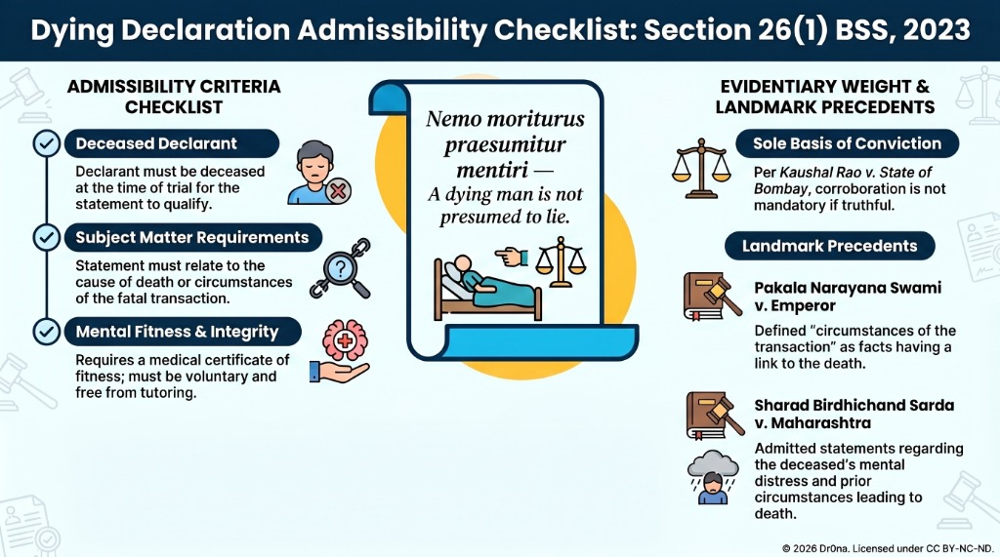

# Module 3: Statements by Persons (Dying Declarations & Expert Opinions)

## Introduction
Module 3 deals with statements made by persons under special circumstances, including statements by individuals who cannot be called as witnesses (e.g., deceased or unavailable persons), relevancy of expert opinions, judgments of courts, and character evidence. 

These provisions govern exceptions to the hearsay rule, allowing secondary statements or expert analysis on record when direct testimony is impossible or requires technical expertise.

---

## 1. Statements by Persons Who Cannot be Called as Witnesses (BSS Sections 26 & 27)

Section 26 of BSS (formerly Section 32 of IEA) outlines cases in which statements of relevant facts by a person who is dead, who cannot be found, who has become incapable of giving evidence, or whose attendance cannot be procured without unreasonable delay or expense, are relevant:

### A. Dying Declaration — Sec. 26(1) BSS
A statement made by a person as to the cause of his death, or as to any of the circumstances of the transaction which resulted in his death, in cases in which the cause of that person's death comes into question.
*   **Admissibility Rules**:
    - Admissible in both civil and criminal proceedings.
    - The person making the statement must be dead at the time of the trial.
    - Rationale: *Nemo moriturus praesumitur mentiri* (A man will not meet his Maker with a lie in his mouth).
*   **Key Case**: *Pakala Narayana Swami v. Emperor (1939)*: The deceased received a letter inviting him to collect a debt. He told his wife he was going to that place, and his dismembered body was later found. His statement to his wife was held admissible as a circumstance of the transaction resulting in his death.
*   **Key Case**: *Kaushal Rao v. State of Bombay (AIR 1958 SC 22)*: The Supreme Court held that a dying declaration can form the sole basis of conviction without corroboration, provided it is voluntary, truthful, and recorded properly.

### Visual Guide: Dying Declaration Admissibility Checklist (Sec. 26(1) BSS)

---

## 2. Relevancy of Expert Witness — Secs. 39 to 45 BSS

Section 39 BSS (formerly Section 45 of IEA) governs the opinion of experts:
When the Court has to form an opinion upon a point of foreign law, science, art, or as to identity of handwriting or finger impressions, the opinions upon that point of persons specially skilled in such foreign law, science, art, or in questions as to identity of handwriting or finger impressions are relevant facts. Such persons are called experts.

### A. Key Provisions:
- **Expert vs Ordinary Witness**: An ordinary witness testifies to facts perceived by their senses (what they saw/heard). An expert testifies to opinions and conclusions drawn from scientific or technical analysis.
- **Evidentiary Value**: Expert opinion is corroborative and advisory in nature. The court is not bound by it and must form its own independent opinion (*State of HP v. Jailal, 1999*).
- **Handwriting and Electronic Expert Opinions**: Section 39 extends relevancy to digital and electronic signatures, and Section 40 provides for the opinion of the Examiner of Electronic Evidence (IT Act, 2000).

---

## 3. Judgments of Courts when Relevant — Secs. 34 to 38 BSS

These sections govern the relevancy of prior judgments:
- **Res Judicata**: A final judgment in a prior case between the same parties is relevant to bar a second suit or trial (Sec. 34 BSS).
- **Judgments in Rem (Sec. 35 BSS)**: Judgments in probate, matrimonial, admiralty, or insolvency proceedings are conclusive proof of legal character and are binding on the whole world (in rem), not just parties to the suit (in personam).

---

## 4. Evidence of Character — Secs. 46 to 50 BSS

Character evidence is generally excluded unless it is directly in issue:
- **Civil Cases (Sec. 46 BSS)**: Character to prove conduct imputed is irrelevant in civil cases, except in so far as such character appears from facts otherwise relevant.
- **Criminal Cases (Sec. 47 & 48 BSS)**: In criminal proceedings, the fact that the accused person has a good character is relevant. However, the fact that he has a bad character is irrelevant, unless evidence has been given that he has a good character, in which case it becomes relevant (rebuttal).
- **Exceptions**: Bad character is relevant where the bad character of any person is itself a fact in issue (e.g., under dacoity or bad livelihood acts).

---

## 5. Landmark Judgments

1.  **Sharad Birdhichand Sarda v. State of Maharashtra (1984 4 SCC 116)**
    - *Ratio*: Re-emphasized the value of dying declarations and laid down that statements made by the deceased regarding her mental state and distress prior to death are admissible as circumstances of the transaction.
2.  **State (NCT of Delhi) v. Navjot Sandhu (2005 11 SCC 600)**
    - *Ratio*: Parliament Attack case. Discussed the admissibility of mobile phone records and the role of expert opinion in digital forensics.

---

## 6. Model Answers (10 Marks & 15 Marks)

### A. Model 10 Marks Answer: Explain the evidentiary value and admissibility of a Dying Declaration under BSS, 2023.
**Answer**:
1.  **Definition**: Section 26(1) of BSS defines a dying declaration as a statement made by a person who is dead, explaining the cause of his death or circumstances of the transaction leading to his death.
2.  **Rationale**: A dying person is highly unlikely to lie, as they face imminent death. *Nemo moriturus praesumitur mentiri*.
3.  **Admissibility Conditions**:
    - The declarant must have died after making the statement. If they survive, it is not a dying declaration (but can be used as a prior statement under Sec. 160 BSS to corroborate or contradict).
    - Must relate to the cause of death.
    - Declarant must be in a fit mental condition to make the statement (Magistrates usually require a doctor's certificate of fitness).
4.  **Sole Basis of Conviction (Kaushal Rao case)**:
    - There is no absolute rule of law that a dying declaration cannot form the sole basis of conviction.
    - If the court is satisfied that the declaration was true, voluntary, and free from prompting, a conviction can be based on it without corroboration.
5.  **Conclusion**: It is a unique and powerful exception to the hearsay rule, but requires careful judicial scrutiny.

### B. Model 15 Marks Answer: Discuss the relevancy of Expert Opinion and the problems associated with Expert Testimony under BSS, 2023.
**Answer**:
1.  **Introduction**: Section 39 of BSS allows the court to admit opinions of persons skilled in science, art, foreign law, handwriting, or finger impressions when the court itself lacks that specialized knowledge.
2.  **Who is an Expert**: An expert is someone who has acquired special knowledge, skill, or experience in a field through study or practice (e.g., doctors, ballistic experts, handwriting examiners).
3.  **Evidentiary Value**:
    - It is not substantive evidence; it is merely corroborative and opinion-based.
    - The opinion is advisory. The judge must evaluate the reasons given by the expert and make the final decision.
4.  **Conflict of Opinions**: When two experts give conflicting reports (e.g., one doctor says death was by suicide, another says homicide), the court must look at the direct eye-witness evidence or other circumstantial evidence to resolve the conflict (*Ram Narain v. State of UP*).
5.  **Digital Forensics under BSS**: BSS has modernized expert opinions to include Examiner of Electronic Evidence (Sec. 40) due to the rising share of cybercrimes and electronic documents.
6.  **Conclusion**: Expert testimony is essential in modern trials, but it remains an aid to the court rather than a replacement of judicial decision-making.

---

## Memory Aids
*   **Mnemonic for Relevancy of Opinions**: **FSAH**
    - **F** -> Foreign Law
    - **S** -> Science or Art
    - **A** -> Authenticity of signatures/handwriting
    - **H** -> Handwriting and finger impressions

<!-- VISUAL_DATA_START -->
Topic: Statements by Persons
MindMapNodes:
- Dying Declaration Sec. 26(1)
- Expert Opinion Sec. 39
- Judgments in Rem Sec. 35
- Res Judicata Sec. 34
- Character Evidence Sec. 46-50
<!-- VISUAL_DATA_END -->
