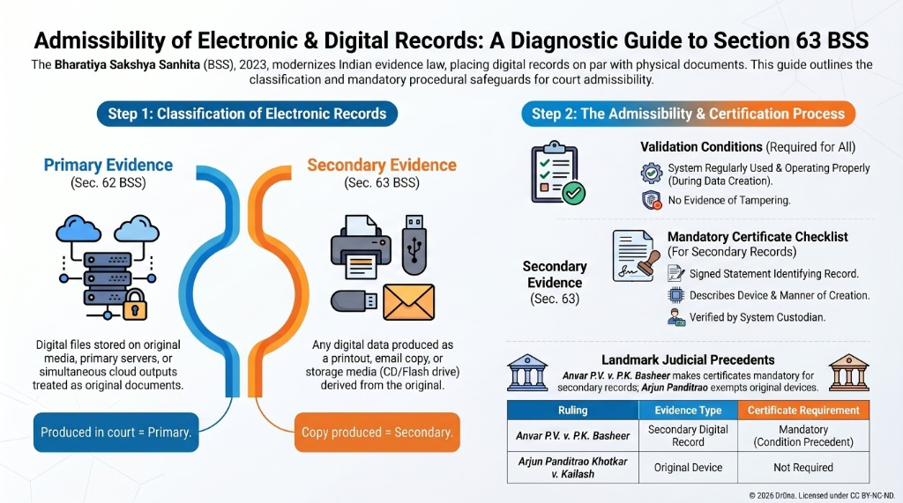

# Condensed Revision Notes: Modules 1 to 4

## Module 1: Introduction & Definitions
- **Fact (Sec. 2(f) BSS)**: Physical (perceived by senses) or Psychological (mental condition conscious of).
- **Facts in Issue (Sec. 2(g) BSS)**: Core disputed facts asserting rights or liabilities.
- **Relevant Facts (Sec. 2(k) BSS)**: Facts logically and legally connected (Secs. 3-50 BSS).
- **May Presume (Sec. 2(h))**: Court's discretion to presume or call for proof (rebuttable).
- **Shall Presume (Sec. 2(l))**: Court must presume as proved until disproved.
- **Conclusive Proof (Sec. 2(b))**: Unrebuttable presumption of law.

## Module 2: Relevance & Admissibility
- **Res Gestae (Sec. 4 BSS)**: Spontaneous contemporaneous declarations forming part of the same transaction. Case: *Sukhar v. State of UP*.
- **Plea of Alibi (Sec. 9 BSS)**: Claim of being elsewhere. Burden of proof is strictly on the accused. Case: *Dudh Nath Pandey v. State of UP*.
- **Admissions (Secs. 15-21 BSS)**: Statements suggesting inferences, usable as estoppel.
- **Confessions (Secs. 22-24 BSS)**: Direct admission of guilt in criminal cases.
  - To police: Inadmissible (Sec. 23(1)).
  - Under custody: Inadmissible unless in presence of Magistrate.
  - **Discovery of Fact (Sec. 23(2))**: Admissible only to the extent it distinctly relates to the discovered object. Case: *Pulukuri Kottaya v. Emperor*.
- **Visual Guides**:
  - **Admissions vs. Confessions**: 
  - **Police Confessions & Discovery (Sec. 23)**: 

## Module 3: Statements by Persons
- **Dying Declaration (Sec. 26(1) BSS)**: Statement by a deceased person regarding the cause of their death. Can form the sole basis of conviction if voluntary. Case: *Kaushal Rao v. State of Bombay*.
- **Visual Guide**:
  - **Dying Declaration Checklist**: 
- **Expert Opinion (Sec. 39 BSS)**: Opinion on science, art, foreign law, handwriting. Advisory and corroborative. Case: *State of HP v. Jailal*.

## Module 4: Documentary Evidence
- **Primary Evidence (Sec. 57 BSS)**: Original documents produced in court.
- **Secondary Evidence (Sec. 58 BSS)**: Copies, certified copies, or oral accounts. Admissible under exceptions (Sec. 60 BSS) like original lost/destroyed.
- **Electronic Records (Sec. 63 BSS)**: Admissible if accompanied by a signed Certificate of authenticity. Cases: *Anvar P.V.*, *Arjun Panditrao*.
- **Visual Guide**:
  - **Section 63 Admissibility Checklist**: 

