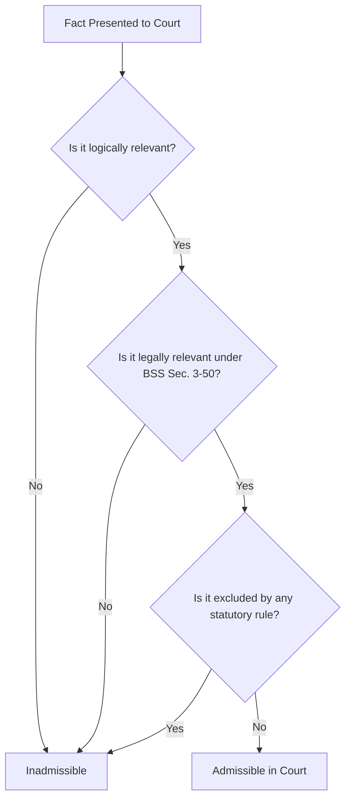
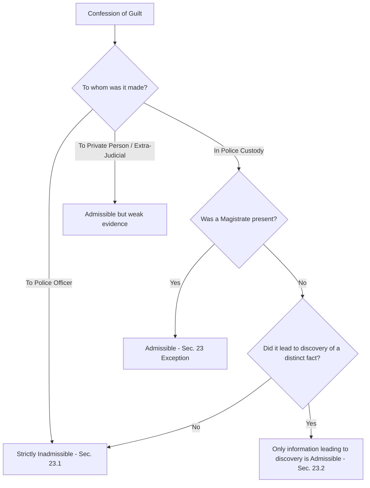
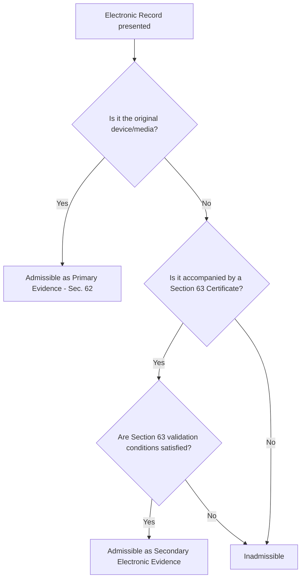
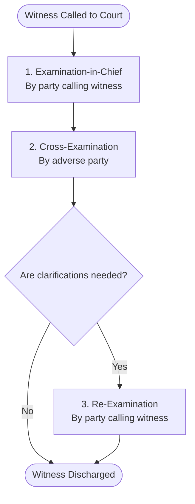

# Flowcharts: Law of Evidence processes

This document contains Mermaid diagrams illustrating key procedural flows in the Law of Evidence.

---

## 1. Hierarchy of Admissibility of Evidence

---

## 2. Confession Admissibility Decision Tree

### Visual Guide: Section 23 Admissibility Flow

---

## 3. Admissibility of Electronic Records (Sec. 63 Certification)

### Visual Guide: Section 63 Admissibility Checklist (Electronic & Digital Records)

---

## 4. Order of Witness Examination

