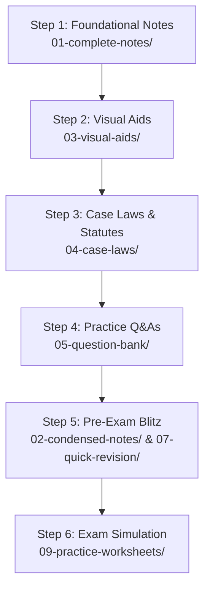

# 📖 Study Path Guide - Law of Evidence (LCC 0702)

Welcome to the **Law of Evidence** study guide. This pack is designed to prepare you for SPPU examinations under the **Bharatiya Sakshya Sanhita, 2023** (BSS) framework, which replaces the Indian Evidence Act, 1872.

---

## 🗺️ Recommended Study Path

Follow this step-by-step path to master the subject and ace your examinations:

---

## 🛠️ Step-by-Step Study Guide

### Step 1: In-depth Understanding
Read through the **[Complete Notes](./01-complete-notes/)** module by module. BSS 2023 has restructured section numbers; ensure you memorize both BSS 2023 and the corresponding Indian Evidence Act, 1872 sections.

### Step 2: Visual Concept Mapping
Review the **[Mermaid Flowcharts](./03-visual-aids/Flowcharts/Flowcharts_Evidence.md)** and **[Comparison Tables](./03-visual-aids/Comparison_Tables/Comparison_Tables_Evidence.md)** to consolidate structural relationships and processes (like examination sequence or electronic evidence admissibility).

### Step 3: Memorize Landmark Rulings
Study the **[Landmark Cases Summary](./04-case-laws/Landmark_Cases_Summary.md)**. You must cite at least 3-5 cases in every 15-mark essay answer.

### Step 4: Practice Writing Answers
Go to the **[Question Bank](./05-question-bank/)** and read model answers:
- [5 Marks Short Notes](./05-question-bank/5_Marks/)
- [10 Marks Questions](./05-question-bank/10_Marks/)
- [15 Marks Essay Questions](./05-question-bank/15_Marks/)
- [Distinguish Between](./05-question-bank/Distinguish_Between/)

Use the **[Answer Writing Template](./08-exam-strategy/Answer_Writing_Template.md)** to structure your answers.

### Step 5: Rapid Revision
Before the exam, review:
- **[Condensed Revision Guides](./02-condensed-notes/)**
- **[All Mnemonics Cheat Sheet](./07-quick-revision/All_Mnemonics_One_Page.md)**
- **[Doctrines and Maxims Summary](./07-quick-revision/Doctrines_and_Maxims.md)**

### Step 6: Test Yourself
Solve the **[Self Assessment Test](./09-practice-worksheets/Self_Assessment_Test.md)** under simulated 3-hour exam conditions.
