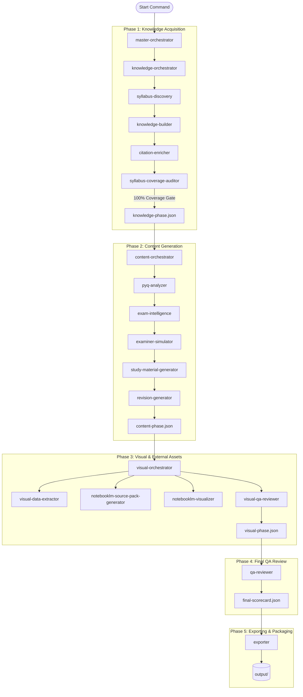

# Gemini Agent & Orchestration Platform

This document describes the structure, organization, and execution workflow of the Gemini-specific agents, commands, and templates configured for the **SPPU LLB Study Material Generation Platform**. All these components are centralized under the [.gemini/](file:///Users/vnalwar/work/law/law-study-notes/.gemini) directory.

---

## 📂 Directory Layout

The [.gemini/](file:///Users/vnalwar/work/law/law-study-notes/.gemini) directory houses the brains and rules of the generation system:

```text
.gemini/
├── .agents/          # Orchestrators and specialized generation/QA agents (Markdown prompt instructions)
├── .commands/       # High-level entry point commands (e.g., generate-subject.md)
└── .templates/      # Standard curriculum structures for different categories of law
```

---

## 🤖 Orchestration Layer (`.gemini/.agents/`)

The platform uses a layered, multi-agent orchestration architecture to ensure that the generated study materials are syllabus-complete, legally accurate, and exam-oriented.

### Execution Graph



### Agent Roles & Specifications

| Agent Prompt File | Phase | Description / Core Responsibility |
| :--- | :--- | :--- |
| [master-orchestrator.md](file:///Users/vnalwar/work/law/law-study-notes/.gemini/.agents/master-orchestrator.md) | **Global** | Coordinates the entire pipeline, validates quality gates between phases, manages checkpoint recovery. |
| [knowledge-orchestrator.md](file:///Users/vnalwar/work/law/law-study-notes/.gemini/.agents/knowledge-orchestrator.md) | **Knowledge** | Orchestrates and ensures 100% syllabus discovery and citation mapping before generating any study material. |
| [syllabus-discovery.md](file:///Users/vnalwar/work/law/law-study-notes/.gemini/.agents/syllabus-discovery.md) | Knowledge | Parses and structures raw subject syllabus files into standard JSON and outlines. |
| [knowledge-builder.md](file:///Users/vnalwar/work/law/law-study-notes/.gemini/.agents/knowledge-builder.md) | Knowledge | Generates basic legal definitions, concepts, and principles for every discovered syllabus topic. |
| [citation-enricher.md](file:///Users/vnalwar/work/law/law-study-notes/.gemini/.agents/citation-enricher.md) | Knowledge | Attaches relevant statutory provisions, Articles, landmark cases, and legal doctrines. |
| [syllabus-coverage-auditor.md](file:///Users/vnalwar/work/law/law-study-notes/.gemini/.agents/syllabus-coverage-auditor.md) | Knowledge | Audits generated knowledge repository against the original syllabus; blocks progress if coverage < 100%. |
| [content-orchestrator.md](file:///Users/vnalwar/work/law/law-study-notes/.gemini/.agents/content-orchestrator.md) | **Content** | Manages exam analysis, primary study guide generation, and condensed revision notes. |
| [pyq-analyzer.md](file:///Users/vnalwar/work/law/law-study-notes/.gemini/.agents/pyq-analyzer.md) | Content | Analyzes Previous Year Papers (PYQs) to extract topic recurrence frequency. |
| [exam-intelligence.md](file:///Users/vnalwar/work/law/law-study-notes/.gemini/.agents/exam-intelligence.md) | Content | Scores topics based on exam frequency, generating an exam-priority heat map. |
| [examiner-simulator.md](file:///Users/vnalwar/work/law/law-study-notes/.gemini/.agents/examiner-simulator.md) | Content | Classifies potential questions into marks categories (5, 10, 15 marks) and compiles predicted papers. |
| [study-material-generator.md](file:///Users/vnalwar/work/law/law-study-notes/.gemini/.agents/study-material-generator.md) | Content | Creates comprehensive study notes and model answers utilizing subject structure templates. |
| [revision-generator.md](file:///Users/vnalwar/work/law/law-study-notes/.gemini/.agents/revision-generator.md) | Content | Synthesizes short revision sheets, mnemonics, and pre-exam summaries. |
| [visual-orchestrator.md](file:///Users/vnalwar/work/law/law-study-notes/.gemini/.agents/visual-orchestrator.md) | **Visual** | Orchestrates flowchart/table creation and prepares clean source bundles for Google NotebookLM. |
| [visual-data-extractor.md](file:///Users/vnalwar/work/law/law-study-notes/.gemini/.agents/visual-data-extractor.md) | Visual | Extracts process flows suitable for Mermaid flowchart translation. |
| [notebooklm-source-pack-generator.md](file:///Users/vnalwar/work/law/law-study-notes/.gemini/.agents/notebooklm-source-pack-generator.md) | Visual | Formats and packages clean, markdown source documents optimal for Google NotebookLM upload. |
| [notebooklm-visualizer.md](file:///Users/vnalwar/work/law/law-study-notes/.gemini/.agents/notebooklm-visualizer.md) | Visual | Structures visual assets and comparison tables for student study. |
| [visual-qa-reviewer.md](file:///Users/vnalwar/work/law/law-study-notes/.gemini/.agents/visual-qa-reviewer.md) | Visual | Verifies correctness and rendering capability of generated flowcharts and tables. |
| [qa-reviewer.md](file:///Users/vnalwar/work/law/law-study-notes/.gemini/.agents/qa-reviewer.md) | **QA** | Conducts final scorecard validation checking content depth, accuracy, and formatting before release. |
| [exporter.md](file:///Users/vnalwar/work/law/law-study-notes/.gemini/.agents/exporter.md) | **Export** | Compiles, structures, and exports all finalized deliverables into the release packages. |

---

## 📋 Subject Structure Templates (`.gemini/.templates/`)

Templates under [.gemini/.templates/](file:///Users/vnalwar/work/law/law-study-notes/.gemini/.templates) act as structural frameworks. The [study-material-generator.md](file:///Users/vnalwar/work/law/law-study-notes/.gemini/.agents/study-material-generator.md) consumes them to format subject materials based on their specific legal discipline:

- [administrative-law.md](file:///Users/vnalwar/work/law/law-study-notes/.gemini/.templates/administrative-law.md): Emphasizes judicial review, principles of natural justice, and discretionary powers.
- [company-law.md](file:///Users/vnalwar/work/law/law-study-notes/.gemini/.templates/company-law.md): Focuses on corporate governance, shareholder rights, and Companies Act provisions.
- [constitutional-law.md](file:///Users/vnalwar/work/law/law-study-notes/.gemini/.templates/constitutional-law.md): Structured around fundamental rights, directive principles, and writ jurisdictions.
- [contract-law.md](file:///Users/vnalwar/work/law/law-study-notes/.gemini/.templates/contract-law.md): Highlights agreements, consideration, breach, and remedies.
- [criminal-law.md](file:///Users/vnalwar/work/law/law-study-notes/.gemini/.templates/criminal-law.md): Places emphasis on *mens rea*, BNS/BNSS codification, trials, and penal provisions.
- [family-law.md](file:///Users/vnalwar/work/law/law-study-notes/.gemini/.templates/family-law.md): Focuses on personal laws, marriage, succession, and guardianship.
- [jurisprudence.md](file:///Users/vnalwar/work/law/law-study-notes/.gemini/.templates/jurisprudence.md): Concentrates on schools of thought, legal theory, rights, and duties.
- [labour-law.md](file:///Users/vnalwar/work/law/law-study-notes/.gemini/.templates/labour-law.md): Focuses on industrial disputes, safety regulations, and employee welfare codes.
- [property-law.md](file:///Users/vnalwar/work/law/law-study-notes/.gemini/.templates/property-law.md): Targets ownership, easement rights, mortgage rules, and the Transfer of Property Act.
- [public-international-law.md](file:///Users/vnalwar/work/law/law-study-notes/.gemini/.templates/public-international-law.md): Structures state sovereignty, treaty dynamics, and international forums.
- [tort-law.md](file:///Users/vnalwar/work/law/law-study-notes/.gemini/.templates/tort-law.md): Targets civil wrongs, negligence, strict liability, and damages.

---

## ⚡ Execution Commands (`.gemini/.commands/`)

To run the pipeline, invoke the command file:

- [generate-subject.md](file:///Users/vnalwar/work/law/law-study-notes/.gemini/.commands/generate-subject.md): Top-level execution guide. 

### Execution Protocol

1. **Setup Inputs**:
   Create the subject curriculum folder inside the workspace and place inputs in:
   ```text
   input/syllabus/        # Curriculums / Syllabus documents (Mandatory)
   input/pyq/             # Past question papers (Optional)
   input/books/           # Supporting books (Optional)
   input/notes/           # Class notes (Optional)
   ```
2. **Execute Agent**:
   Instruct the Gemini/Antigravity agent to read and follow [.gemini/.commands/generate-subject.md](file:///Users/vnalwar/work/law/law-study-notes/.gemini/.commands/generate-subject.md).
3. **Sequential Pipeline Run**:
   - The agent reads [.gemini/.agents/master-orchestrator.md](file:///Users/vnalwar/work/law/law-study-notes/.gemini/.agents/master-orchestrator.md) and proceeds phase by phase.
   - For each phase, intermediate checkpoints are logged under `.temp/checkpoints/` to enable step resumption if interrupted.
4. **Collect Deliverables**:
   Final output products are packaged and deposited in:
   ```text
   output/
   ```
